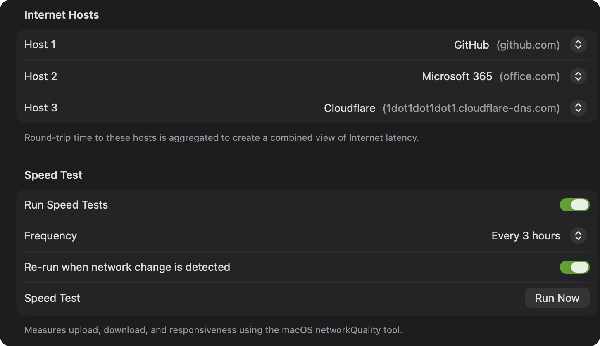

---
head:
  - tag: title
    content: "Check reporting accuracy | PeakHour Help"
title: "How do I check if PeakHour is reporting data accurately?"
description: "Use a speed test to sanity-check the throughput PeakHour reports for your Internet Gateway."
sidebar:
  label: Check reporting accuracy
status: reviewed
---

The simplest way to check whether PeakHour measures your Internet Gateway's traffic accurately is to run a speed test. Then compare the results with what PeakHour's monitor shows.

1. Open [Settings → Dashboard](/user-guide/settings/dashboard/#speed-test).
2. Turn on **Run Speed Tests**.
3. Click **Run Now** beside **Speed Test**.

While the test runs, watch the monitor for your Internet Gateway. The upload and download throughput that it shows should be near the speeds that the test gives at the end. The speeds show under **ISP** on the [Internet Dashboard](/user-guide/main-view/internet-dashboard/#isp).

You can also right-click the Internet Dashboard, then choose **Run Speed Test**. On macOS 26 and later, the Advisor's [Speed Test](/user-guide/advisor/speed-test/) page has a **Run Speed Test** button too.

If the numbers don't match, see [Adjust Scaling Factor](/troubleshooting/common-issues/adjust-scaling-factor/) and, for UPnP routers, [Testing your router's UPnP with MiniUPnP](/troubleshooting/upnp/test-router-with-miniupnp/). Check out the [Usage Monitoring](/troubleshooting/reference/usage-monitoring/) page for more information on accuracy.
