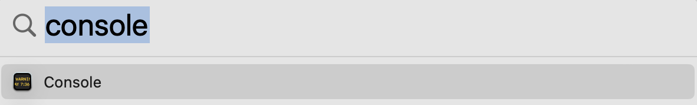
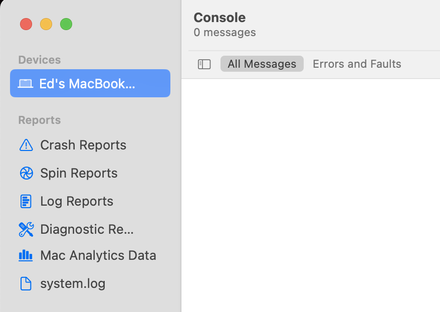
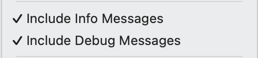
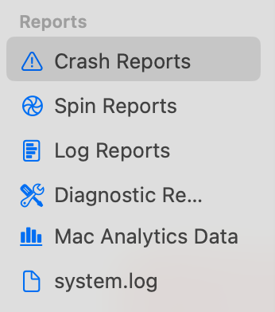

If you're experiencing crashes or hangs, these steps will allow you to gather the crash dumps and logs for analysis.

## Capturing Logs

1.  Open **Terminal**.

2.  Run the following command:

    ```sh
    log collect \
      --predicate 'eventMessage CONTAINS[c] "peakhour"' \
      --last 12h \
      --output ~/Desktop/PeakHourLogs.logarchive
    ```

    Change the `--last` argument to capture the time period in question (e.g. `30m` for the last 30 minutes, `2d` for the last 2 days, etc.)

3.  Send the file `PeakHourLogs.logarchive` as directed.

## Capturing SNMP / UPnP Debug Logs

1.  Quit PeakHour.

2.  Open **Terminal**.

    1.  To enable **SNMP** debug logging, run the following command:

        ```sh
        defaults write com.digitician.peakhour5 EnableSNMPDebugLogging -bool YES
        ```

    2.  To enable **UPnP** debug logging, run the following command:

        ```sh
        defaults write com.digitician.peakhour5 EnableUPnPDebugLogging -bool YES
        ```

3.  Run the following command to enable writing debug log events to disk:

    ```sh
    sudo log config --mode "level:debug,persist:debug" --subsystem com.digitician.peakhour5
    ```

4.  Start PeakHour and reproduce the issue.

5.  When the issue has been reproduced, run the following command in Terminal:

    ```sh
    log collect \
      --predicate 'subsystem BEGINSWITH "com.digitician.peakhour" AND (category == "upnp" OR category == "snmp")' \
      --last 12h \
      --output ~/Desktop/PeakHourLogs.logarchive
    ```

6.  Run the following command to disable debug log writing:

    ```sh
    sudo log config --mode "level:default,persist:default" --subsystem com.digitician.peakhour5
    ```

7.  Send the file `PeakHourLogs.logarchive` as directed.

8.  To disable SNMP / UPnP debug logging, run the following commands:

    ```sh
    defaults delete com.digitician.peakhour5 EnableSNMPDebugLogging
    defaults delete com.digitician.peakhour5 EnableUPnPDebugLogging
    ```

## Capturing Logs (manual method)

1.  Click the Spotlight (magnifying glass) icon in the menu bar.

2.  Type 'Console' — when you see the **Console** app highlighted, tap Enter.

    

3.  If the Sources view is not visible down the left side, choose **View → Show Sources**.

4.  In the **Sources** view, choose the top-most source under **Devices**. It will have the same name as your Mac.

    

5.  In the search field, type `peakhour` and press Enter.

    

6.  In the **Action** menu, ensure **Include Info Messages** and **Include Debug Messages** are enabled.

    

7.  Click **Start Streaming** to start gathering logs.

8.  Reproduce the problem / issue you're having.

9.  Once the problem is reproduced, go back to **Console**.

10. Choose **Edit → Select All**, then **Edit → Copy**.

11. Save the contents of the clipboard to a file and attach it to an email.
    **DO NOT** paste logs directly into a message — long messages can crash some email clients.

12. Send the log file to support, as directed.

## Sending Crash Dumps

1.  Click the Spotlight (magnifying glass) icon in the menu bar.

2.  Type 'Console' — when you see the **Console** app highlighted, tap Enter.

3.  If the Sources view is not visible down the left side, choose **View → Show Sources**.

4.  In the Sources view, choose **Crash Reports**.

    

5.  Locate reports related to PeakHour.

6.  Choose one and choose **Reveal in Finder**.

7.  Right-click the file in Finder and choose **Share → Mail**, or drop it as an attachment in your email client, and send it to [support@peakhourapp.com](mailto:support@peakhourapp.com).
