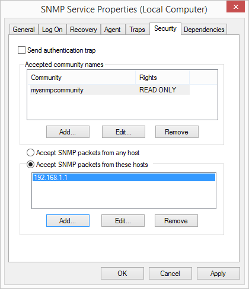

{/* TODO(manual-review):
   - The Windows walkthrough below dates from Windows 7/8 (screenshots from 2015). Verify the modern path on Windows 10/11 — SNMP is now installed via Settings > Apps > Optional features > "Add an optional feature" > SNMP (WMI SNMP Provider) — and retake both screenshots.
   - Confirm the Computer Management service-configuration steps still match Windows 11. */}

PeakHour can monitor the bandwidth usage of any device that supports SNMP. Enabling SNMP lets PeakHour monitor the specific bandwidth usage of your computers, providing a more granular breakdown of their usage.

This article explains how to enable SNMP on the three most popular desktop operating systems: macOS, Windows and Linux.

## macOS

Use **PeakHour Enabler**, our free, open-source tool that configures another Mac so PeakHour can monitor it over SNMP. See [Monitor Another Mac (PeakHour Enabler)](/user-guide/monitor-another-mac-peakhour-enabler/) for download and instructions.

## Microsoft Windows

On most Windows systems, the SNMP service is not installed by default.

On **Windows 10 and 11**, install it via **Settings → Apps → Optional features → Add an optional feature**, then search for **SNMP** and install **Simple Network Management Protocol (SNMP)**.

On older versions of Windows, follow these steps instead:

### Installing the SNMP service

1.  Click **Start → Control Panel → Programs → Programs and Features**.

2.  On the left-hand side, click **Turn Windows features on or off**.

3.  Scroll to **Simple Network Management Protocol (SNMP)** and click the checkbox to select it.

    

4.  Click **OK**.

The SNMP service will install.

### Configuring the SNMP service

1.  Click **Start → Settings → Control Panel → Administrative Tools** and then open **Computer Management**.

2.  In the tree view, expand **Services and Applications** and then click **Services**.

3.  In the list of services, scroll down and locate **SNMP Service**.

4.  Under the **Action** menu, click **Properties**.

5.  Click the **Security** tab.

6.  Under **Accepted community names**, click **Add**.

7.  Under **Community Rights**, choose **READ ONLY**.

8.  In **Community Name**, type a case-sensitive community name, and then click **Add**. More information: [SNMP Community](/troubleshooting/reference/snmp-community/).

9.  Specify whether or not to accept SNMP packets from a specific host or all hosts:

      - To accept SNMP requests from any host on the network, click **Accept SNMP packets from any host**.

      - To limit SNMP requests to specific hosts, click **Accept SNMP packets from these hosts**, click **Add**, type the appropriate host name or IP address, and then click **Add** again.

10. Click **Apply** to apply the changes.

#### Example SNMP configuration

## Linux

Installing `net-snmpd` on Linux varies from distribution to distribution. We recommend you consult the documentation and community forums for the most up-to-date instructions for your distribution (for example, the `snmpd` package on Debian/Ubuntu, or `net-snmp` on Fedora/RHEL).
