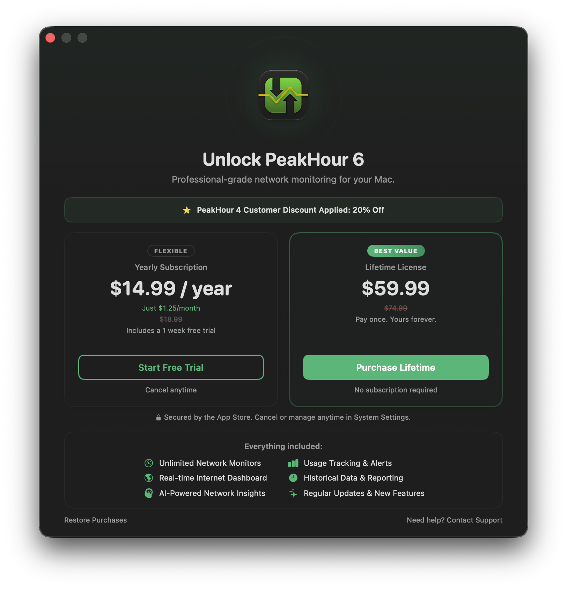
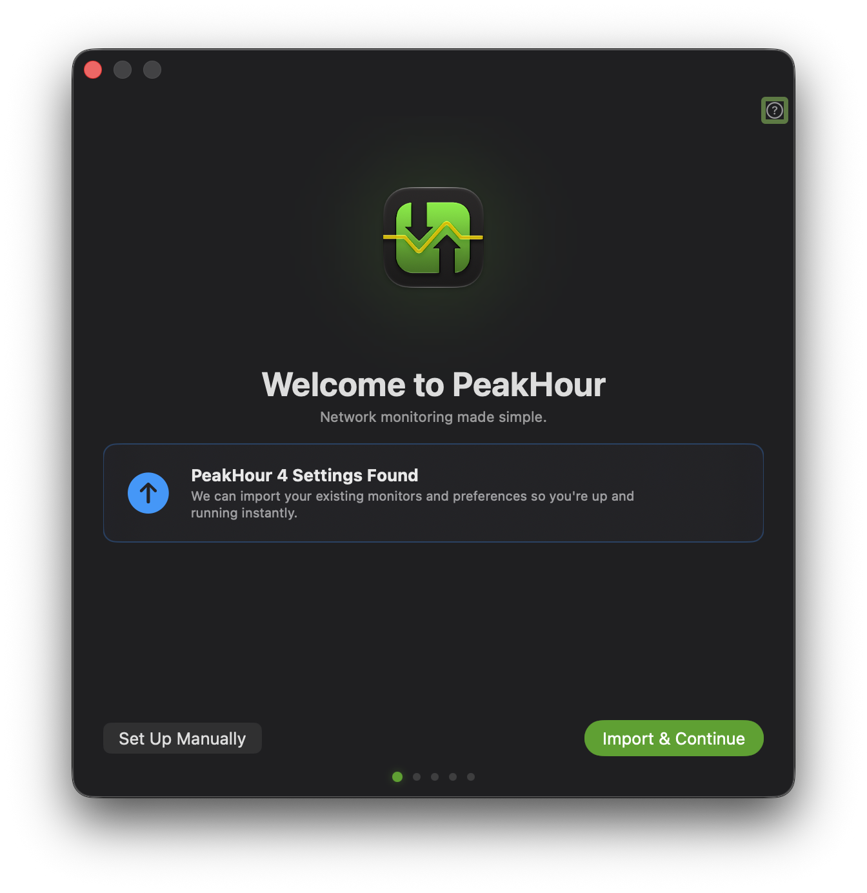
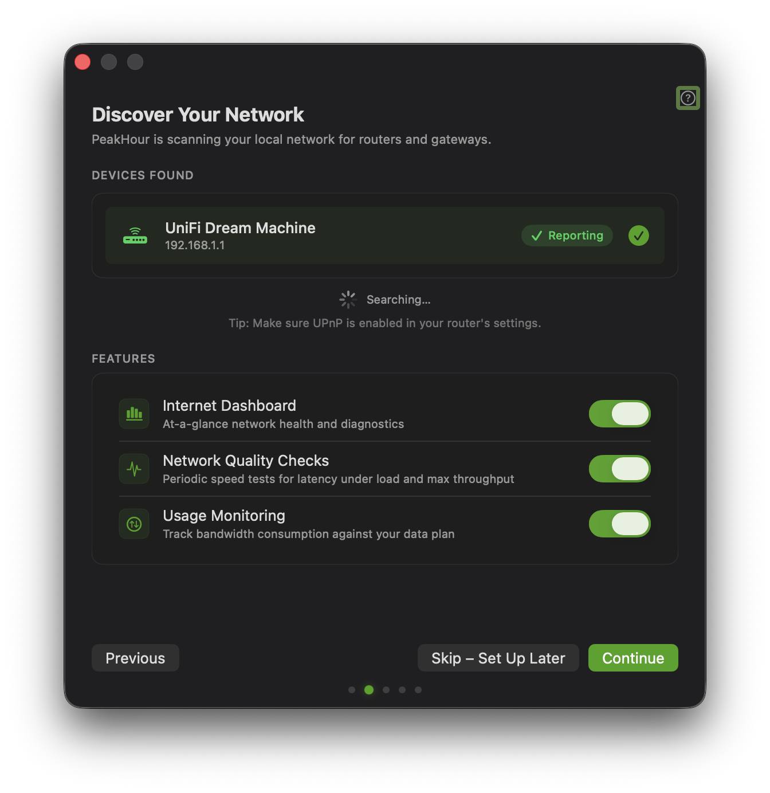
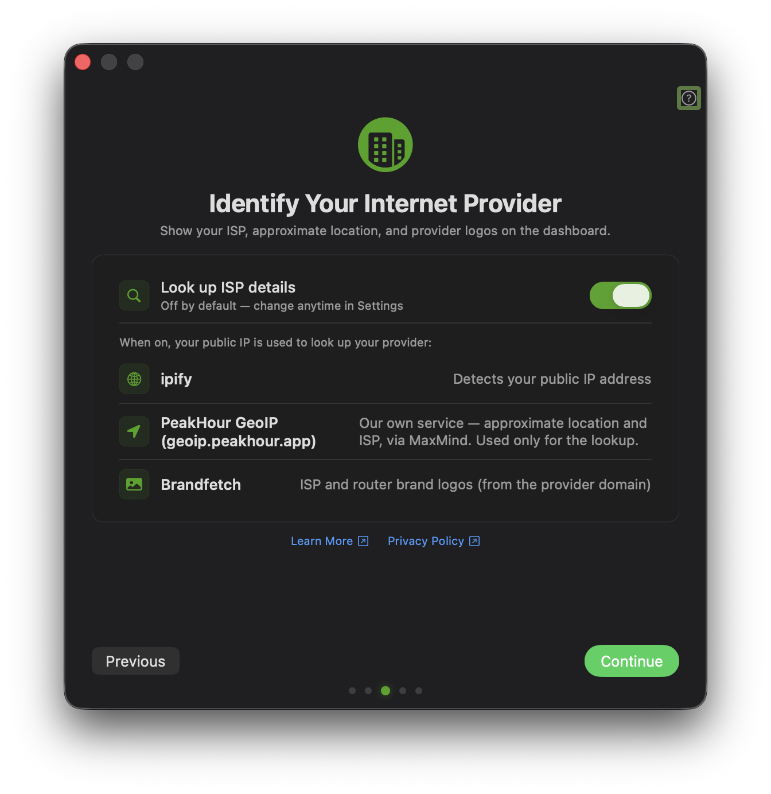
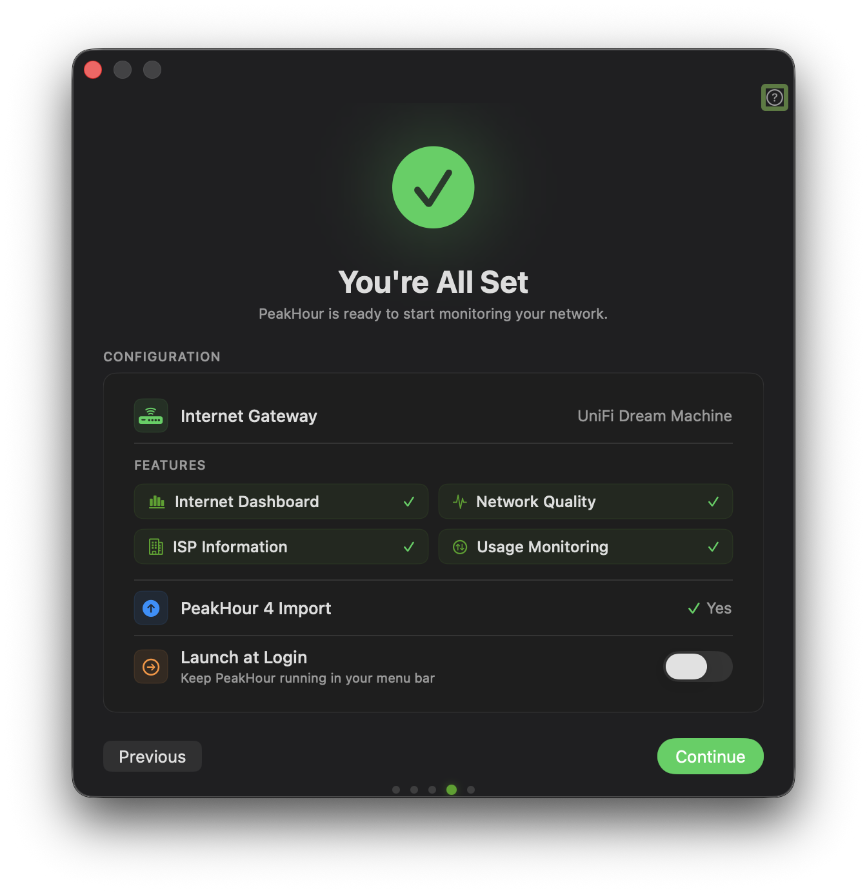

If you purchased PeakHour 4, you can upgrade to the current version of PeakHour at a discounted price.

To upgrade, do the following:

First, make sure you have the latest version of PeakHour 4 installed and activated. If you can't locate your PeakHour 4 license key, visit [old.peakhourapp.com](https://old.peakhourapp.com) and click **Recover License** under Help & Support.

:::tip
For a smooth, trouble-free import, quit PeakHour 4 before starting First Time Setup.
:::

1.  Visit PeakHour in the [Mac App Store](https://apps.apple.com/us/app/peakhour/id1560576252?mt=12) and click **Get** to download.

2.  Once PeakHour has finished downloading, click **Open** to launch it.

3.  Follow the prompts in the splash screen to start your free trial, activate a subscription, or purchase a one-time Lifetime license.
    As a PeakHour 4 user, ensure you see the **PeakHour 4 Customer Discount Applied: 20% Off** banner on the purchase screen — the discounted prices apply to both the yearly subscription and the Lifetime license.

    

4.  Once activated, the [First Time Setup](/user-guide/first-time-setup/) assistant detects your existing settings and shows **PeakHour 4 Settings Found**. Click **Import & Continue** to bring across your monitors and preferences.

    

5.  Complete the remaining First Time Setup steps — discovering your network and choosing which features to enable, and ISP identification.

    

    

6.  The final **You're All Set** screen confirms your configuration, including **PeakHour 4 Import: Yes**. Click **Continue** to start monitoring.

    

Congratulations! 🎉 You've successfully upgraded.
