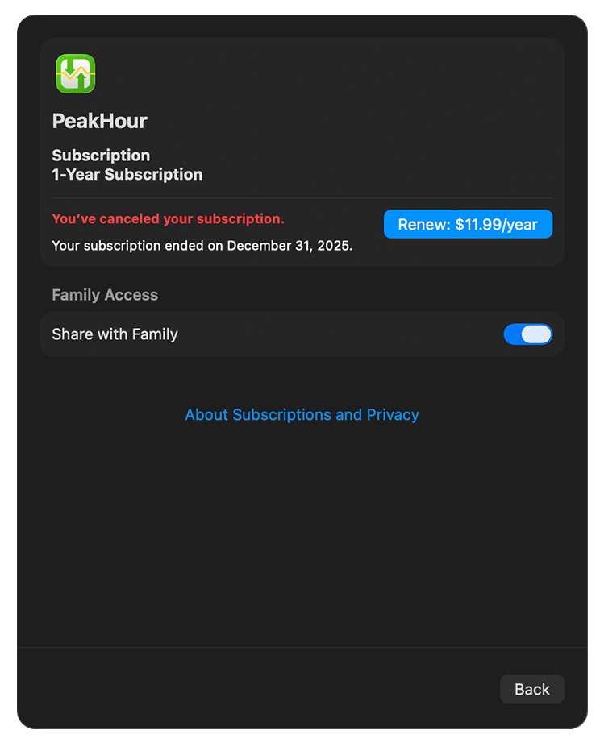
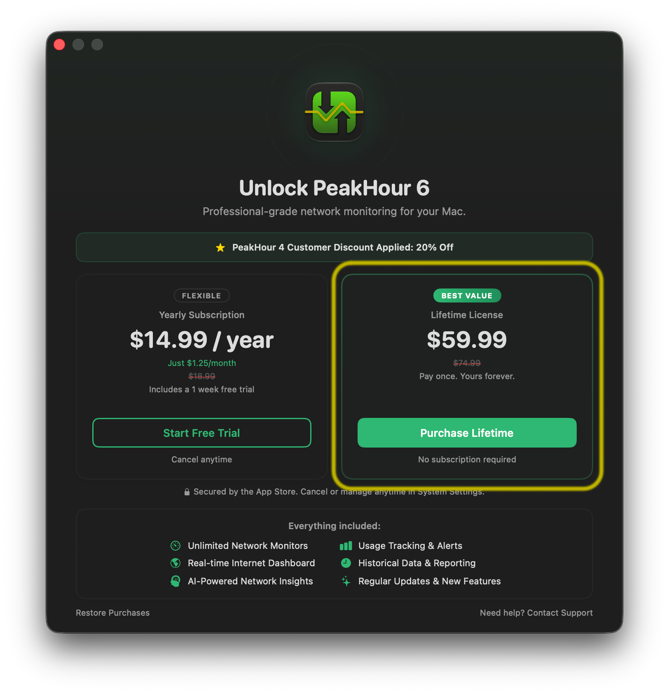

Yes, you can upgrade your license from a yearly subscription to a Lifetime license.

To do this, you must first cancel your existing subscription. To cancel your existing PeakHour subscription, follow the instructions on [Apple's support page](https://support.apple.com/en-us/118428).

Once your subscription has been cancelled, wait until your subscription term has expired. After it has expired, the next time you launch PeakHour you will be prompted to choose a purchase option. Under **Lifetime License**, click **Purchase Lifetime**.

