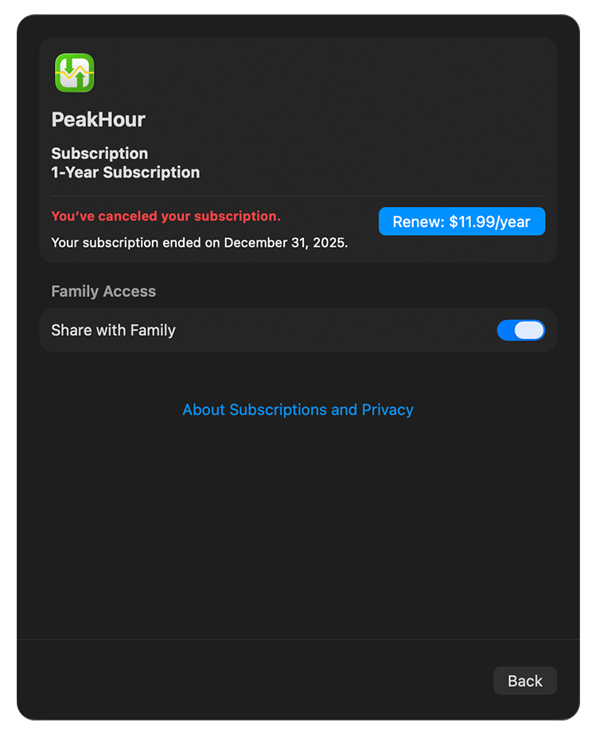
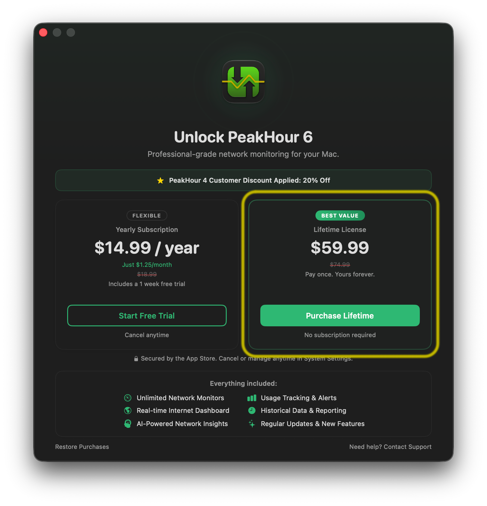

---
head:
  - tag: title
    content: "Upgrade a subscription to Lifetime | PeakHour Help"
title: "Can I upgrade from a subscription to a Lifetime license?"
description: "Yes — buy the Lifetime License in PeakHour from Settings → About, then cancel your Annual Pass in your App Store subscriptions."
sidebar:
  label: Subscription → Lifetime license
status: reviewed
---

Yes. With an Annual Pass or a free trial, you can buy the Lifetime License in PeakHour at any time. You don't have to wait for your subscription to end.

## Buy the Lifetime License

1. Open **Settings → About** and click **Get Lifetime License…** on your license card. Or, while a PeakHour window is in front, choose **PeakHour → Get Lifetime License…**.
2. The window shows the price of the Lifetime License, and a reminder:
   - with an Annual Pass: *Your Annual Pass renews until you cancel it.*
   - with a free trial: *Your free trial becomes a paid Annual Pass unless you cancel it.*
3. Click **Buy for** and the price, then confirm the purchase with the App Store.

The Lifetime License costs its full price. If you bought PeakHour 4, you keep your [PeakHour 4 discount](/troubleshooting/faq/purchasing-licensing/upgrade-from-peakhour-4/).

## Cancel your Annual Pass

PeakHour can't cancel your Annual Pass for you. After the purchase, PeakHour says that your Annual Pass still renews, or that your free trial still becomes a paid Annual Pass. Click **Manage Subscription…** to open your App Store subscriptions, then cancel the PeakHour subscription to stop the next charge. Apple's [support page](https://support.apple.com/en-us/118428) has the steps.

Until you cancel it, your license card in **Settings → About** shows **Lifetime License**, with **Annual Pass renews** under it.

:::note
Apple gives no credit for the unused part of a subscription. When you cancel, your Annual Pass stays active until the end of the period you paid for, and then stops. Your Lifetime License stays active.
:::

## If your subscription has already ended

When you have no active license, PeakHour shows the purchase screen at launch. Under **Lifetime License**, click **Purchase Lifetime**.

