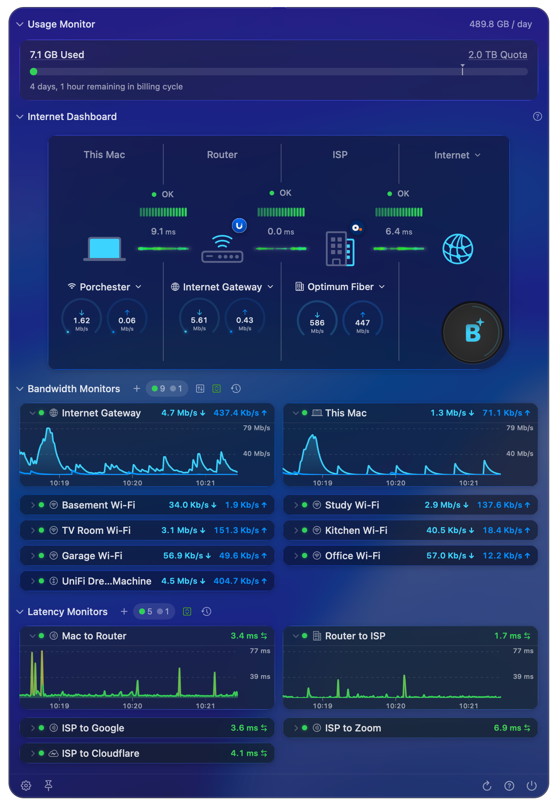

PeakHour is a professional network monitoring tool that shows you a real-time view of your internet health in your Mac menu bar.

PeakHour talks to your router(s), wireless devices, servers, NAS devices and more, and displays a real-time graph of their network activity. PeakHour uses highly accurate latency measurement to determine the quality of your connection to the internet. It can also track usage of your internet connection against limits imposed by your ISP, so you can quickly see exactly how much quota you've used and how much remains.

The [Internet Dashboard](/user-guide/main-view/internet-dashboard/) visualises your connection from your Mac out to the internet, can periodically measure your connection with macOS Network Quality tests, and — with the AI Advisor — uses on-device AI to summarise and grade your network conditions in plain language.

PeakHour has numerous options that let you customise its look and feel. You can monitor an unlimited number of targets (devices — or individual interfaces on a single device, if it supports SNMP) and display them in either a compact or expanded view. PeakHour also collects information over time and can display it in the flexible [History view](/user-guide/history-view/).

To monitor a device, PeakHour requires that it support either the [SNMP](/troubleshooting/reference/snmp/) or [UPnP](/troubleshooting/reference/upnp/) protocol.

For more information on how to configure and customise PeakHour, see the [User Guide](/user-guide/).
