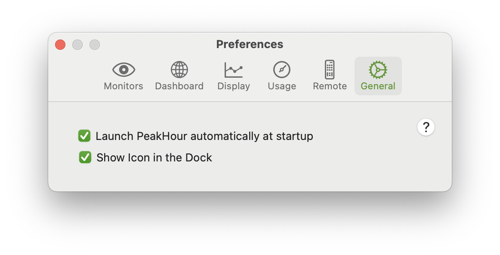

You can control whether PeakHour launches at startup via **Preferences \> **[**General**](https://peakhoursupport.atlassian.net/wiki/spaces/P4D/pages/655595/General) **\> Launch PeakHour automatically at startup.**

