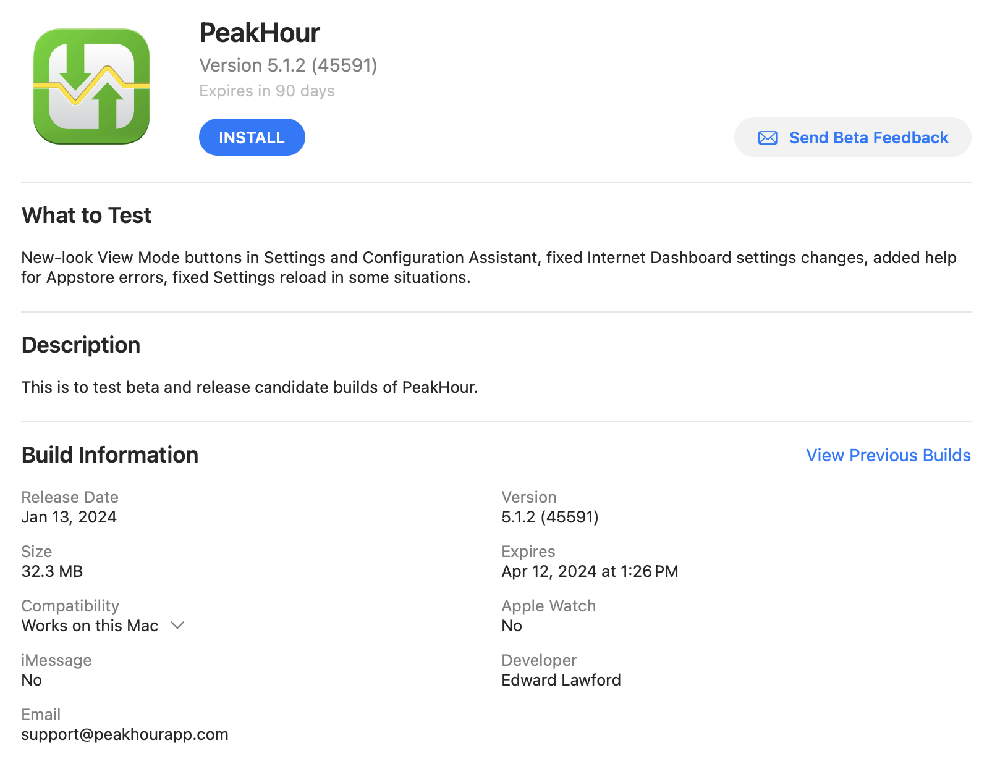

If you’re the kind of person who always wants the latest and greatest, sign up for TestFlight and help us test new versions of PeakHour\!

Signing up to TestFlight is super-easy. Follow these steps to install TestFlight and join the PeakHour TestFlight program:

1.  If you don't already have TestFlight installed, visit the [TestFlight app](https://apps.apple.com/us/app/testflight/id899247664) in the Mac Appstore.

2.  Click **Get** to install TestFlight then click **Open** to launch TestFlight.

3.  When prompted, log in with your Appstore Apple ID.

4.  Once TestFlight is open, click the following link to join PeakHour’s TestFlight program:  
      
    [Join PeakHour TestFlight](https://testflight.apple.com/join/nfRsdadY)  

5.  You should see PeakHour listed as an application. Select PeakHour and click Install to install the latest version.  
    
    

6.  If you wish to stop using the TestFlight build at any time, you can either:
    
    1.  Visit [PeakHour](https://apps.apple.com/us/app/peakhour/id1560576252?mt=12) in the Mac Appstore and reinstall the production build.
    
    2.  Visit PeakHour in TestFlight and click **Stop Testing** at the bottom of the page to opt out of testing all together.

We very much appreciate and value all feedback. If you find bugs or have suggestions or feedback, please reach out to us using the Send Beta Feedback button, or via email at [support@peakhourapp.com.](mailto:support@peakhourapp.com)

Happy testing\!

