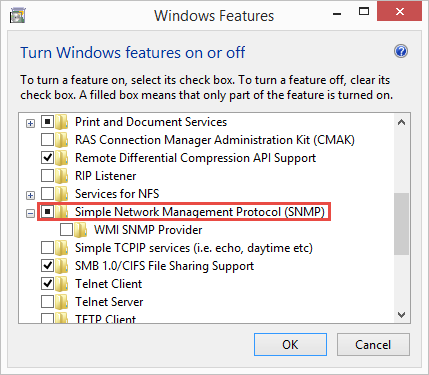

import NeedsReview from '@/components/NeedsReview.astro';

<NeedsReview />

PeakHour can monitor the bandwidth usage of any device that supports SNMP. Enabling SNMP will enable PeakHour to monitor the specific bandwidth usage of your computers, providing a more granular breakdown of their usage.

This is article explains how to enable SNMP on the three most popular desktop operating systems: Mac OS X, Windows and Linux. 

  - [macOS](#I'dliketomonitormyMac/PC/Linuxdevices.HowcanIenablethem?-macOS)
  - [Microsoft Windows](#I'dliketomonitormyMac/PC/Linuxdevices.HowcanIenablethem?-MicrosoftWindows)
  - [Linux](#I'dliketomonitormyMac/PC/Linuxdevices.HowcanIenablethem?-Linux)

# macOS

Check out [Monitor Another Mac (PeakHour Enabler)](https://peakhoursupport.atlassian.net/wiki/spaces/P5D/pages/7144061/Monitor+Another+Mac+PeakHour+Enabler) for instructions on how to use PeakHour Enabler to easily add other Macs to PeakHour.

# Microsoft Windows

On most Windows systems, the SNMP service is not installed by default. Follow these steps to install it:

### Installing the SNMP service

1.  Click **Start** \> **Control Panel** \> **Programs** \> **Programs and Features**

2.  On the left-hand side, click Turn **Windows features on or off**

3.  Scroll to **Simple Network Device Management Protocol (SNMP)** and click the checkbox to select it.  
    
    

4.  Click OK

The SNMP service will install.

**Configuring the SNMP service**

1.  Click **Start \>Settings \>Control Panel \>Administrative Tools** and then open **Computer Management.**

2.  In the tree view, expand **Services and Applications** and then click **Services.**

3.  In the list of services, scroll down and locate **SNMP Service**. 

4.  Under the **Action** menu, click **Properties**. 

5.  Click the **Security** tab.

6.  Under **Accepted community names**, click **Add**. 

7.  Under **Community Rights**, choose **READ ONLY**. 

8.  In **Community Name**, type a case-sensitive community name, and then click Add. More information: [SNMP Community](/troubleshooting/wiki/terminology/snmp/snmp-community/).

9.  Specify whether or not to accept SNMP packets from a specific host or all hosts: 

10.   - To accept SNMP requests from any host on the network, click **Accept SNMP packets from any host**.
    
    <!-- end list -->
    
      - To limit SNMP requests to specific hosts, click **Accept SNMP packets from these hosts**, click **Add** and type the appropriate host name or IP address, and then click **Add** again.

11. Click **Apply** to apply the changes.

### Example SNMP configuration

# Linux

Installing net-snmpd on Linux varies widely from distribution to distribution. We recommend you consult the documentation / support forms / communities for the most up-to-date instructions for your distribution.

