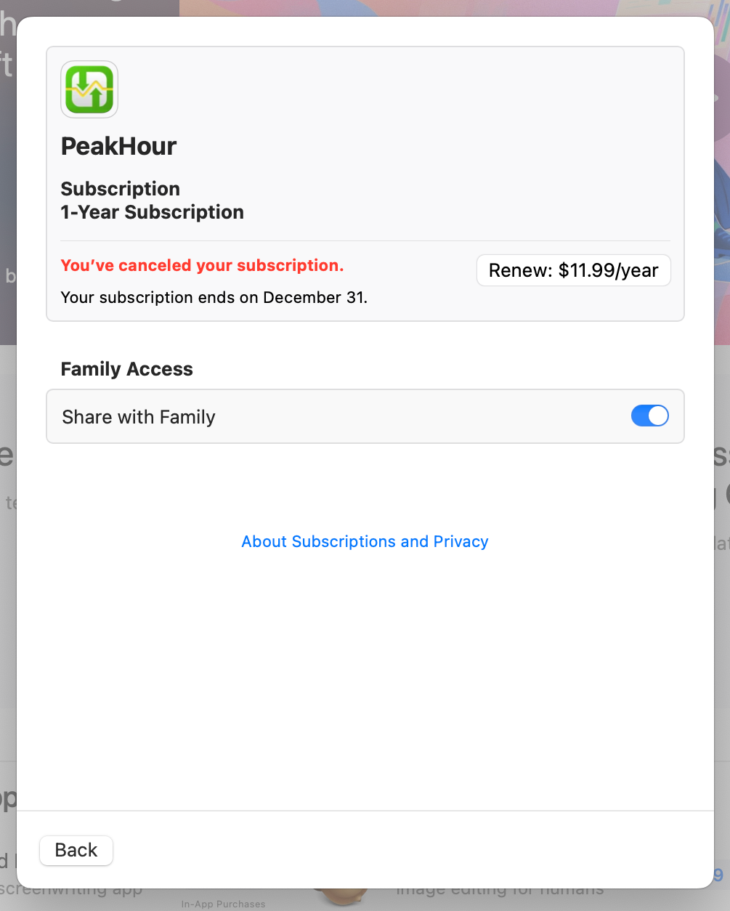

Yes, you can upgrade your license from a yearly subscription to a lifetime license.

To do this, you must first cancel your existing subscription. To cancel your existing PeakHour subscription, follow the instructions on [this page](https://support.apple.com/en-us/118428).

Once your subscription has been cancelled, wait until your subscription term has expired. Once it has expired, the next time you launch PeakHour, you will be prompted to choose a purchase option. Click the **Lifetime** tab and choose **Purchase Lifetime License**.

