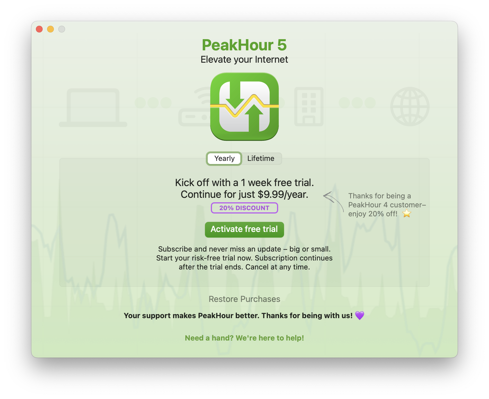
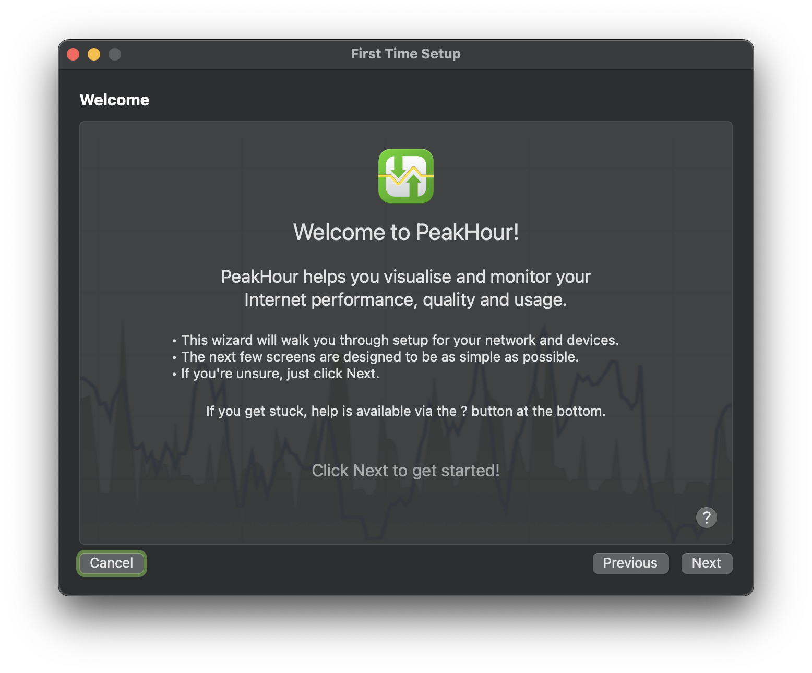
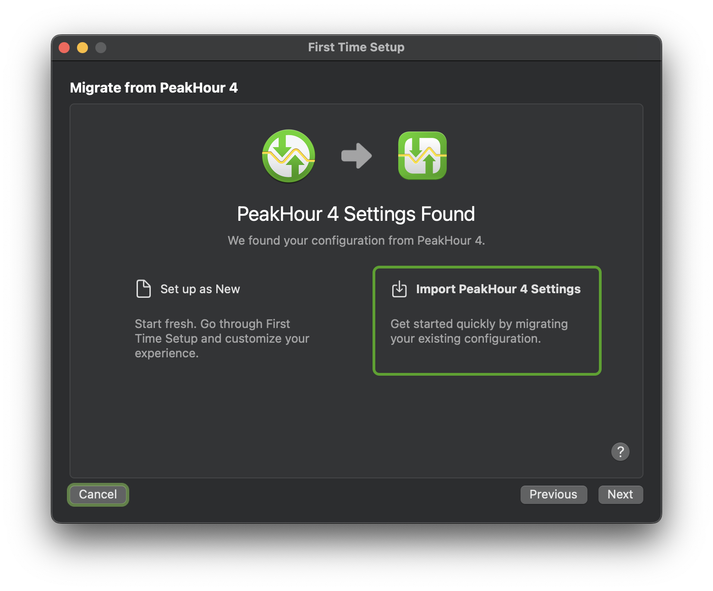
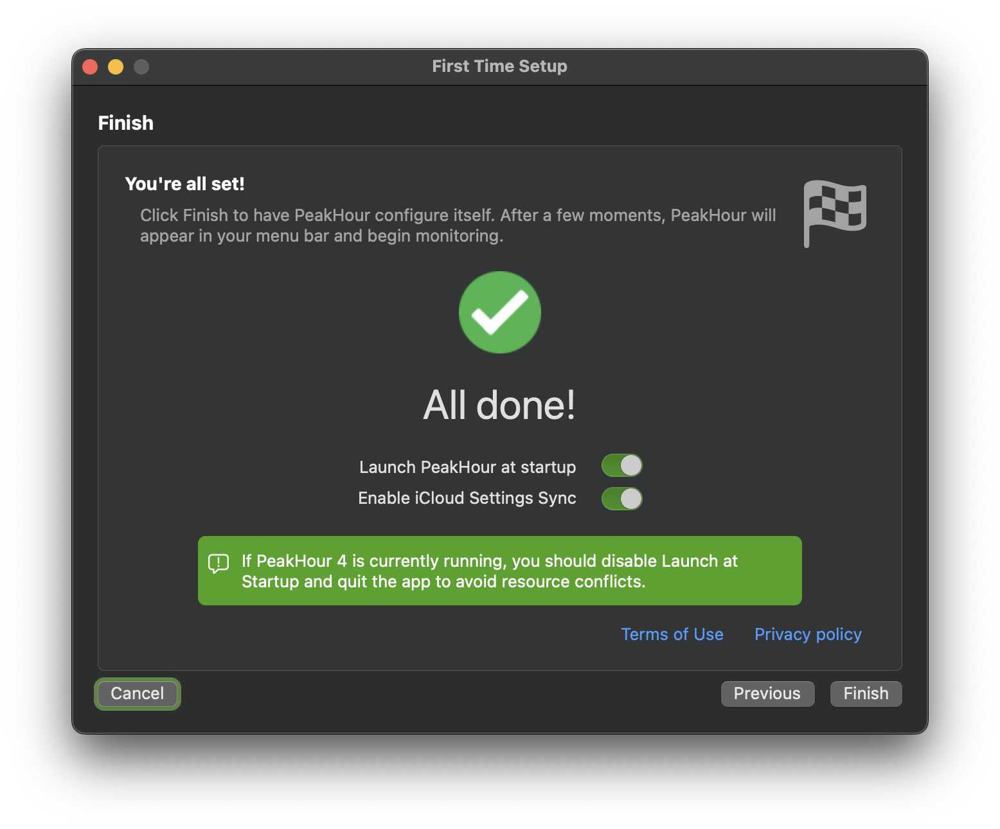

import NeedsReview from '@/components/NeedsReview.astro';

<NeedsReview />

If you purchased PeakHour 4, you can upgrade to PeakHour 5 at a discounted price.

To upgrade, do the following:

First, make sure you have the latest version of PeakHour 4 installed and activated.

If you can't locate your PeakHour 4 license key, visit [old.peakhourapp.com](https://old.peakhourapp.com) and click **Recover License** under Help & Support.

1.  Visit PeakHour in the [Mac Appstore](https://apps.apple.com/us/app/peakhour/id1560576252?mt=12) and click **Get** to download.

2.  Once PeakHour is finished downloading, click **Open** to launch.

3.  Follow the prompts in the splash screen to activate your trial, subscription or purchase a one-time, Lifetime license.  
    As a PeakHour 4 user, ensure you see the 20% discount referenced on the purchase screen.
    
    

4.  Once activated, follow the prompts in the First Time Setup wizard to import your PeakHour 4 configuration.  
    
    
    Make sure you quit PeakHour 4 at the final screen. Once you click Finish, PeakHour 5 will start. Ensure PeakHour 4 isn't running at this point to ensure a smooth, trouble-free experience.

Congratulations\! 🎉 You're successfully upgraded to PeakHour 5.

