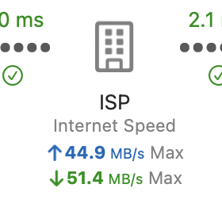

The simplest way to check if PeakHour is measuring your Internet Gateway traffic accurately is to enable Speed Tests in the Internet Dashboard.

You can do from [Internet Dashboard](https://peakhoursupport.atlassian.net/wiki/spaces/P5D/pages/16089091/Dashboard) settings. Enable **Periodically measure Internet Speed** and then click **Run Now**. Check the monitor for your Internet Gateway and make sure the upload and download speeds being shown match the **Internet Speed** shown under **ISP** in the Internet Dashboard.

Check out the [Usage Monitoring](/troubleshooting/wiki/usage-monitoring/)  page for more information on accuracy.

