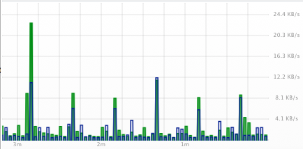

import NeedsReview from '@/components/NeedsReview.astro';

<NeedsReview />

This can be caused by routers that don't update their counters as often as PeakHour is set to query them. It results in a kind of "on" / "off" pattern in the graph, similar to this (sometimes worse):

There are two ways to fix it:

1.  Reduce the frequency the PeakHour polls. This is controlled in [Display](https://peakhoursupport.atlassian.net/wiki/spaces/documentation/pages/655463/Display) preferences via the **Refresh Interval** dropdown.

2.  Try enabling **Ask Device to Smooth Data** under [Display](https://peakhoursupport.atlassian.net/wiki/spaces/DOC3/pages/655405/Display) options. This will send an `snmpset` command to the device each time PeakHour starts that asks the device to increase the frequency of it's updates.
    
    Support for this is device-dependent.

If none of the above options are suitable, we recommend you contact the device manufacturer and ask them to patch their SNMP implementation to allow for more frequent updates.

