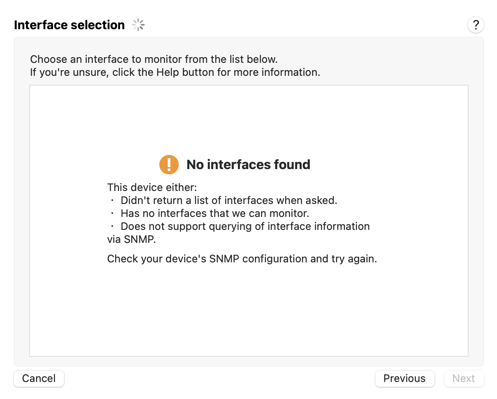
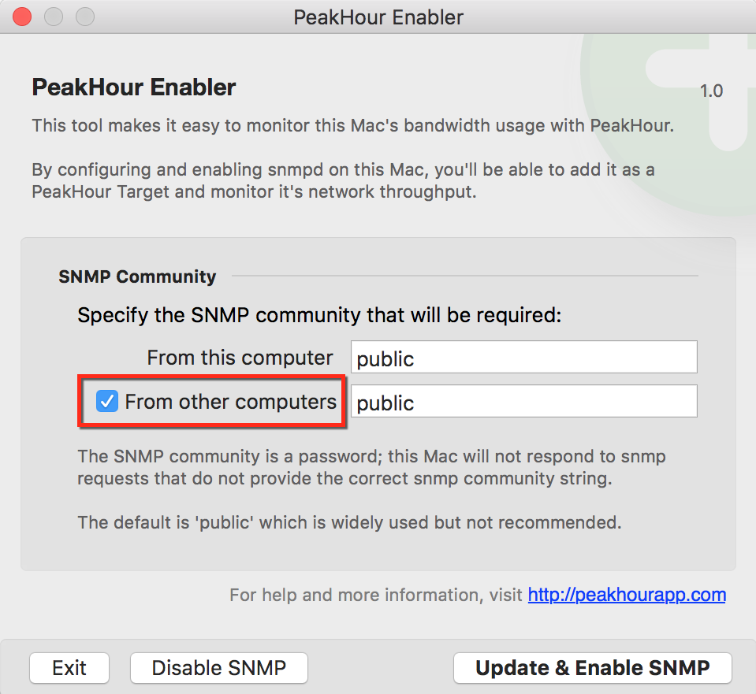

When attempting to add a target using SNMP, you get the following error on the **Interface selection** screen:

# What does this error mean?

The most often reason for getting this error in inadequate permissions with the SNMP device you're talking to.

Some reasons for this include:

  - You enabled SNMP on your Mac using [Monitor Another Mac (PeakHour Enabler)](https://peakhoursupport.atlassian.net/wiki/spaces/P5D/pages/7144061/Monitor+Another+Mac+PeakHour+Enabler) but you didn't enable the "From other computers" checkbox

  - You're using an incorrect SNMP community.

# How can I fix it?

Some steps you can take to try to fix it:

1.  Make sure you are entering the correct SNMP community / password.

2.  If you used [PeakHour Enabler](https://peakhoursupport.atlassian.net/wiki/spaces/DOC3/pages/655417/PeakHour+Enabler) and didn't check the **From other computers** checkbox, make sure you are clicking **Add SNMP Device...** and are specifying 'localhost' as the hostname.  
      
    If this doesn't work, run PeakHour Enabler again, enable the **From other computers** checkbox and try again.  
      
    
    

