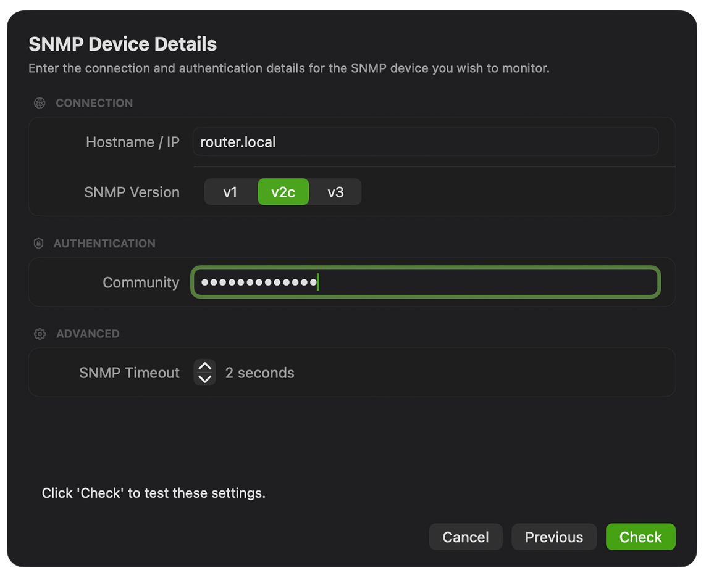

## What is an 'SNMP community'?

An SNMP community is, essentially, a byword for **password** or shared key.

It is a secret that is shared between your router or network device and PeakHour (or another SNMP-enabled application). Saying 'SNMP community' is just another way of saying 'password' or 'key'.

## What does an SNMP community do?

An SNMP-enabled device will only respond to queries if the SNMP community is correct. Think of it as an authentication password: you're not allowed to query a device unless you specify the correct SNMP community in the query.

:::note
On most devices, the default read-only community is `public`.
:::

## How does this affect PeakHour?

PeakHour — among other things — is an SNMP client. In order to successfully communicate with an SNMP-enabled router or device to find out its bandwidth consumption, you must give PeakHour the correct SNMP community to use. If you don't, the device will not respond, or will respond with no information — see ["No Interfaces Found" when choosing an interface](/troubleshooting/snmp/no-interfaces-found/).
