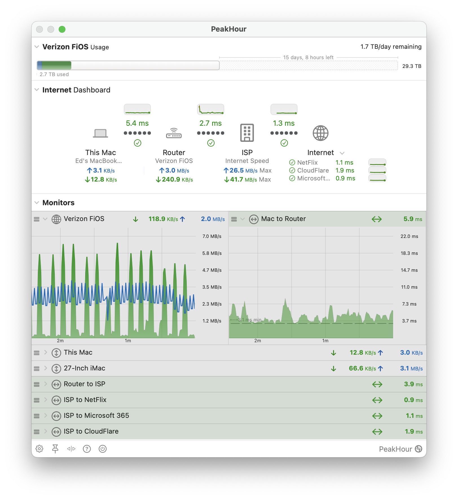

import NeedsReview from '@/components/NeedsReview.astro';

<NeedsReview />

PeakHour is a powerful tool that shows you a real-time view of your Internet health in your Mac menu bar.

PeakHour talks to your router(s), wireless devices, servers, NAS devices and more and displays a real-time graph of their network activity. PeakHour uses highly accurate, advanced latency measurement to determine the quality of your connection to the Internet. PeakHour can also track of usage of your Internet connection against limits imposed by your ISP, allowing you to quickly see exactly how much quota you've used, how much is remaining per day etc.

PeakHour has numerous options that allows you to customise the look and feel. You can monitor an unlimited number of targets (devices or interfaces on a single device - if it's SNMP) and can display them using either a compact format or an expanded view. PeakHour also collects information over time and can display that information in a flexible and powerful History view.

In order to be able to monitor a device, PeakHour requires that it support either the [SNMP](/troubleshooting/wiki/terminology/snmp/) or [UPnP](/troubleshooting/wiki/terminology/upnp/)  protocol.

For more information on how to configure and customize PeakHour, see the [PeakHour 5 Documentation](https://peakhoursupport.atlassian.net/wiki/spaces/P5D/pages/7012790/PeakHour+5+Documentation).

