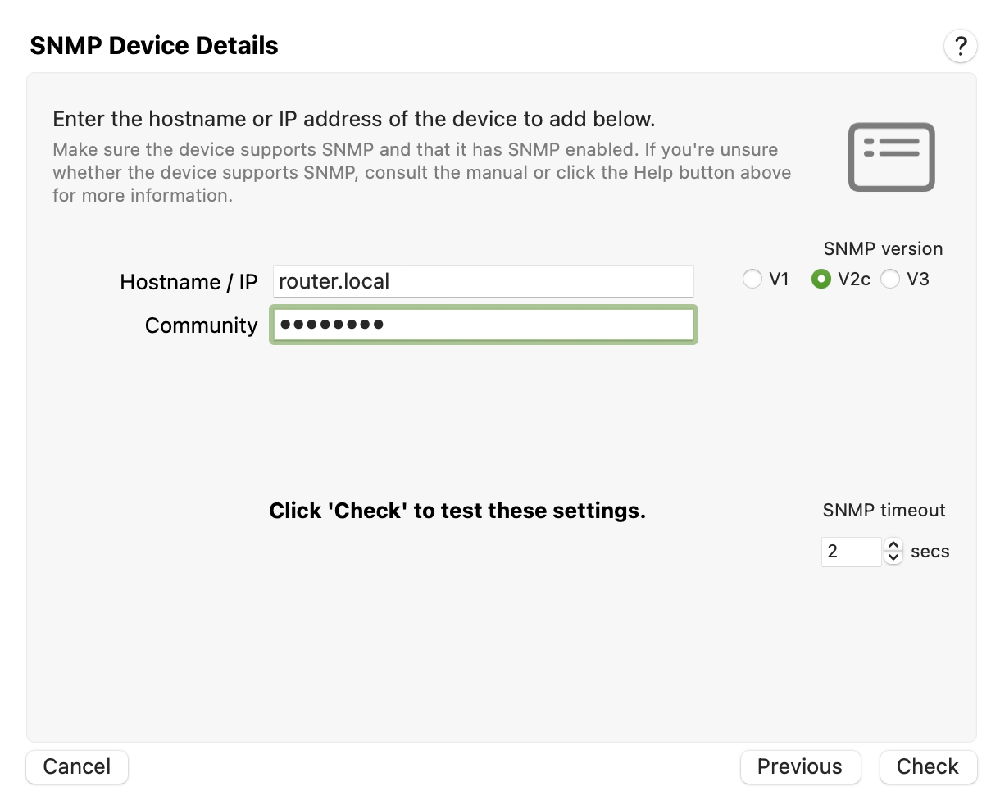

# What is an 'SNMP community'?

SNMP community is a byword for **password** or shared key.

An SNMP community is secret key that is shared between your router or network device and PeakHour (or other SNMP-enabled application). Essentially, SNMP community is just another way of saying 'password' or 'key.'

# What does an SNMP community do?

An SNMP-enabled device will only respond to queries if the SNMP community is correct. Think of it as an authentication password; you're not allowed to query a device unless you specify the correct SNMP community in the query.

# How does this affect PeakHour?

PeakHour - among other things - is an SNMP client. In order for you to be able to successfully communicate with an SNMP-enabled router or device to find out its bandwidth consumption, you give PeakHour the correct SNMP community to use. If you don't, the device will not respond, or respond with no information.

