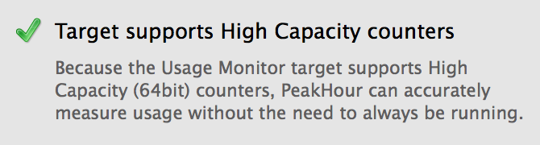

import NeedsReview from '@/components/NeedsReview.astro';

<NeedsReview />

## How it Works

Every router that is capable of being monitored by PeakHour keeps a running count of the total number of bytes uploaded and downloaded. PeakHour queries these counters regularly and uses them to calculate how much data is being currently being transferred (the transfer rate) as well as the total data transferred (usage).

On most SNMP routers and all UPnP routers, these counters are only 32bits long. In practise, it means each counter can only go up to 4,294,967,295 bytes or (\~4GB) before it resets or 'rolls over' to zero and starts again.

The question is: how does this affect usage monitoring?

While PeakHour is running, it does not matter if the counter rolls over; PeakHour is only concerned about the change in the counter's value, not the absolute value.

If it's stopped for a period of time and data is still being transferred, things can happen that are beyond yours and our control:

  - If the counters DON'T roll over while PeakHour is stopped, there is no problem. Usage will be calculated accurately as if PeakHour had been running the entire time.

  - If the counters DO roll over while PeakHour is stopped, it's becomes impossible for PeakHour to know how much data was transferred during that time; the counters could have rolled multiple times but we have no way of knowing how many times exactly. 

If the counters do roll, the next time PeakHour is started it will drop into **Usage Estimation** mode.

### Usage Estimation

In Usage Estimation mode, PeakHour will attempt to estimate the usage while it was stopped by using other counters available to it. This is not as accurate as measuring directly but it will get close in many instances.

If you wish, you can disable Usage Estimation in [Advanced options](https://peakhoursupport.atlassian.net/wiki/spaces/P5D/pages/7144484/Advanced+options) .

## High Capacity Counters

The solution to counters rolling over is [High Capacity Counters](/troubleshooting/wiki/terminology/snmp/high-capacity-counters/) .

High Capacity Counters increase the size from 32bit (4,294,967,295 bytes) to 64bit (9,223,372,036,854,775,807 bytes). Due to their increased size, High Capacity counters roll *a lot* less frequently. PeakHour can be stopped for a very long time before any usage inaccuracy would be noticed.

#### Support for High Capacity Counters

High Capacity counters are supported by some (usually higher-end) SNMP devices. Most enterprise-grade routers, servers running net-snmpd, open-source firewalls (such as pfSense). If a device supports High Capacity Counters, PeakHour will detect and use them automatically.

## Tips for accurate usage

Simply put: the best way to ensure accurate usage is to choose a router that supports [High Capacity Counters](/troubleshooting/wiki/terminology/snmp/high-capacity-counters/) .

In case that is not possible:

  - Install PeakHour on a machine that is always on.

  - If that is not possible, you will get most accurate results if there aren't a lot of devices using your Internet connection whilst PeakHour isn't running. PeakHour will remain accurate as long as large amounts of data aren't transferred while it is stopped.

