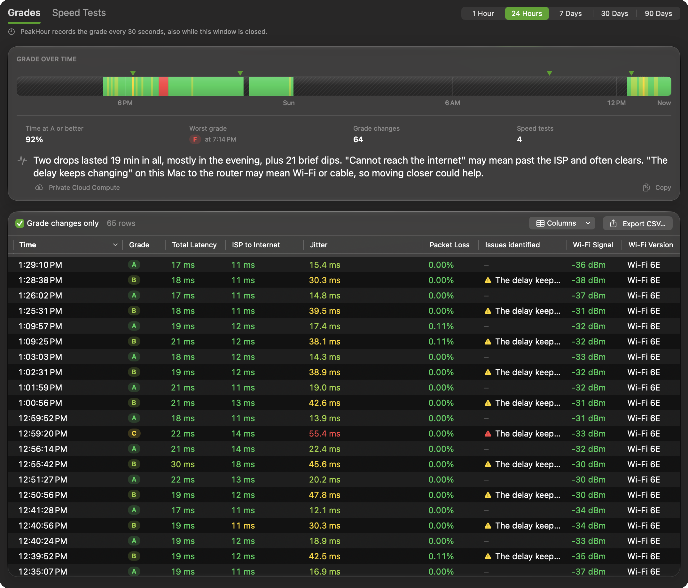
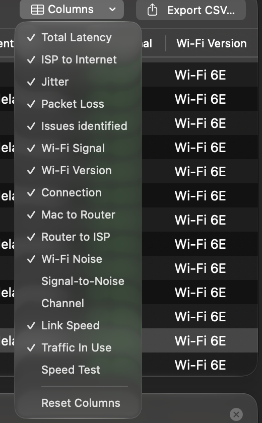
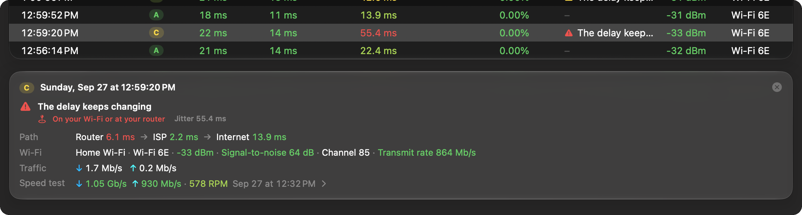
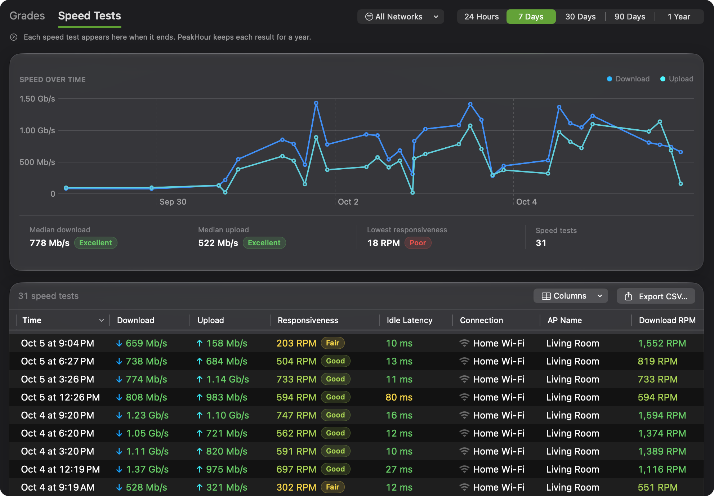

The **History** page shows how your connection has done over time. Use it to find out when the grade dropped, and why.

It has two tabs: **Grades** and **Speed Tests**. Choose the period at the top right.

## How PeakHour records the grade

PeakHour records the grade, with its reasons and its measurements, **every 30 seconds** — also while the Advisor window is closed.

It doesn't record:

- while the Mac is asleep, including the short wake-ups that macOS makes while the lid is closed;
- for about 90 seconds after PeakHour starts or the Mac wakes, while the monitors settle;
- while a speed test runs, because the test itself loads the connection;
- while **AI Advisor** is turned off in [Settings → Dashboard](/user-guide/settings/dashboard/#ai-advisor). PeakHour still records your speed tests then.

A time without a network is recorded as **No network**, so it doesn't look like a gap.

PeakHour keeps the 30-second records for **7 days**. Every 5 minutes it also keeps a summary for **90 days**, with the worst grade of those 5 minutes, its reasons, and the highest latency, jitter and packet loss. A short drop therefore still shows in the long views. The 30- and 90-day views read the 5-minute summaries.

The history stays on this Mac.

## Grades

### Grade over time

The strip shows the grade across the period, one color for each grade. Hatched stretches are times with no record, for example while the Mac slept.

- **Hover** over the strip to see the time and the grade.
- **Click** the strip to select that moment in the table.
- **▼ markers** above the strip are speed tests. Hover over one for its result, or click it to open it in the **Speed Tests** tab.

Under the strip are **Time at A or better**, the **Worst grade** and when it happened, the number of **Grade changes**, and the number of **Speed tests**. **Without network** appears when there was a time without a network.

### Patterns

Under the figures, a line sums up the drops in the period — for example *3 drops below A, 42 min in all. Most were in the evening. Most common reason: Calls break up (On your Wi-Fi).*

- **A drop** is a stretch below an A that lasts at least a minute. Shorter ones are counted as **brief dips**.
- A **part of the day** is named when it holds most of the drop time. A **weekday** is named in the periods of a week or more, once there are enough drops.

With [Private Cloud Compute](/user-guide/advisor/ask/#private-cloud-compute) turned on, a larger Apple model writes a short explanation of the pattern instead: what happened, what may be the cause, and one thing to try. The text is marked **Private Cloud Compute**. PeakHour checks that it uses only the numbers and times from your history; otherwise it shows its own line. Click **Copy** to copy the text.

### The table

The table lists the records of the period, newest first. **Grade changes only** is on at first, so the table shows only the moments when the grade changed. Turn it off to see every record.

Turn on **Relative time** to see how long each grade held, for example **+14m 54s**, in the **Time** column.

Measurements are colored by their band — green for good, through yellow and orange, to red for poor.

Choose **Columns** to show or hide columns, or **Reset Columns** to go back to the defaults. You can sort by any column, and drag a column to move it.

| Column | Shown at first | What it shows |
|--------|:--------------:|---------------|
| **Time**, **Grade** | ✓ | When, and the grade. |
| **Total Latency** | ✓ | The round trip from this Mac to the internet. The grade reads this value. |
| **ISP to Internet** | ✓ | The part of the latency from your ISP to the internet sites. |
| **Jitter**, **Packet Loss** | ✓ | As on the Your Network page. |
| **Issues identified** | ✓ | The reasons that held the grade back. |
| **Wi-Fi Signal**, **Wi-Fi Version** | ✓ | For example −52 dBm and Wi-Fi 6E. |
| **Connection** | ✓ | The network, with an icon for Wi-Fi, Ethernet or a Personal Hotspot, and a shield when a VPN was on. |
| **AP Name** | | The Wi-Fi access point. Use it on a mesh network, where every access point has the same Wi-Fi name. To give an access point a name, click the pencil on the dashboard's [This Mac card](/user-guide/main-view/internet-dashboard/#this-mac). |
| **Mac to Router**, **Router to ISP** | | The first two parts of the latency. |
| **Wi-Fi Noise**, **Signal-to-Noise**, **Channel** | | More detail on the Wi-Fi link. |
| **Link Speed** | | The Wi-Fi transmit rate, or the speed of the Ethernet cable. |
| **Traffic In Use** | | The download and upload traffic at that moment. |
| **Speed Test** | | The last speed test before that moment. |

In the 30- and 90-day views, a value with **max** beside it is the average of the 5 minutes, with the highest value after it.

### The details of one moment

Select a row to see its details under the table:

- the grade, the time, and each reason with where it started — or **No issues found**;
- **Path** — Mac to Router, Router to ISP and ISP to Internet;
- the link — for Wi-Fi, the network name, the Wi-Fi version, signal, signal-to-noise, channel and transmit rate; for Ethernet, the link speed; for a Personal Hotspot, a note that the connection used mobile data;
- **Traffic** — the download and upload in use, and whether a VPN was on;
- **Speed test** — the result of the last test before that moment. Click it to open the test.

Press **Esc** or click the close button to hide the details.

## Speed Tests

The **Speed Tests** tab lists every [network quality test](/user-guide/settings/dashboard/#network-quality) from the last **year**, including the ones that ran on a schedule.

The **Speed over time** chart shows download in blue and upload in teal. Hover over a point for its result and the Wi-Fi network or the cable it ran on, or click it to select it in the list. Under the chart are the **Median download**, the **Median upload**, the **Lowest responsiveness**, and the number of tests. PeakHour uses the median so that one test run during a large download doesn't drag the figure down.

The list shows **Time**, **Download**, **Upload**, **Responsiveness**, **Idle Latency** and **Connection**. **Columns** also offers:

- **Of Plan** — the download speed as a share of your [Internet plan](/user-guide/settings/dashboard/#internet-plan). Hover over it to see the plan speed of that test.
- **AP Name** — the Wi-Fi access point, as in the Grades table.
- **Download RPM**, **Upload RPM**, **Interface** and the Apple test **Server**.

To see the tests of one network, use the filter menu above the list. Choose **All Networks**, a kind of link such as **Wi-Fi** or **Ethernet**, or one network. Each item shows how many tests it holds.

For the full results of your last test, see the [Speed Test](/user-guide/advisor/speed-test/) page.

## Export

Click **Export CSV…** above either table, or use **Export** in the window's toolbar. The file covers the period you chose.

The CSV uses English column names and a full stop for decimals, whatever the language of your Mac, so any spreadsheet or script can read it. In the grade history, each row also carries the result of the speed test in force at that moment. The speed test file also holds your Internet plan at the time of each test, the share of the plan that the test reached, and the link rate of this Mac.
