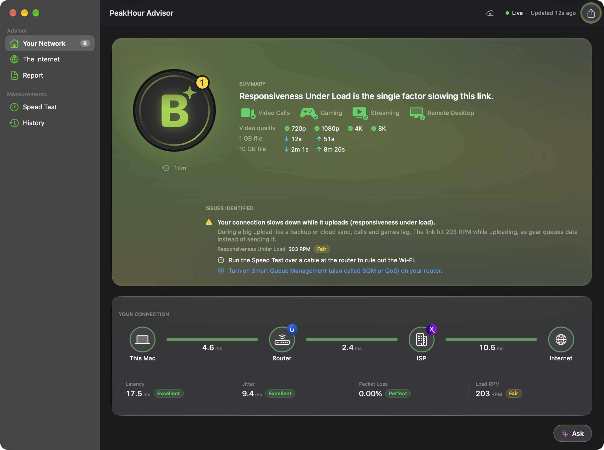
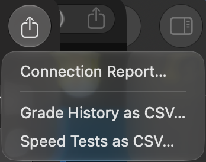

The **PeakHour Advisor** turns PeakHour's measurements into a grade and a plain-language diagnosis. It tells you what is wrong with your connection, where the problem starts, and what you can try.

It has its own window. The sidebar has two sections:

| Section | Page | What it shows |
|---------|------|---------------|
| **Advisor** | [Your Network](/user-guide/advisor/your-network/) | Your grade, the path from this Mac to the internet, and the issues that hold the grade back. |
| | [The Internet](/user-guide/advisor/the-internet/) | Problems on the route to a single site, a map of where each site answers from, and the route your traffic takes to it. |
| | [Report](/user-guide/advisor/report/) | A formatted report to send to your ISP or to support. |
| **Measurements** | [Speed Test](/user-guide/advisor/speed-test/) | Your last speed test in full, and whether your connection delivers your Internet plan. |
| | [History](/user-guide/advisor/history/) | Your grade over the last hour to 90 days, and every speed test from the last year. |

With Private Cloud Compute turned on, you can also [ask questions about your connection](/user-guide/advisor/ask/) at the bottom of every page.

## Open the Advisor

- Click the **grade** on the [Internet Dashboard](/user-guide/main-view/internet-dashboard/), in the Simple or the Detailed view. With the AI Advisor off, the same button reads **Advisor**.
- Choose **Window → PeakHour Advisor**, or press **⌥⌘A**.
- Right-click (or Control-click) the PeakHour icon in the menu bar, then choose **PeakHour Advisor**.
- Click the **ISP** column on the dashboard, then click **Open Full Report ›**. The window opens on the [Speed Test](/user-guide/advisor/speed-test/) page.

The window updates live. The top-right corner shows **Live** and the time of the last update. PeakHour grades your connection every 30 seconds, and it keeps recording the grade while the window is closed.

A small number on the rim of the grade shows how many issues hold the grade back. Its color matches the worst of them. The same number appears on the grade in the Advisor window, so you can see where the click leads.

## The grade

The grade runs from **A+** down to **F**. PeakHour works it out with fixed rules from your latency, jitter, packet loss, speed, and responsiveness under load. The Advisor never guesses the grade, and every grade below an A has at least one reason on the Your Network page. See [How the grade works](/user-guide/advisor/grade/).

## Export

The **Export** button in the toolbar saves:

- **Connection Report…** — the [report](/user-guide/advisor/report/), as a Markdown file.
- **Grade History as CSV…** — the grade history for the period that you last chose on the History page.
- **Speed Tests as CSV…** — the speed tests for the period that you last chose on the History page.

## Requirements

- **macOS 26 (Tahoe) or later.**
- **AI Advisor** turned on in [Settings → Dashboard](/user-guide/settings/dashboard/#ai-advisor), for the grade and the diagnosis. It is on by default.

The grade and the reasons come from PeakHour's own rules, so the Advisor works without Apple Intelligence. When Apple Intelligence is available, its on-device model rewrites the explanations so they read naturally. PeakHour checks every sentence the model writes: a sentence that changes or adds a number is dropped, and PeakHour shows its own wording instead.

## With the AI Advisor off

The window also opens while **AI Advisor** is turned off. It then shows your measurements without a diagnosis:

- **These still work:** the [Speed Test](/user-guide/advisor/speed-test/) page, the [History](/user-guide/advisor/history/) of your speed tests, [The Internet](/user-guide/advisor/the-internet/) page with its map and routes, and the path diagram and its four figures on [Your Network](/user-guide/advisor/your-network/).
- **These stop:** a note, **The AI Advisor is off**, takes the place of the grade and its reasons, with an **Open Settings…** button to turn it on. The **Report** row in the sidebar is grey, and you can't ask questions. No model rewrites any text.

PeakHour still records your speed tests to the History, but not your grade.

## Privacy

By default, the Advisor runs entirely on your Mac. Your measurements go to Apple only if you turn on [Private Cloud Compute](/user-guide/advisor/ask/#private-cloud-compute). Even then, your Wi-Fi name, your Mac's name, and the names and addresses of the monitors you added stay on your Mac.

The route to each site and the map use the [ISP Information](/user-guide/settings/isp-information/) lookups, which you turn on separately.
