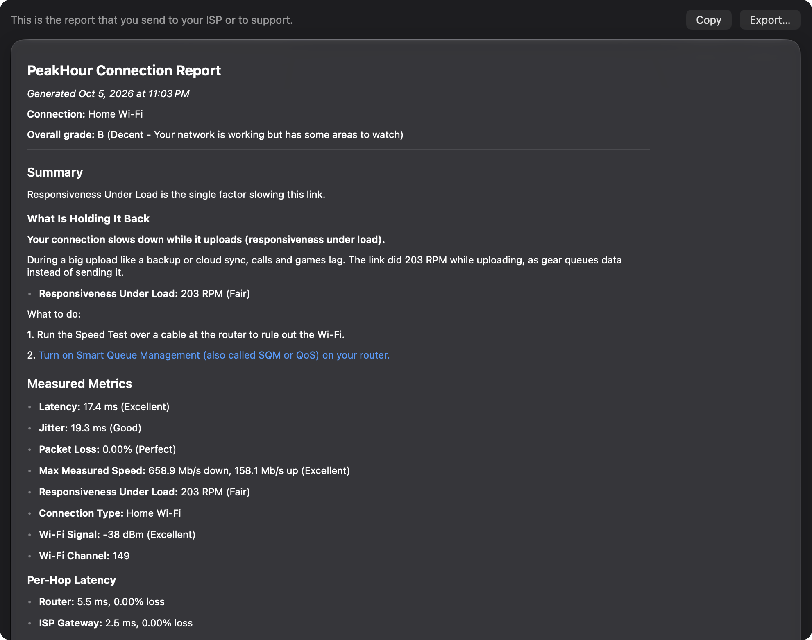

The **Report** page shows a formatted **PeakHour Connection Report** — the report to send to your ISP or to support when you need help with your connection.

It holds the same facts as the other pages, in one document:

- the date, your connection, and your **overall grade**;
- **Summary** — the summary sentence, the issues that hold the grade back, and any issues outside your network;
- **Measured Metrics** — latency, jitter, packet loss, the last speed test and responsiveness, each with its band, and your Wi-Fi signal and channel. With an [Internet plan](/user-guide/settings/dashboard/#internet-plan) set, the speed test also gives the share of your plan;
- **Per-Hop Latency** — the latency and loss to your router, your ISP's gateway and the internet;
- **Routes** — the route to each site that PeakHour monitors, as one [hop table](/user-guide/advisor/the-internet/#the-hop-table) for each site, with every router on the way. It needs [ISP Information](/user-guide/settings/isp-information/); while that is off, the section asks you to turn it on;
- **Activity Suitability** — video calls, gaming, streaming and remote desktop;
- **Analysis** — what each measurement means, the diagnostic findings, suggestions, and what already works well.

The report reflects the latest analysis, and updates with it.

The report needs the **AI Advisor**. While it is off, the **Report** row in the sidebar is grey.

## Copy or export

- **Copy** puts the report on the clipboard as Markdown text, ready to paste into an email or a support form.
- **Export…** saves it as a Markdown (`.md`) file. You can also choose **Export → Connection Report…** in the window's toolbar from any page.

Markdown is plain text with light formatting, so it reads well in any email or text editor, and support tools that understand Markdown show its headings and lists.

:::tip
To show a problem that comes and goes, pair the report with the grade history: choose **Export → Grade History as CSV…** after picking a period on the [History](/user-guide/advisor/history/) page.
:::
