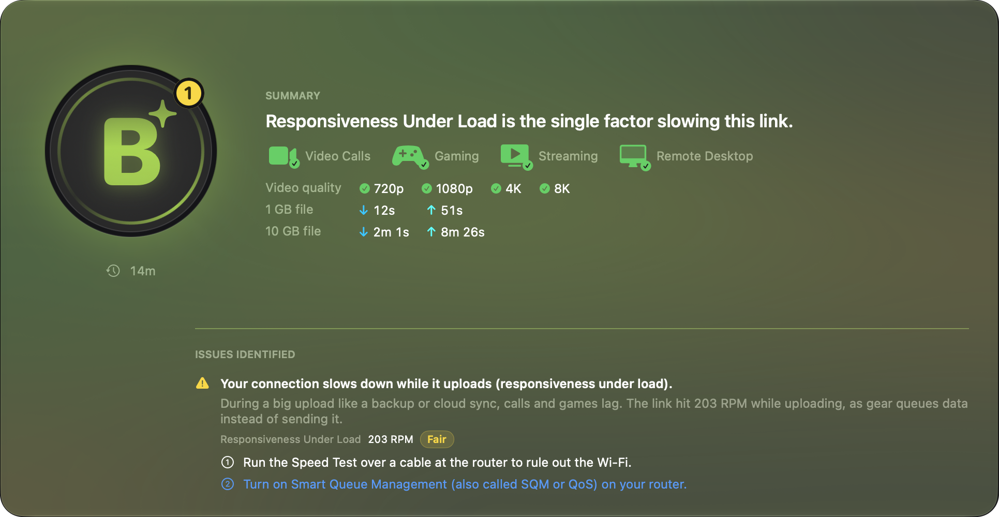
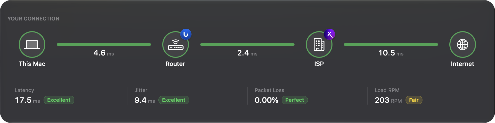
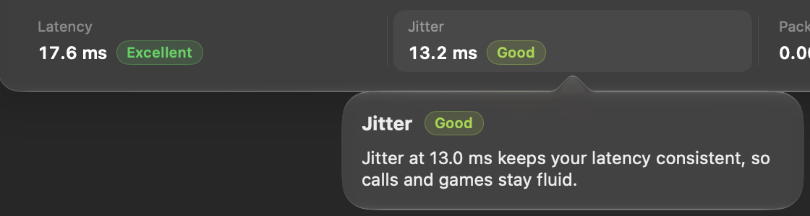

**Your Network** is the first page of the [PeakHour Advisor](/user-guide/advisor/). It answers two questions: how good is your connection right now, and if it isn't great, why not.

## The grade card

The large card at the top shows your grade, from **A+** to **F**, with a one-sentence summary. Its color follows the grade. See [How the grade works](/user-guide/advisor/grade/).

Under the summary:

- **Video Calls**, **Gaming**, **Streaming** and **Remote Desktop** — a symbol for each activity. It's green when your connection handles the activity comfortably, red when it doesn't, and grey when PeakHour needs a speed test to judge it. A badge in its corner gives the same verdict as a tick, a cross or a question mark. Hover over a symbol to see why. **Remote Desktop** also covers SSH: both need little speed, but jitter and packet loss make them stutter. See [Responsiveness and the activities](#responsiveness-and-the-activities).
- **Grade A for 2 h 14 min** (for example) — how long the current grade has held. It appears after 10 minutes. Restarting PeakHour or putting the Mac to sleep starts the count again.
- **No speed test yet** — shown while an activity is grey. Click **Run Speed Test** to start a test straight away.

### Responsiveness and the activities

**Gaming**, **Video Calls** and **Remote Desktop** show a cross when your responsiveness under load is **Poor**: below 200 RPM. PeakHour uses the lower of the download and upload values. Each game packet, call frame or key press then waits behind the data in the queue. The reason reads, for example, *Responsiveness under load is 108 RPM. Gaming can lag while the connection is busy.*

**Streaming** keeps its verdict, because a buffer hides a slow response. The responsiveness comes from your last speed test. Before the first test, the responsiveness changes no activity.

### What your speeds make possible

After a speed test, two more lines show what your measured speeds let you do:

- **Video quality** — a mark for each streaming resolution: 720p, 1080p, 4K and 8K. Hover over the line to see why.
- **1 GB file** and **10 GB file** — how long each file takes to download (↓) and to upload (↑) at your measured speeds.

### Issues identified

When the grade is below an A, the card lists each reason under **Issues identified**. Every reason has:

- **What you notice**, in plain language, with the technical term in brackets — for example *Everything takes a moment to start (latency)*.
- **Where it starts** — one of:
  - **On your Wi-Fi**
  - **At your router or its cable** (on a wired Mac)
  - **On your Wi-Fi or at your router**, when PeakHour can't tell the two apart
  - **At your ISP**
  - **Past your ISP** — further out on the internet
  - **In your VPN** or **Past your VPN server**, when a VPN carries all your traffic
- **An explanation** of what the measurement means for you, with the measurement and its band.
- **A step to try**, where one helps — for example *Turn on Smart Queue Management (also called SQM or QoS) on your router*. When a help article explains the step in more detail, the step links to it. See [Fix a Grade](/troubleshooting/fix-a-grade/).

When a trend is clear, the explanation also says whether the problem has grown or eased over the last 5 to 15 minutes.

On Wi-Fi, a low responsiveness under load has two numbered steps. Step 1 is a speed test over a cable at the router. Step 2 is Smart Queue Management (SQM) on your router. On a cable, the Advisor gives only the SQM step. See [Improve responsiveness under load](/troubleshooting/fix-a-grade/responsiveness-under-load/).

## Your connection

The second card shows the path your traffic takes, from **This Mac** to your **Router**, your **ISP**, and the **Internet**, with the latency of each link. A link changes color when one of the issues points at it. It then shows the symbol of that problem — for example a waveform for jitter — and the name of the problem under its latency.

A link can also read:

- **No answer** — the link stopped answering.
- **Not measured** — a grey link that works, but that PeakHour has no measurement for. This happens when your ISP blocks traceroute: the sites answer, but PeakHour can't find your ISP's router to measure it.

Under the path are your **Latency**, **Jitter**, **Packet Loss** and **Load RPM** (responsiveness under load), each with its band.

- **Click a figure** to read what it measures and what your value means.
- **An arrow** beside latency, jitter or packet loss shows whether it is rising, falling or steady over the last few minutes. Hover over the arrow for the details. The arrows appear after about 5 minutes of readings.

## With the AI Advisor off

While **AI Advisor** is turned off in [Settings → Dashboard](/user-guide/settings/dashboard/#ai-advisor), a note — **The AI Advisor is off** — takes the place of the grade card. Click **Open Settings…** to turn it on. The **Your connection** card, with the path and its four figures, still works. See [With the AI Advisor off](/user-guide/advisor/#with-the-ai-advisor-off).

## When a VPN is on

When a VPN carries all of your traffic, the path reads **This Mac → Router → VPN → Internet**. The link after your router is the tunnel, and the location and the delays past it belong to the VPN server, not to your home connection. A problem inside the tunnel is placed **In your VPN**, and its step to try is to turn the VPN off for a moment or pick another server.

PeakHour still measures your router directly over Wi-Fi or Ethernet, so a problem on your own network keeps pointing at your Wi-Fi or your router.
