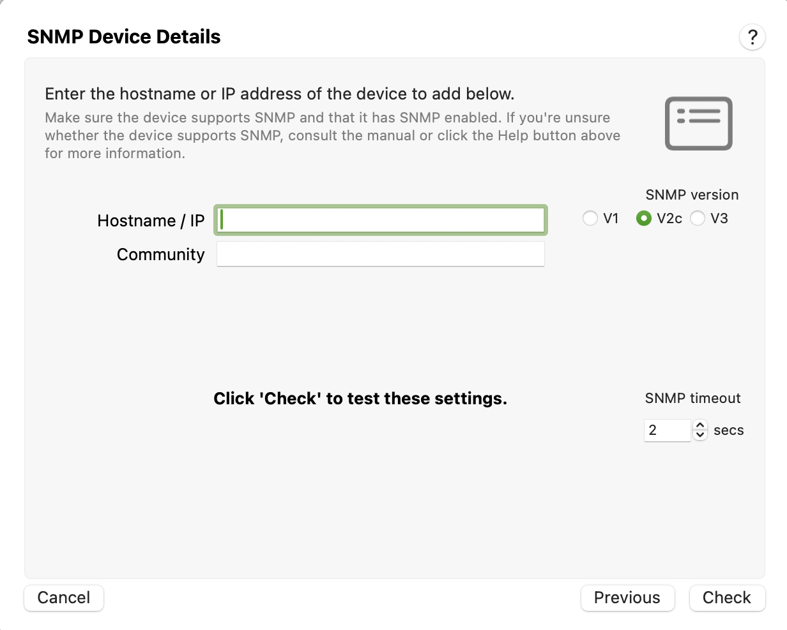
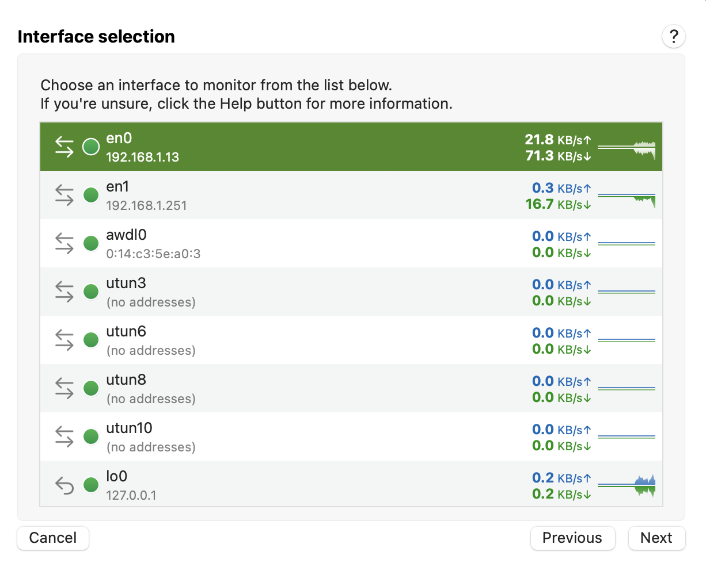

PeakHour supports monitoring the throughput of devices that support SNMPv1, v2c and v3. PeakHour supports both 32-bit and 64-bit counters.

Before you can add a device, you need to know the following:

1.  The device’s hostname or IP address

2.  Security credentials:  
    **SNMP v1, v2c:** the SNMP community string (a password, essentially)  
    **SNMPv3:** the Security Name, Auth Key and optional Privacy Key

3.  The interface(s) you want to monitor.

<table>
<tbody>
<tr class="odd">
<td><strong>Device Name</strong></td>
<td>The hostname, FQDN or IP address of the SNMP-compatible device you wish to monitor.</td>
</tr>
<tr class="even">
<td><strong>Community (SNMP v1, SNMP v2c</strong></td>
<td>
The SNMP community this device will respond to. The SNMP community is essentially a password; the device will only respond if the community string is correct.

Note the community need only be read-only, not read-write (although read-write will work also, but it is more permission than PeakHour needs).
</td>
</tr>
<tr class="odd">
<td><strong>Security Name</strong> 
<strong>Security Mode</strong> 
<strong>Auth Key</strong> 
<strong>Privacy Key</strong> 
<strong>Protocol</strong> 
<strong>(SNMP v3 only)</strong></td>
<td>
SNMPv3 provides must stronger security, authentication and encryption of data. SNMPv3 newer than SNMPv1/v2c and generally only supported by more fully featured devices. If you're unsure which version your router supports, try SNMPv1/v2c first. 

For more information on SNMPv3 security, see this page:

<a href="http://www.snmp.com/snmpv3/snmpv3_intro.shtml" class="external-link">http://www.snmp.com/snmpv3/snmpv3_intro.shtml</a>

</td>
</tr>
</tbody>
</table>

## Choosing an interface

SNMP allows you to choose which network interface to monitor. For example, your broadband router might have a WAN / Internet Port as well as a number of LAN (local) ports that you plug other devices into. In addition, it might also have a Wi-Fi interface for wireless devices to connect to.

You should choose the interface that you'd like PeakHour to monitor. If you want to monitor more than one interface (say, both Internet and WiFi), add the device more than once, choosing a different interface each time.

Most of the time, you'll want to at least monitor the Internet interface. On many routers, this might be called:

  - **wan0**

  - **pppoe0**

  - **pppoa0**

  - **internet**

or something similar. Note that interface names vary from manufacturer to manufacturer and device to device so you may need to do a little detective work if you're not sure (see below for our tip on using Speedtest).

### Which interface?

If you want to monitor Internet usage and you're unsure which interface, a good way to test is to visit somewhere like <http://speedtest.net> whilst the Interface list is visible. Watch each interface and see which one corresponds closest to the throughput of [speediest.net](http://speediest.net).

  
For information on the next steps in the wizard, see [Configuration Assistant](/user-guide/configuration-assistant/).

