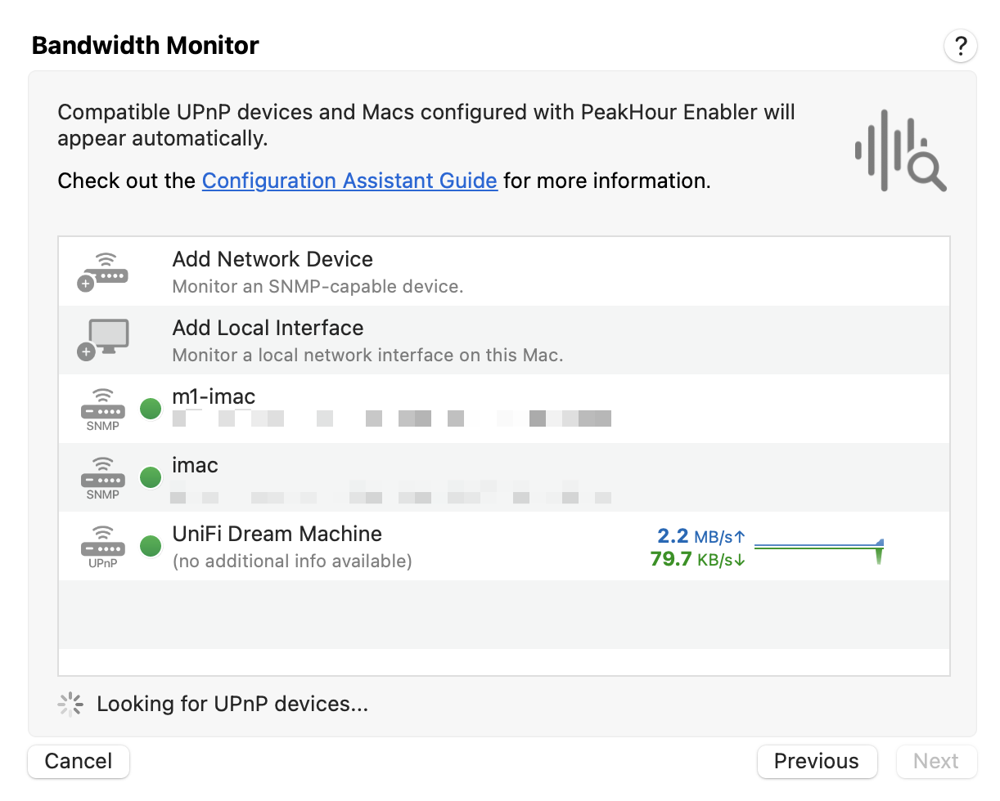
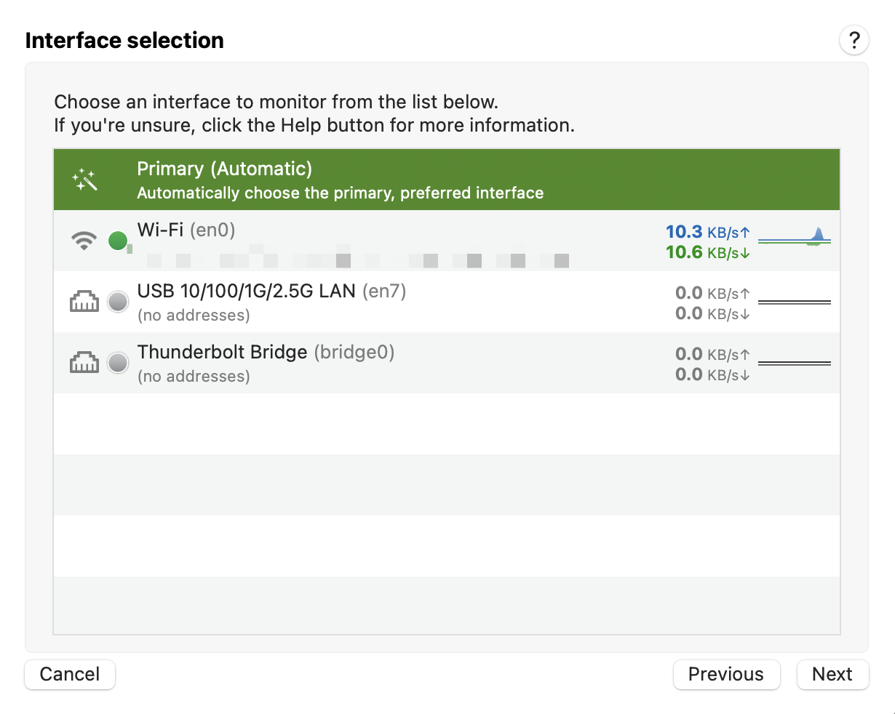
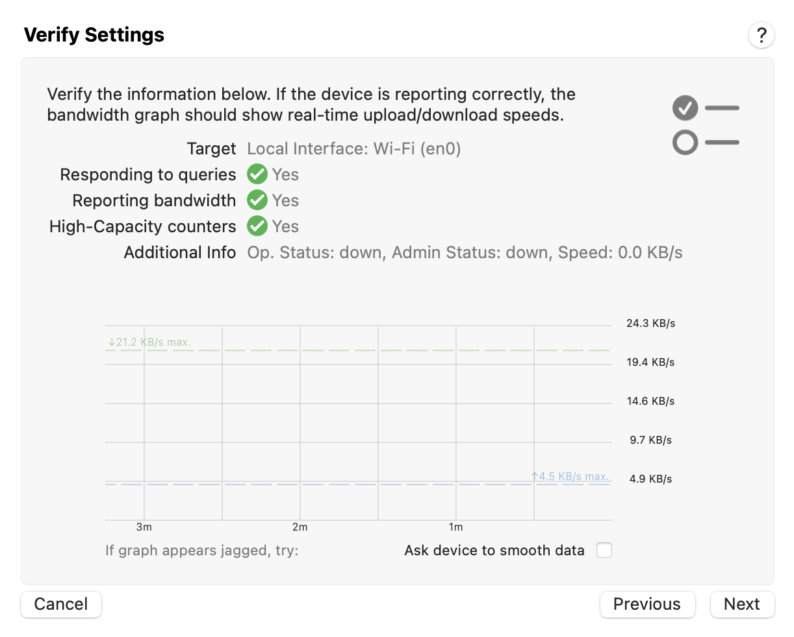
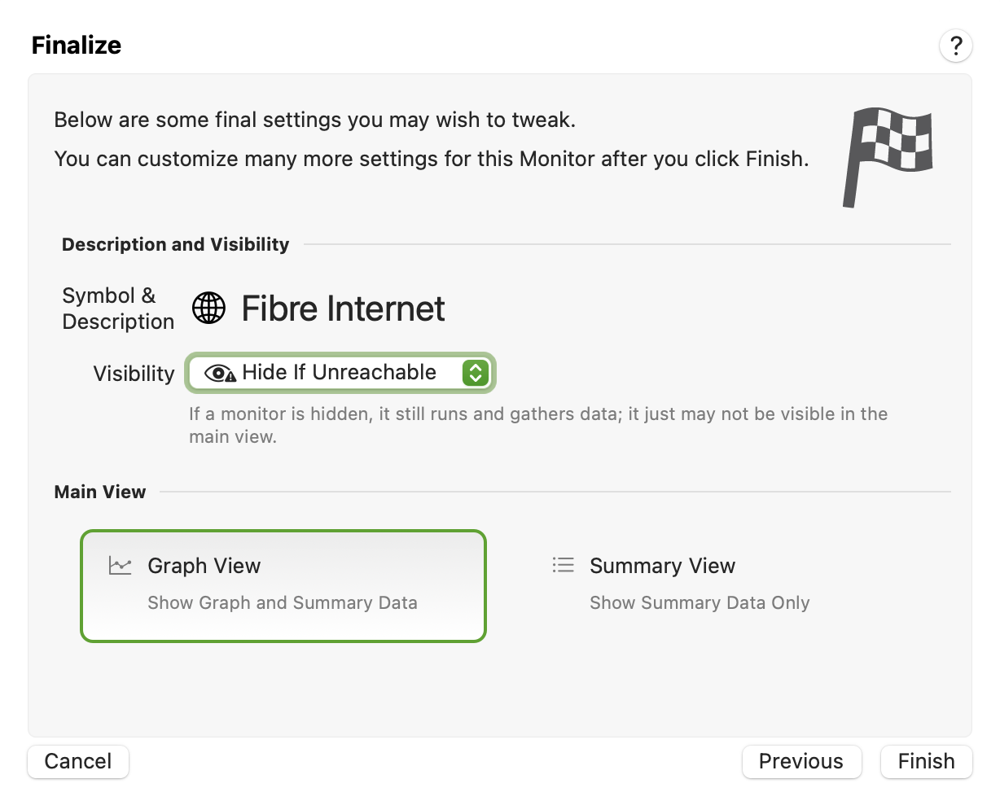

[Interface selection \[SNMP and Local Interface\]](#ConfigurationAssistant:BandwidthMonitor-Interfaceselection%5BSNMPandLocalInterface%5D) | [Verify settings](#ConfigurationAssistant:BandwidthMonitor-Verifysettings) | [Finalise](#ConfigurationAssistant:BandwidthMonitor-Finalise) | [Didn't find any UPnP or SNMP-compatible devices?](#ConfigurationAssistant:BandwidthMonitor-Didn'tfindanyUPnPorSNMP-compatibledevices?) | [What next?](#ConfigurationAssistant:BandwidthMonitor-Whatnext?) | [Still need help?](#ConfigurationAssistant:BandwidthMonitor-Stillneedhelp?)

When configuring a Bandwidth Monitor, you have three different ways in which bandwidth can be measured:

  - UPnP (Universal Plug and Play)

  - SNMP (Simple Network Management Protocol)

  - Local Interface on your Mac

When configuring or editing a Bandwidth Monitor, the first page shows a list of available options:

  - **Add Network Device**  
    This option lets you manually add and configure an SNMP device to be monitored. For detailed instructions on how to add an SNMP device, see: [Adding an SNMP Device](/user-guide/configuration-assistant/configuration-assistant-bandwidth-monitor/adding-an-snmp-device/).

  - **Add Local Interface**  
    This option lets you choose an interface on your Mac to monitor. See below for more details.

  - **Discovered devices**  
    Below the two options above is a list of discovered devices. This will contain devices that have been auto-discovered via [UPnP](https://peakhoursupport.atlassian.net/wiki/spaces/P5W/pages/9503464/UPnP) , as well as other Macs that are running SNMP via PeakHour Enabler. If you have UPnP devices on your network, but do not see them here, see our [UPnP Troubleshooting](https://peakhoursupport.atlassian.net/wiki/spaces/P5W/pages/9503200/UPnP+Troubleshooting) guide.

## Interface selection \[SNMP and Local Interface\]

This screen lets you choose the interface to monitor.

If you’re adding/editing an SNMP monitor, you’ll see a list of interfaces on the device.

If you’re adding/editing a Local Interface monitor, you’ll see a list of interfaces on your Mac.

Choose the interface to monitor and click **Next**.

## Verify settings

The Validation screen analyses the configuration and attempts to show a real-time view of bandwidth throughput.

The following describes the what the analysis means:

|                                        |                                                                                                                                                                                                                                                                                                                                                                                                                                                                         |
| -------------------------------------- | ----------------------------------------------------------------------------------------------------------------------------------------------------------------------------------------------------------------------------------------------------------------------------------------------------------------------------------------------------------------------------------------------------------------------------------------------------------------------- |
| **Responding to queries**              | Whether or not the device is responding to (SNMP or UPnP) queries and returning meaningful responses.                                                                                                                                                                                                                                                                                                                                                                   |
| **Reporting bandwidth**                | Whether or not the device appears to be reporting bandwidth correctly. This will be Yes if PeakHour can see that the device / interface is reporting traffic moving through the device. Note that this can be Yes but the device or interface may not report bandwidth correctly. In order to ensure whats being reported matches up with what you expect, we recommend a test by either downloading a file of a known size or using a site like <http://speedtest.net> |
| **High Capacity Counters (SNMP only)** | If this is Yes, the interface supports High Capacity (64-bit) counters. See [High Capacity Counters](https://peakhoursupport.atlassian.net/wiki/spaces/WIKI3/pages/458852/High+Capacity+Counters) for more information.                                                                                                                                                                                                                                                 |

If the graph appears to be showing throughput as you'd expect, click **Next**.

## Finalise

The last screen in the Configuration Assistant lets you set a few important parameters:

<table>
<tbody>
<tr class="odd">
<td><strong>Symbol &amp; Description</strong></td>
<td>The symbol and description (or name) for this Monitor. Click either to change them.</td>
</tr>
<tr class="even">
<td><strong>Visibility</strong></td>
<td><ul>
<li>
<strong>Hide If Unreachable:</strong> Hide this Monitor if it can’t be reached or is otherwise offline.
</li>
<li>
<strong>Always Visible:</strong> Always show this Monitor.
</li>
<li>
<strong>Always Hide:</strong> Always hide this Monitor.
</li>
</ul></td>
</tr>
<tr class="odd">
<td><strong>Graph View / Summary View</strong></td>
<td><ul>
<li>
<strong>Graph View:</strong> Shows this Monitor with graph (expanded) in the main view.
</li>
<li>
<strong>Summary View:</strong> Shows this Monitor without the graph (collapsed) in the main view.
</li>
</ul></td>
</tr>
</tbody>
</table>

Once you're done, click Finish. The new monitor should appear in the Main Window and, if configured, the menu bar.

### Didn't find any UPnP or SNMP-compatible devices?

Check out our [Bandwidth Monitoring FAQ](https://peakhoursupport.atlassian.net/wiki/spaces/P5W/pages/9502997/Bandwidth+Monitoring+FAQ) for help and troubleshooting tips.

## What next?

There are lots more ways to customize Bandwidth Monitors. For all the details, check the [Bandwidth Monitor](/user-guide/settings/monitors-settings/bandwidth-monitor/) tab in Settings.

# Still need help?

  - [Bandwidth Monitoring FAQ](https://peakhoursupport.atlassian.net/wiki/spaces/P5W/pages/9502997/Bandwidth+Monitoring+FAQ)

  - [Can PeakHour monitor the usage of individual computers / devices?](https://peakhoursupport.atlassian.net/wiki/spaces/P5W/pages/9503017/Can+PeakHour+monitor+the+usage+of+individual+computers+devices)

  - [I'd like to monitor my Mac/PC/Linux devices. How can I enable them?](https://peakhoursupport.atlassian.net/wiki/spaces/P5W/pages/9503037/I+d+like+to+monitor+my+Mac+PC+Linux+devices.+How+can+I+enable+them)

  - [Can PeakHour monitor the usage of individual computers / devices?](https://peakhoursupport.atlassian.net/wiki/spaces/P5W/pages/9503017/Can+PeakHour+monitor+the+usage+of+individual+computers+devices)

