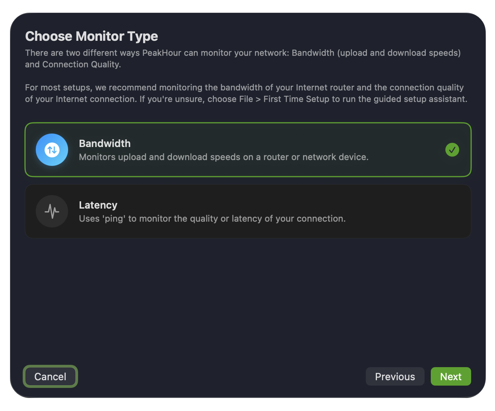
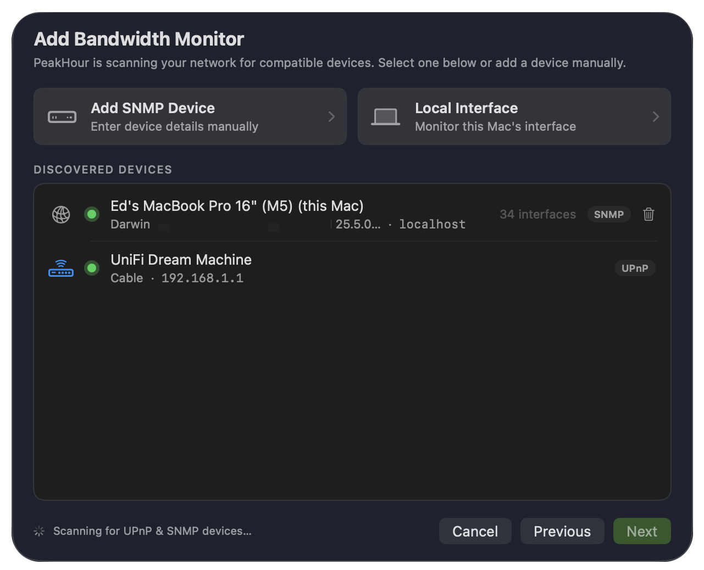
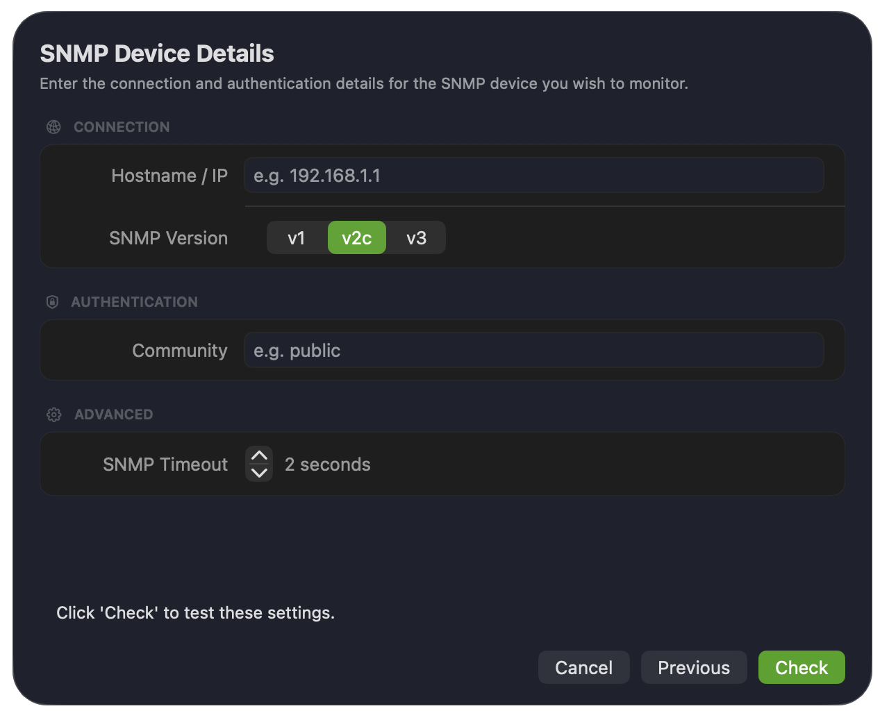
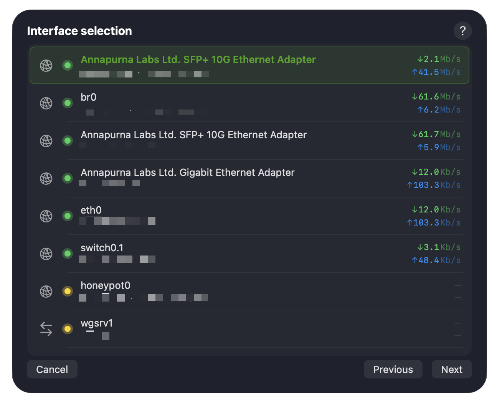
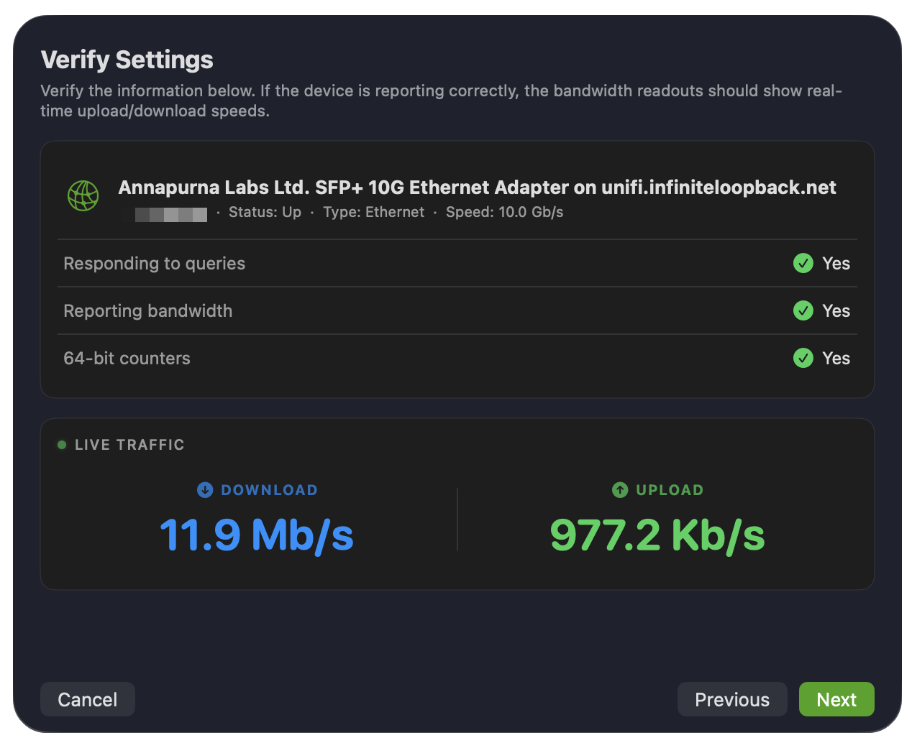
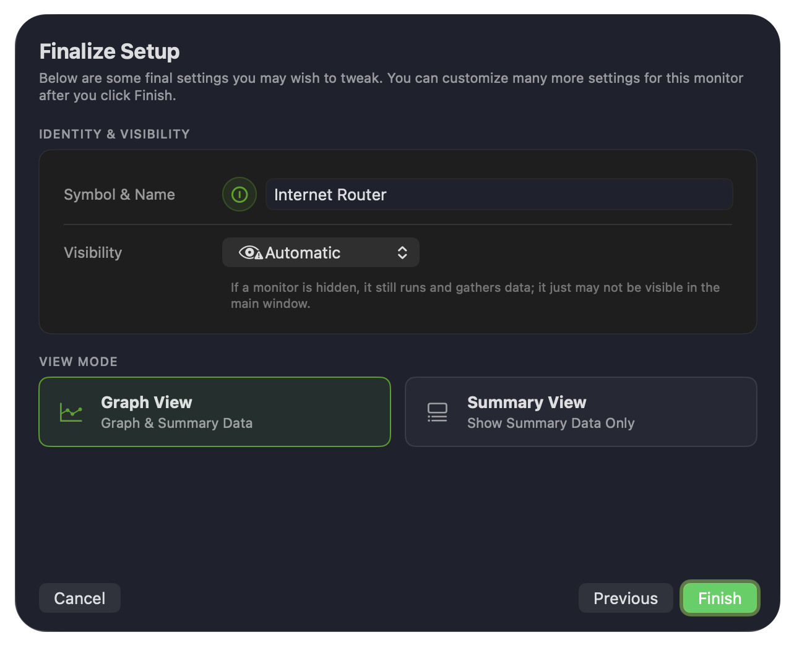

A Bandwidth Monitor measures the upload and download throughput of a device on your network. The Configuration Assistant walks you through adding one step by step.

PeakHour can measure bandwidth in three ways:

- **UPnP** (Universal Plug and Play) — for routers that report throughput over UPnP. These devices are discovered automatically.
- **SNMP** (Simple Network Management Protocol) — for routers, switches, and other devices that support SNMP. PeakHour supports SNMPv1, v2c, and v3, with both 32-bit and 64-bit counters.
- **Local Interface** — an interface on your Mac itself, such as Wi-Fi or Ethernet.

## 1. Choose the monitor type

The first screen asks what kind of monitor you want to add. Choose **Bandwidth** and click **Next**.

To monitor latency instead, choose **Latency** — see [Configuration Assistant: Latency](/user-guide/configuration-assistant/configuration-assistant-latency/).

## 2. Choose a device

PeakHour scans your network for compatible devices and lists what it finds. You have three choices:

- **Add SNMP Device** — enter an SNMP device's details manually. Use this when the device you want isn't discovered automatically.
- **Local Interface** — monitor an interface on this Mac.
- **Discovered devices** — the list below the two buttons. It includes devices found via UPnP, along with other Macs running SNMP via [PeakHour Enabler](/user-guide/monitor-another-mac-peakhour-enabler/). Each entry shows a status dot, the device's address, and a badge indicating how it was found (**UPnP** or **SNMP**).

Select a device or button and click **Next**.

## 3. Enter SNMP details

If you chose **Add SNMP Device**, enter the device's connection and authentication details. Before you start, make sure you have the device's hostname or IP address and its SNMP credentials — the **community string** for SNMP v1/v2c, or the **Security Name**, **Auth Key**, and optional **Privacy Key** for SNMPv3.

| Field | Description |
|-------|-------------|
| **Hostname / IP** | The hostname, FQDN, or IP address of the device you want to monitor. |
| **SNMP Version** | The SNMP version the device uses — **v1**, **v2c**, or **v3**. If you're unsure, try v1/v2c first. |
| **Community** | The SNMP community string (essentially a password) the device responds to. A read-only community is sufficient. Shown for v1 and v2c. |
| **SNMP Timeout** | How long PeakHour waits for a response before giving up. The default of 2 seconds suits most networks. |

When you select **v3**, additional authentication fields replace **Community**:

| Field | Description |
|-------|-------------|
| **Security Name** | The SNMPv3 username the device authenticates against. |
| **Security Mode** | The level of security to use — authentication and/or privacy (encryption). |
| **Auth Key** | The authentication passphrase for the security name. |
| **Privacy Key** | The optional passphrase used to encrypt the data. |
| **Protocol** | The authentication and privacy algorithms the device expects. |

SNMPv3 adds stronger authentication and encryption, but it's newer and generally only supported by more capable devices. For background on SNMPv3 security, see [snmp.com's SNMPv3 introduction](http://www.snmp.com/snmpv3/snmpv3_intro.shtml).

Click **Check** to test the settings.

:::note
This step only appears for SNMP devices. If you chose a discovered UPnP device or a local interface, the assistant skips straight to the next step.
:::

## 4. Select an interface

SNMP and local-interface devices can have several network interfaces. Choose the one you want to monitor and click **Next**.

Each interface shows its current download (↓) and upload (↑) throughput, which makes it easier to spot the right one. Most of the time you'll want the Internet (WAN) interface — on many routers this is named `wan0`, `pppoe0`, `internet`, or similar. Interface names vary between manufacturers and devices, so you may need to do a little detective work if you're not sure which one to pick.

:::tip
If you're not sure which interface carries your internet traffic, run a speed test at [speedtest.net](https://www.speedtest.net) while this list is visible, and watch which interface's throughput tracks the test.
:::

To monitor more than one interface (say, both Internet and Wi-Fi), add the device again and choose a different interface each time.

## 5. Verify settings

The Verify Settings screen checks the configuration and shows a live view of throughput so you can confirm everything is working before finishing.

| Check | What it means |
|-------|---------------|
| **Responding to queries** | Whether the device responds to SNMP or UPnP queries and returns meaningful data. |
| **Reporting bandwidth** | Whether the device appears to report traffic correctly. This can read **Yes** even if the figures don't match your expectations, so confirm with a real test — download a file of known size or run a speed test and watch the **Live Traffic** readout. |
| **64-bit counters** *(SNMP only)* | Whether the interface supports high-capacity (64-bit) counters, which are needed to measure high-speed links accurately. |

If the **Live Traffic** readout reflects throughput as you'd expect, click **Next**.

## 6. Finalize setup

The last screen sets a few key parameters. You can adjust all of these (and many more) later in [Settings → Bandwidth Monitor](/user-guide/settings/monitors-settings/bandwidth-monitor/).

| Setting | Description |
|---------|-------------|
| **Symbol & Name** | The icon and name for the monitor. Click either to change it. |
| **Visibility** | Whether the monitor appears in the main window. **Automatic** hides it when it can't be reached; you can also force it to always show or always hide. A hidden monitor still runs and gathers data — it just may not be visible. |
| **View Mode** | **Graph View** shows the monitor with its graph; **Summary View** shows summary data only (collapsed). |

Click **Finish**. The new monitor appears in the main window and, if configured, the menu bar.

## What next?

There are many more ways to customise a Bandwidth Monitor — see the [Bandwidth Monitor](/user-guide/settings/monitors-settings/bandwidth-monitor/) settings.

If PeakHour didn't find your device, double-check that UPnP or SNMP is enabled on it, then use **Add SNMP Device** to add it by hostname or IP.
