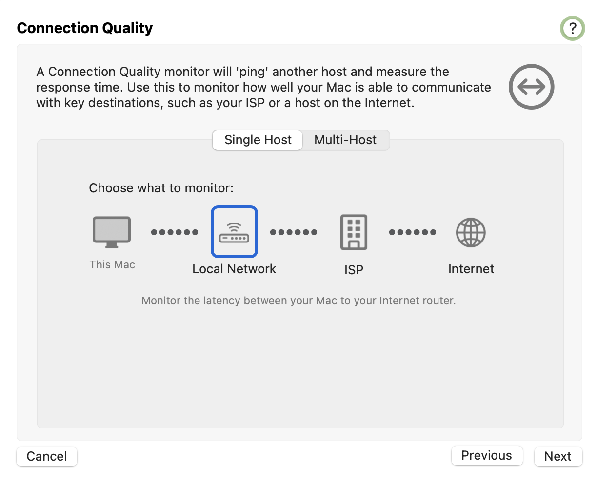
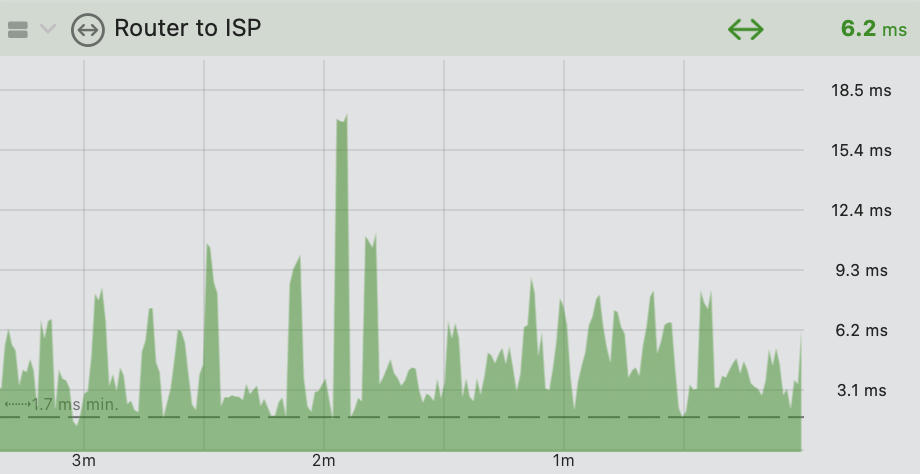

import NeedsReview from '@/components/NeedsReview.astro';

<NeedsReview />

[Single Host vs. Multi-Host](#ConfigurationAssistant:ConnectionQuality-SingleHostvs.Multi-Host) | [Single Host](#ConfigurationAssistant:ConnectionQuality-SingleHost) | [Multi-Host](#ConfigurationAssistant:ConnectionQuality-Multi-Host)

A Connection Quality monitor pings the host and measures the time it takes for a response to come back. This allows you to monitor the quality or latency to that host. If the Internet Dashboard is enabled, PeakHour will automatically create a series of Connection Quality monitors. These monitors will measure the latency to your router, ISP and the wider Internet.

Adding a new Connection Quality monitor allows you to choose which point on the Internet to monitor. You can set up multiple Connection Quality monitors to monitor different points on the Internet (e.g. NetFlix or your VPN connection to work).

Enabling the Internet Dashboard will automatically set up a series of Connection Quality monitors that will monitor important points of your Internet connection.

### Single Host vs. Multi-Host

#### Single Host

Single host monitors are simple ping monitors that measure the latency to a host on the Internet. PeakHour supports a number of automated monitors that will automatically look up the host for you:

  - **Local Network**  
    A Local Network monitor will monitor the latency to your local Internet gateway router. Typically this is the first ‘hop’ from your Mac. Your Internet router will be automatically discovered using Traceroute, a mechanism for discovering hops along a packet’s route.

  - **ISP**  
    An ISP monitor will monitor the latency to your ISP. Typically this is the 2nd hop from your Mac, but you can configure this to be the 3rd or 4th hop, if for some reason the hop doesn’t respond to ping, or isn’t able to be resolved / discovered.

  - **Internet**  
    An Internet monitor will let you monitor the latency to any hostname or IP address on the Internet.

#### Multi-Host

A Multi-Host monitor allows you to measure the latency between two different points on the Internet. For example, you can use a Multi-Host monitor to measure the latency between your Internet router and your ISP. This allows you to better determine the source of high or inconsistent latency than a Single Host monitor.

The Internet Dashboard creates Multi-Host monitors to measure the latency between your Router and your ISP as well as the ISP to several key hosts on the Internet. You can add your own Multi-Host monitors or customize the monitors that are created automatically.

