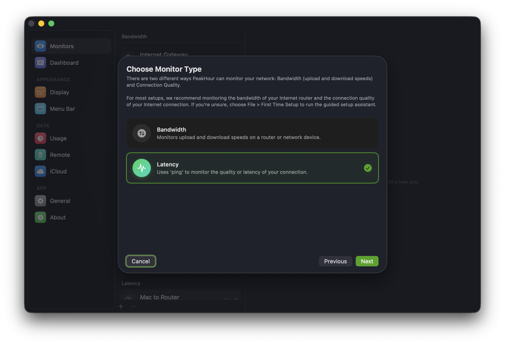
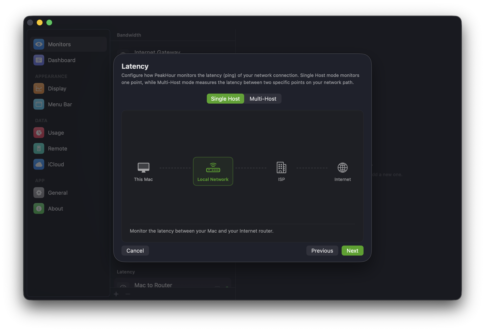
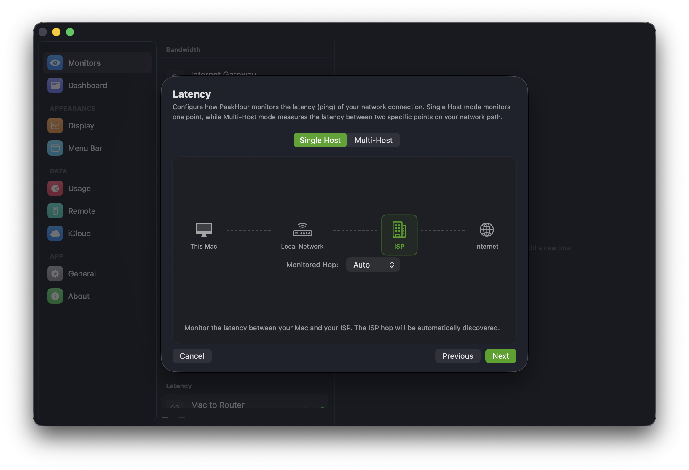
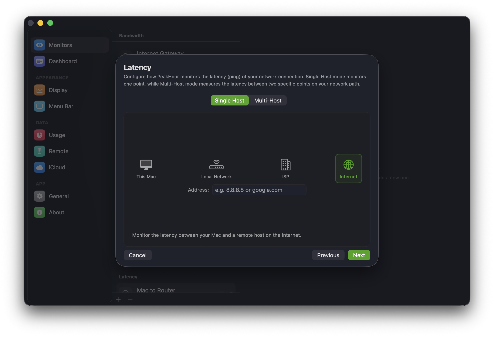
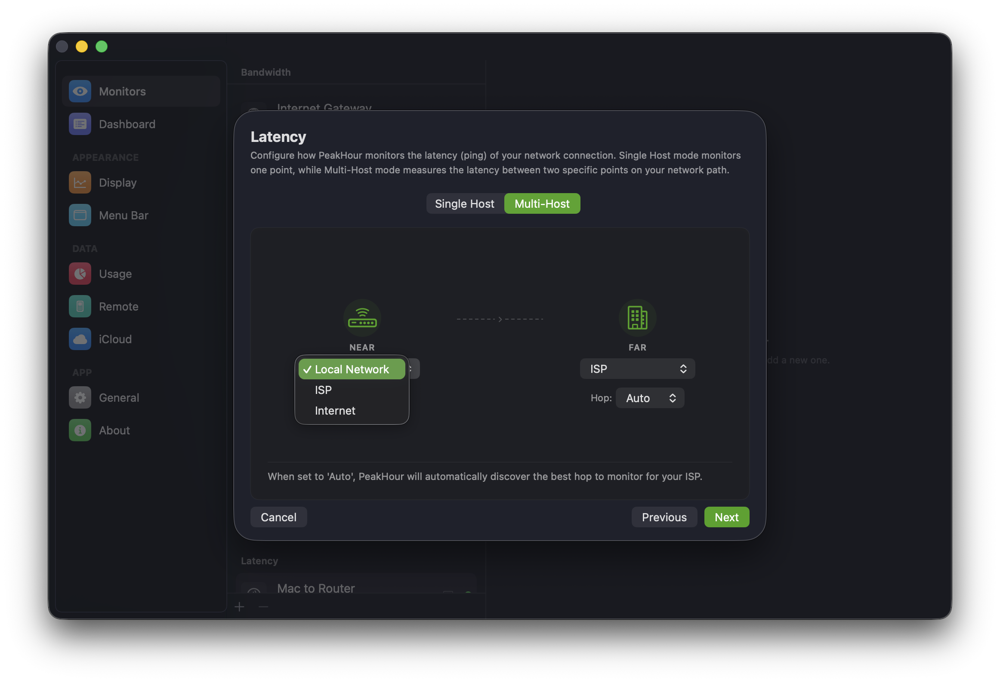
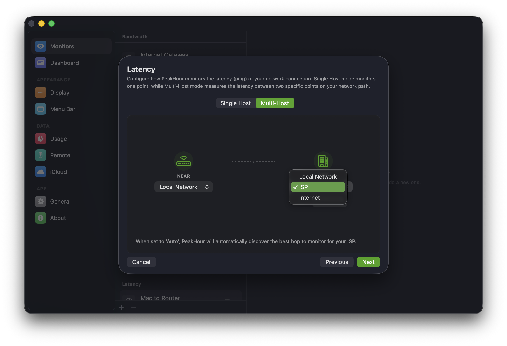
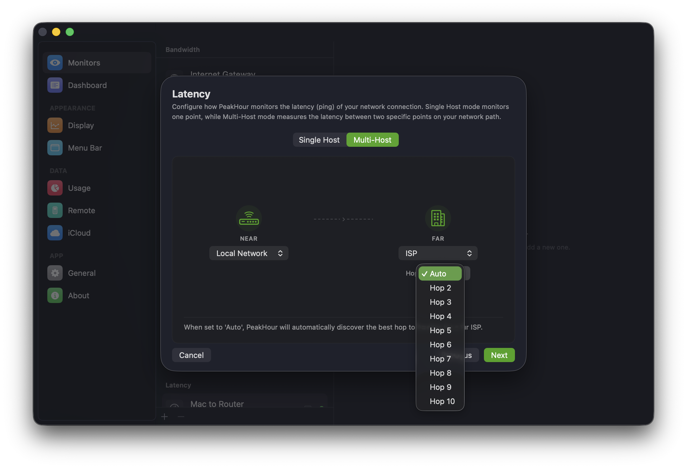
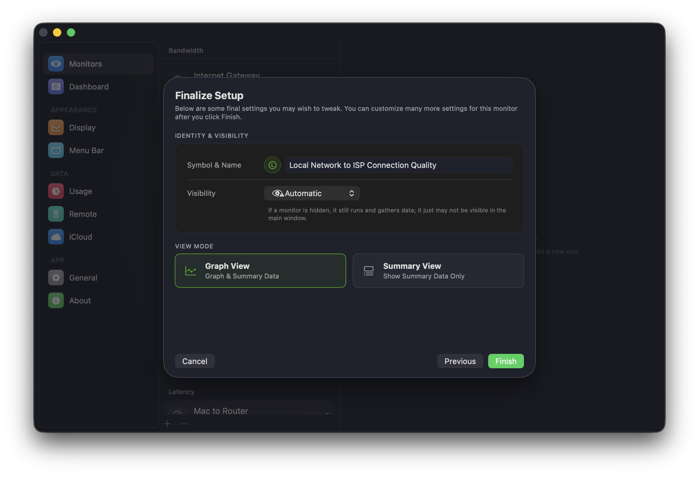

A Latency Monitor pings a host or hop and measures the round-trip time for a reply to come back, letting you track the latency and responsiveness of a point on your network path. The Configuration Assistant walks you through adding one step by step.

:::note
When the [Internet Dashboard](/user-guide/main-view/internet-dashboard/) is enabled, PeakHour automatically creates a series of Latency Monitors for your router, ISP, and several hosts on the internet. You can add your own monitors here, or customise the ones created automatically.
:::

## 1. Choose the monitor type

The first screen asks what kind of monitor to add. Choose **Latency** and click **Next**.

To monitor throughput instead, choose **Bandwidth** — see [Configuration Assistant: Bandwidth Monitor](/user-guide/configuration-assistant/configuration-assistant-bandwidth-monitor/).

## 2. Choose what to measure

The Latency screen lets you pick what to measure using the **Single Host** / **Multi-Host** toggle at the top:

- **Single Host** — measures the latency from your Mac to one point on the path.
- **Multi-Host** — measures the latency *between* two points, isolating a specific segment of the path.

### Single Host

In Single Host mode, pick the endpoint to measure the latency to. The path runs **This Mac → Local Network → ISP → Internet**; select the point you want.

#### Local Network

Measures the latency from your Mac to your local internet gateway (router) — typically the first hop. PeakHour discovers the router automatically using traceroute.

#### ISP

Measures the latency from your Mac to your ISP — typically the second hop. The **Monitored Hop** dropdown defaults to **Auto**, which discovers the right hop for you; set a specific hop only if the auto-discovered one doesn't respond to ping.

#### Internet

Measures the latency from your Mac to any host you choose. Enter a hostname or IP address (for example, `8.8.8.8` or `google.com`) in the **Address** field.

### Multi-Host

Multi-Host mode measures the latency between two points on the path — a **Near** endpoint and a **Far** endpoint — so you can isolate where high or inconsistent latency is coming from. This is how the Internet Dashboard measures hops like **Router → ISP**.

Choose the **Near** and **Far** endpoints from their dropdowns. Each can be **Local Network**, **ISP**, or **Internet**.

When an endpoint is set to **ISP**, a **Hop** dropdown appears. Leave it on **Auto** to let PeakHour discover the best hop for your ISP, or pick a specific hop (Hop 2–Hop 10) if needed.

When you've chosen what to measure, click **Next**.

## 3. Finalize setup

The last screen sets a few key parameters. PeakHour suggests a name based on the endpoints you chose. You can adjust all of these (and many more) later in [Settings → Latency Monitor](/user-guide/settings/monitors-settings/latency-monitor/).

| Setting | Description |
|---------|-------------|
| **Symbol & Name** | The icon and name for the monitor. Click either to change it. |
| **Visibility** | Whether the monitor appears in the main window. **Automatic** hides it when it can't be reached; you can also force it to always show or always hide. A hidden monitor still runs and gathers data — it just may not be visible. |
| **View Mode** | **Graph View** shows the monitor with its graph; **Summary View** shows summary data only (collapsed). |

Click **Finish**. The new monitor appears in the main window and, if configured, the menu bar.

## What next?

There are many more ways to customise a Latency Monitor — see the [Latency Monitor](/user-guide/settings/monitors-settings/latency-monitor/) settings, where you can adjust polling intervals, latency thresholds, packet count, and colors.
