A Latency Monitor pings a host or hop and measures the round-trip time for a reply to come back, letting you track the latency and responsiveness of a point on your network path. The Configuration Assistant walks you through adding one step by step.

:::note
When the [Internet Dashboard](/user-guide/main-view/internet-dashboard/) is enabled, PeakHour automatically creates a series of Latency Monitors for your router, ISP, and several hosts on the internet. You can add your own monitors here, or customise the ones created automatically.
:::

## 1. Choose the monitor type

The first screen asks what kind of monitor to add. Choose **Latency** and click **Next**.

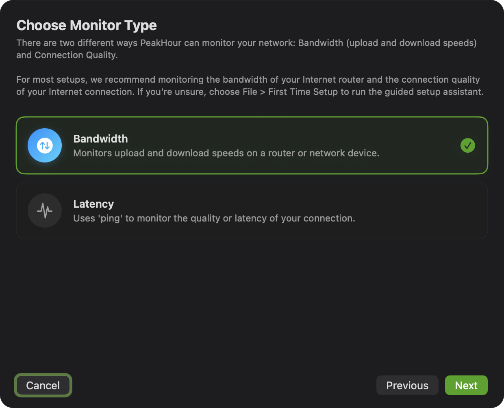

To monitor throughput instead, choose **Bandwidth** — see [Configuration Assistant: Bandwidth Monitor](/user-guide/configuration-assistant/configuration-assistant-bandwidth/).

## 2. Choose what to measure

A new latency monitor starts on the **What to Measure** page: *Choose the part of your connection to monitor.* The page shows three cards. Each card has a small picture of the path from this Mac to your router, your ISP and the internet. The green part of the picture is the part that the monitor measures.

| Card | What it measures | When to use it |
|------|------------------|----------------|
| **ISP to Internet** | From your ISP to a site, past your home network. | It shows if a delay is outside your home. |
| **One Host** | From this Mac to one host, through your home network. | It shows the delay that your apps feel. |
| **Custom** | Between any two points on the path. | For a specific router, ISP hop or site. |

- **ISP to Internet** is the default, and has the label **Recommended**. Your home network isn't part of the result. The Internet Dashboard makes the same type of monitor for its sites, for example **ISP to Cloudflare**.
- **One Host** measures the whole path from this Mac. The result includes your home network: the link from this Mac to the router, and the router.
- **Custom** gives you all the settings. The green part of its picture moves along the path, because you choose the two points.

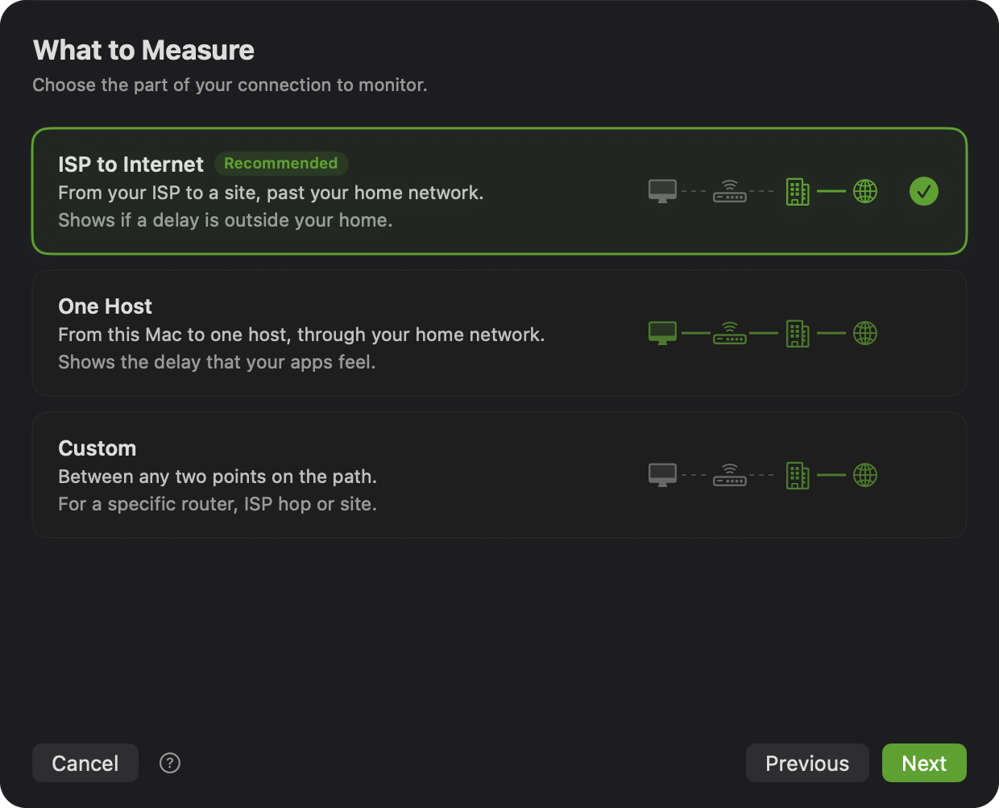

Click a card, then click **Next**. You can also double-click a card.

:::tip
The **?** button beside **Cancel** opens this help page.
:::

## 3. Set up the monitor

The next page has the title **Latency**. It shows only the settings of the card that you chose. To choose another card, click **Previous**. The assistant keeps each value that still applies, for example the site.

### ISP to Internet

*Measures only the path from your ISP to a site.* The path shows **This Mac**, **Local Network**, **ISP** and the site. Only the part from the ISP to the site is green.

Choose the site from the **Site** menu:

- The menu has the same sites as the [Internet Hosts](/user-guide/settings/dashboard/#internet-hosts) of the dashboard, in groups such as **DNS Providers**, **AI Services** and **Streaming & Entertainment**.
- Choose **Custom…** to type a host name or an IP address. To go back to the list, click the list button beside the field.

**Next** is available after you choose a site. The line under the path names the site, for example *Monitor the latency between your ISP and Cloudflare. Your home network is not part of the result.* PeakHour finds the hop of your ISP automatically. To measure from a specific ISP hop, use **Custom**.

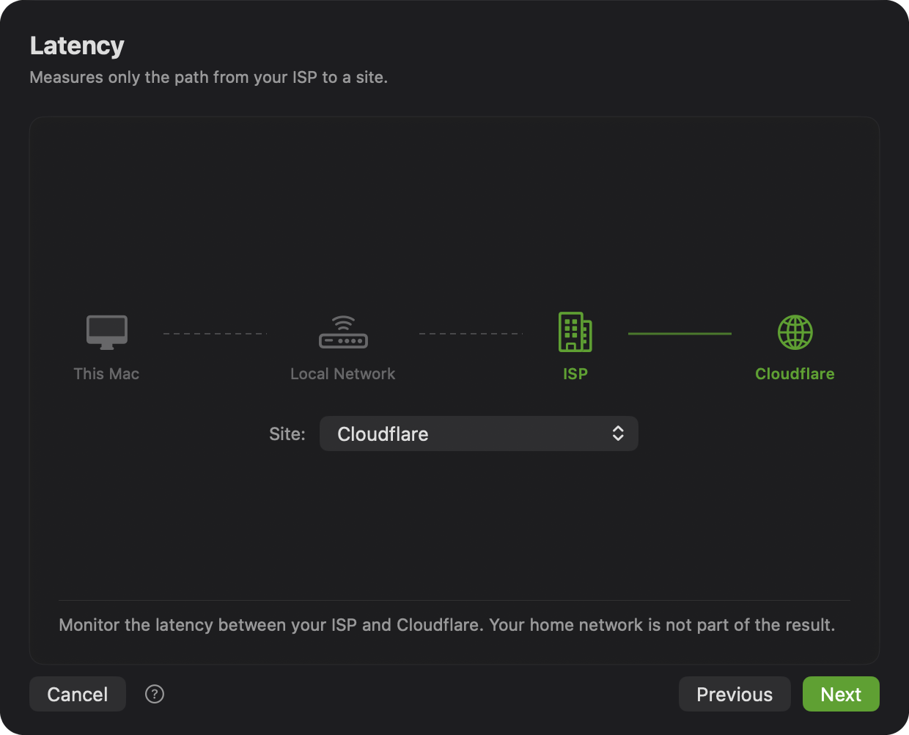

### One Host

*Measures the whole path from this Mac to one host.* Click the point on the path to measure to: **Local Network**, **ISP** or **Internet**. **This Mac** and each point up to the one you click are green.

#### Local Network

Measures the latency from your Mac to your local internet gateway (router) — typically the first hop. PeakHour discovers the router automatically using traceroute.

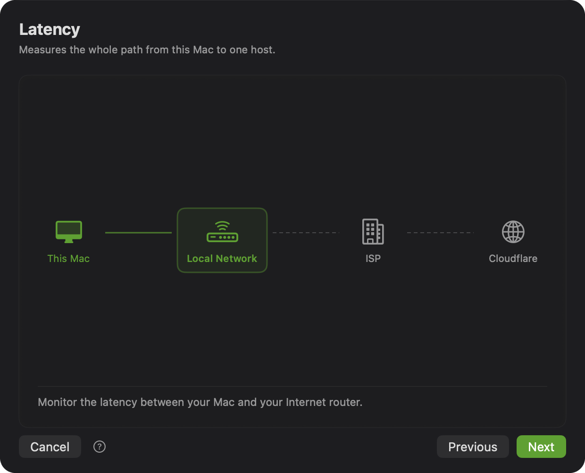

#### ISP

Measures the latency from your Mac to your ISP — typically the second hop. The **Monitored Hop** menu is under **Advanced**, at the bottom of the card. It is set to **Auto**, which finds the right hop for you. **Auto** suits almost every user. Set a specific hop (**Hop 2** to **Hop 10**) only if the hop that PeakHour finds doesn't reply to ping.

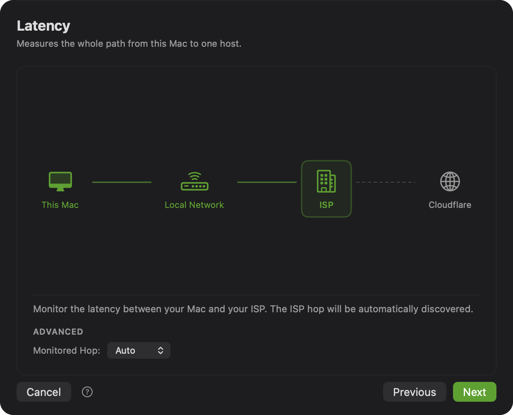

#### Internet

Measures the latency from your Mac to a site on the internet. Choose the site from the **Site** menu, as for [ISP to Internet](#isp-to-internet). The **Internet** point on the path then shows the name of the site. **Next** is available after you choose a site.

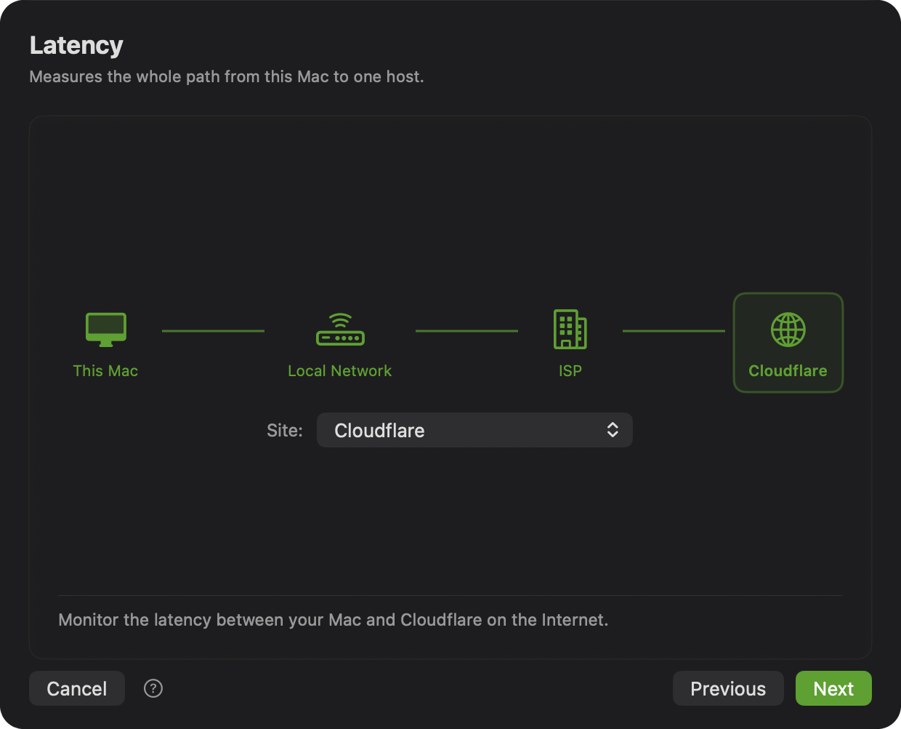

### Custom

*Single Host measures the whole path. Multi-Host measures only the part between two points.* A **Single Host** / **Multi-Host** control at the top of the page sets the mode:

- **Single Host** — the same settings as [One Host](#one-host).
- **Multi-Host** — measures the latency *between* two points, to isolate a specific segment of the path.

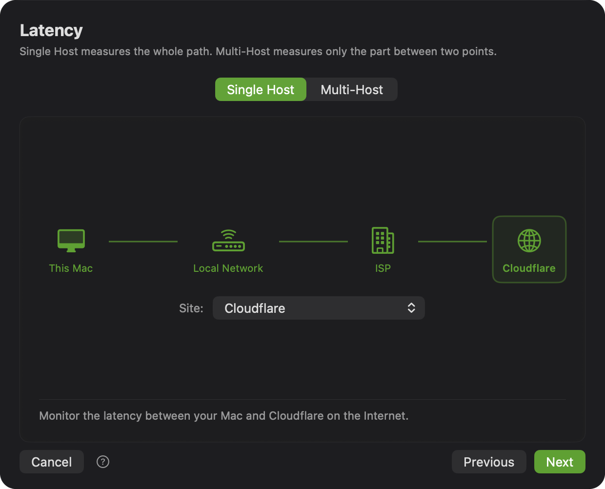

Multi-Host mode has a **Near** endpoint and a **Far** endpoint, so you can find where high or inconsistent latency comes from. This is how the Internet Dashboard measures hops like **Router → ISP**. Choose each endpoint from its menu: **Local Network**, **ISP** or **Internet**. The line between the two endpoints is green. PeakHour measures only the part of the path between **Near** and **Far**.

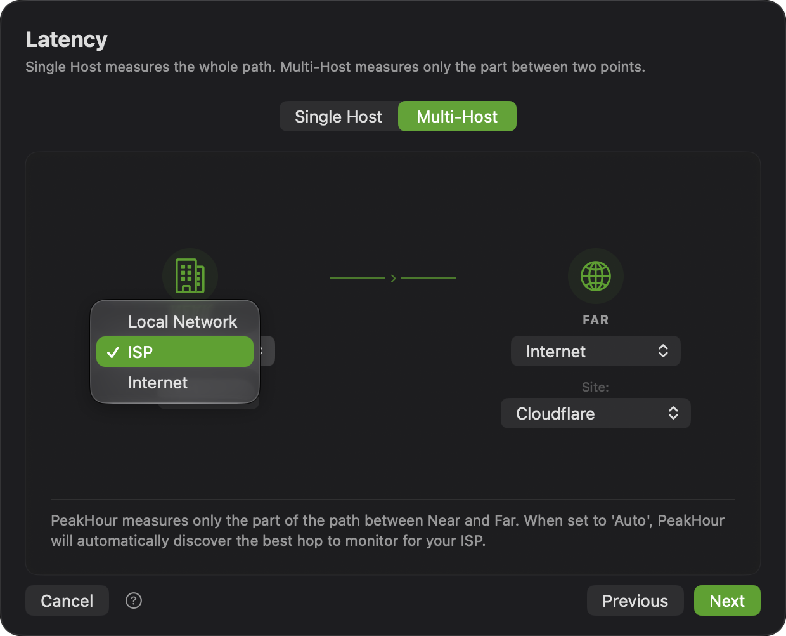

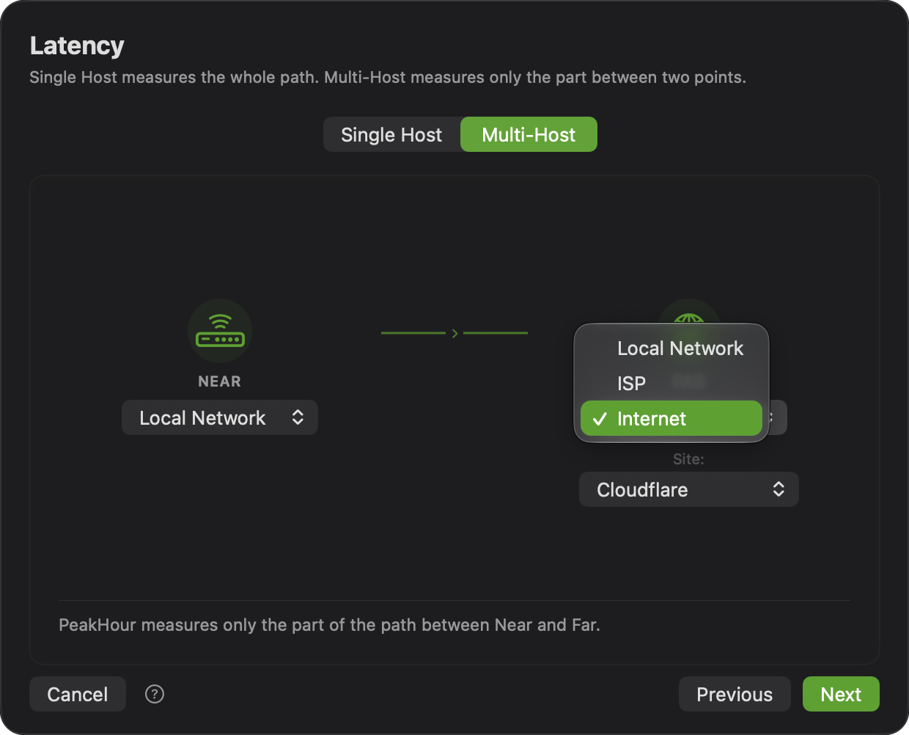

When an endpoint is set to **ISP**, a **Hop** menu appears. Leave it on **Auto** to let PeakHour find the best hop for your ISP, or pick a specific hop (**Hop 2** to **Hop 10**). An endpoint set to **Internet** has a **Site** menu. When **Near** is **ISP** with **Auto**, **Far** is always **Internet**.

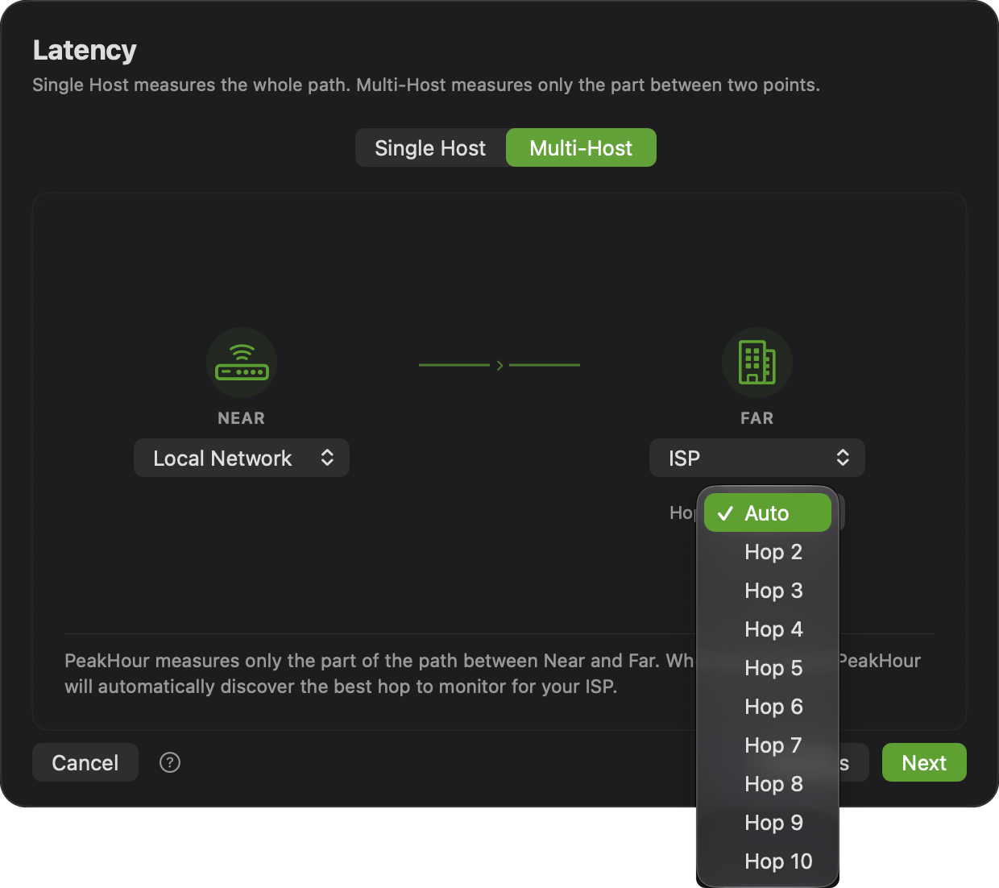

When you've set up the monitor, click **Next**.

## 4. Finalize setup

The last screen sets a few key parameters. PeakHour suggests a name from the endpoints you chose. A site from the **Site** menu gives its name to the monitor, for example **Cloudflare** for One Host, or **ISP to Cloudflare** for ISP to Internet. You can adjust all of these (and many more) later in [Settings → Latency Monitor](/user-guide/settings/monitors-settings/latency-monitor/).

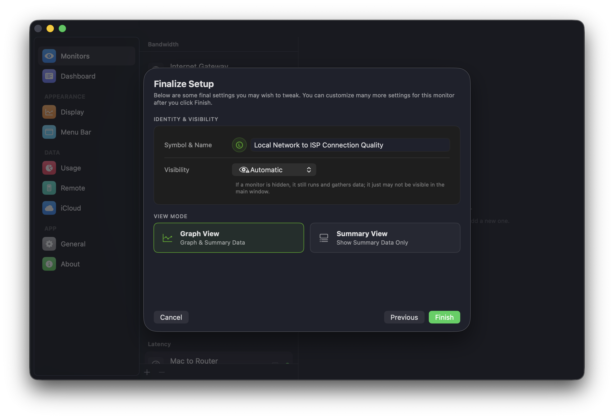

| Setting | Description |
|---------|-------------|
| **Symbol & Name** | The icon and name for the monitor. Click either to change it. |
| **Visibility** | Whether the monitor appears in the main window. **Automatic** hides it when it can't be reached; you can also force it to always show or always hide. A hidden monitor still runs and gathers data — it just may not be visible. |
| **View Mode** | **Graph View** shows the monitor with its graph; **Summary View** shows summary data only (collapsed). |

Click **Finish**. The new monitor appears in the main window and, if configured, the menu bar. To change a setting first, click **Previous**. The assistant goes back to the settings page of your card.

## Edit a latency monitor

In [Settings → Monitors](/user-guide/settings/monitors-settings/), select the monitor and click **Edit…**. The assistant opens on the settings page, with the card that matches the monitor. For example, a monitor from the ISP (**Auto**) to a site opens as **ISP to Internet**, and a monitor from the router to the ISP opens as **Custom**. To choose another card, click **Previous**.

## What next?

There are many more ways to customise a Latency Monitor — see the [Latency Monitor](/user-guide/settings/monitors-settings/latency-monitor/) settings, where you can adjust polling intervals, latency thresholds, packet count, and colors.
