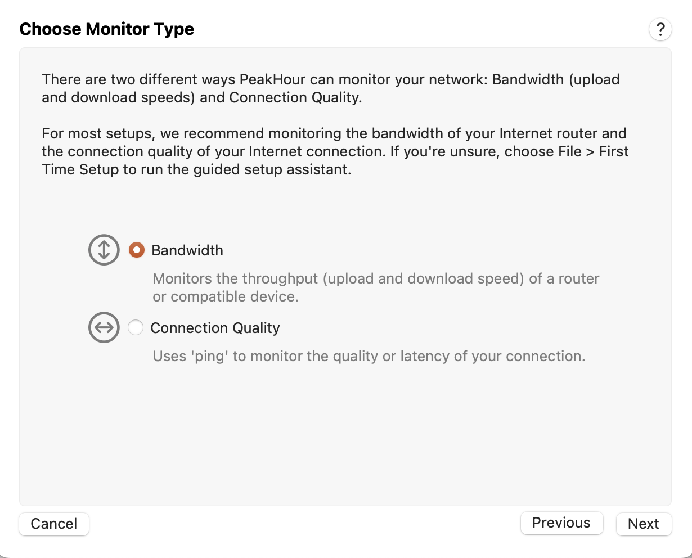

import NeedsReview from '@/components/NeedsReview.astro';

<NeedsReview />

The Configuration Assistant walks you through adding a new Monitor or editing an existing one.

**Having trouble monitoring your device(s)?**

If you're having trouble, have a look at the [Monitoring & Compatibility](https://peakhoursupport.atlassian.net/wiki/spaces/P5W/pages/9502987/Monitoring+Compatibility) FAQs.

# What is a Monitor?

  - A Monitor is either a [Bandwidth options](/user-guide/settings/monitors-settings/bandwidth-monitor/bandwidth-options/) or a [Connection Quality Monitor](/user-guide/settings/monitors-settings/connection-quality-monitor/).
    
      - [Bandwidth Monitor](/user-guide/settings/monitors-settings/bandwidth-monitor/) monitor the network through (upload and download) of a device.
    
      - [Connection Quality Monitor](/user-guide/settings/monitors-settings/connection-quality-monitor/) monitors the latency to a hop or specific host on the Internet, allowing you to see the latency between you and that endpoint, or between two different endpoints (differential latency).

  - You can configure and monitor as many Monitors as you wish (or your Mac can handle\!).

