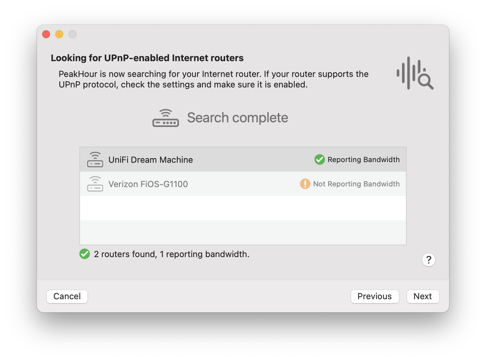
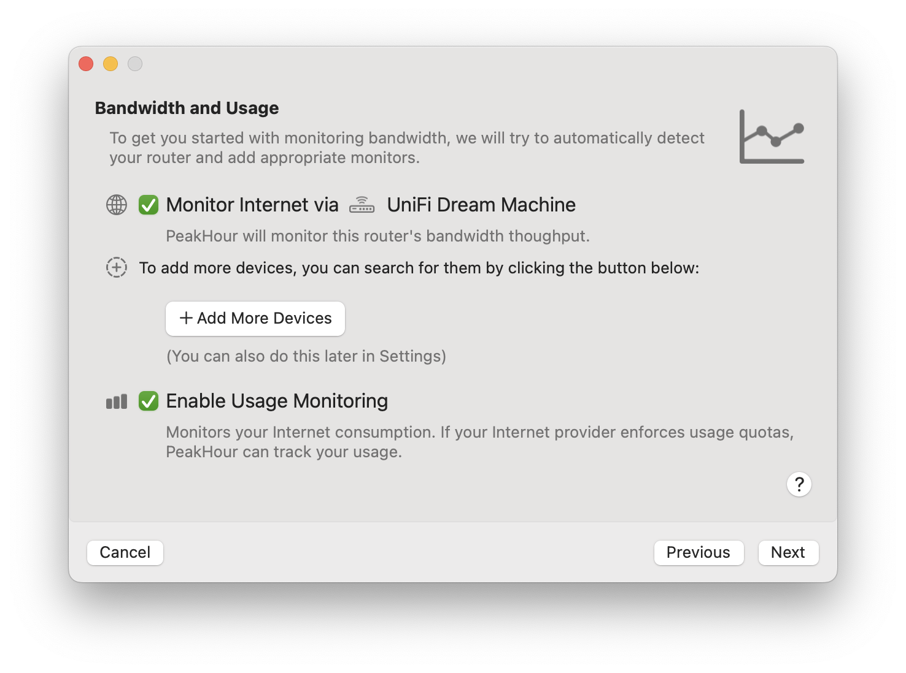
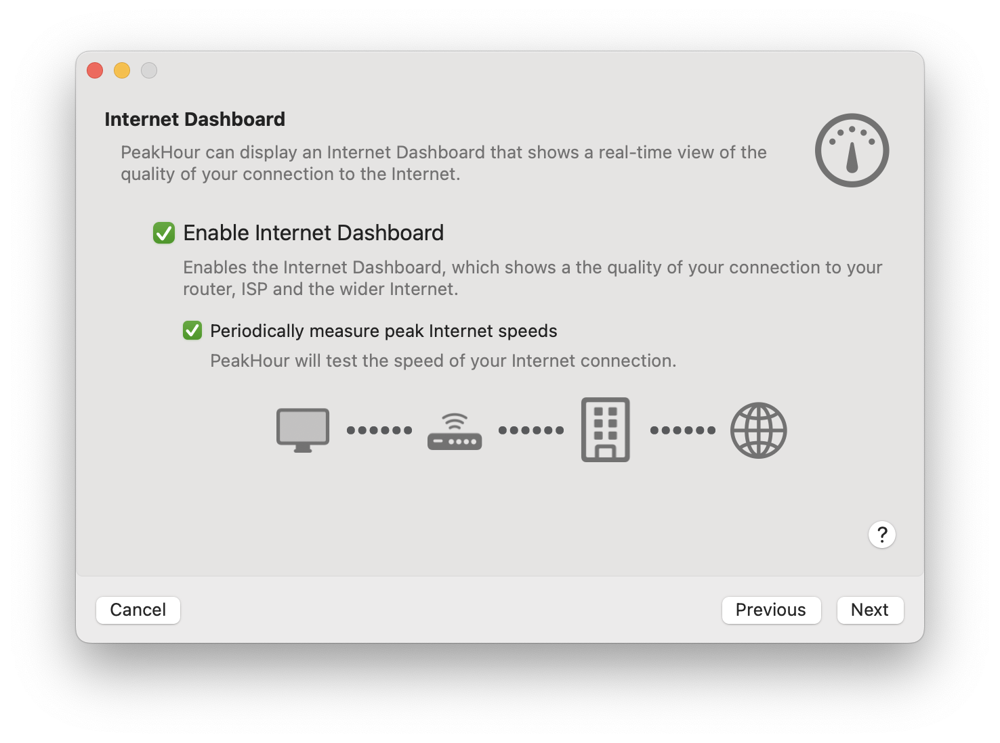
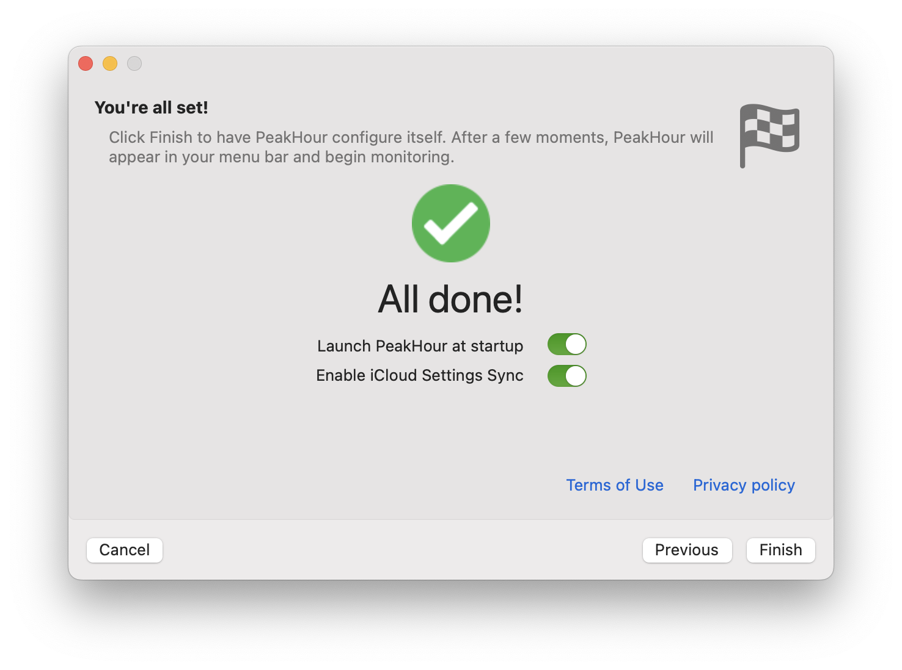

import NeedsReview from '@/components/NeedsReview.astro';

<NeedsReview />

# Prerequisites

Before you set up PeakHour on your Mac, check that your system meets the [Requirements](/user-guide/requirements/).

# Getting Started.

When you launch PeakHour for the first time, the First Time Setup Assistant will appear to guide you through the setup process.

Setting up PeakHour involves a couple of steps, which the First Time Setup Assistant will walk you through:

  - **Discovering your Internet router**  
    PeakHour will first look for your Internet router using UPnP discovery. It’s OK if it doesn’t find your router here; you can look for it or add it manually later.  

  - **Adjust Monitor Settings**  
    Here you can add additional monitors and choose whether or not to enable Usage Monitoring.  
     

  - **Internet Dashboard**  
    In this step, you can enable the Internet Dashboard and, optionally, regular speed tests of your network. The Internet Dashboard will monitor your connection out to the Internet and show you when potential problems arise.  

  - **Final Setup**  
    In this step you can add other network devices such as other Macs, PCs, WiFi access points, Network Attached Storage (NAS) or any other device that supports [SNMP](https://peakhoursupport.atlassian.net/wiki/spaces/P5W/pages/9503401/SNMP).  

# Search for Internet Router

In the first step, PeakHour will search for your Internet router. If the list is empty, you may need to enable UPnP on your router first in order for it to be discoverable. Check your router's manual and setup interface for an option labeled [UPnP](https://peakhoursupport.atlassian.net/wiki/spaces/P5W/pages/9503464/UPnP) or sometimes **Universal Plug & Play** and ensure it is enabled. You may need to restart your router and / or PeakHour in order for it to become visible.

  

  

  

Some routers do not fully implement the UPnP spec, or implement it poorly. PeakHour will do it's best to validate the information being reported by your router and indicate whether it appears valid or not. If you see the router as **Reporting**, that means it is reporting back the information that PeakHour needs. For information on troubleshooting UPnP, check out these FAQs: [UPnP Troubleshooting](https://peakhoursupport.atlassian.net/wiki/spaces/P5W/pages/9503200/UPnP+Troubleshooting).

# Choose What to Monitor

In this screen, you get to choose the monitors that will be added:

  - **Monitor Internet via \[Your-Router-Model\]**  
    If a router was found and reporting was detected in the previous step, this checkbox will set up a monitor for it. If you don't wish to add a monitor, uncheck this box.

  - **Add More Devices**  
    This will bring up the Configuration Assistant so you can configure additional devices, such as SNMP-enabled routers, servers, Macs or other network devices. You can also add local interfaces from your Mac as well. You can add as many additional devices here as you like. Note that you can also do this later on in Settings.

  - **Enable Usage Monitoring**  
    Enabling this will enable Usage Monitoring of your primary Internet Gateway (by default, the router that was discovered).

# Internet Dashboard

This page lets you enable or disable the Internet Dashboard. The Internet Dashboard is a single view that lets you monitor your vital stats that impact the quality of your Internet experience. Enabling the Internet Dashboard will automatically create a series of Connection Quality monitors that will ping various points along your path to the Internet and provide you with real-time information on latency, throughput, jitter, errors and dropped packets. The

The Dashboard can optionally periodically speed test your Internet connection and display the maximum measured throughput in the dashboard.

# Finish

Once you're done, click Finish to enable your configuration and start monitoring\! 🎉

# Next Steps

Now that PeakHour is running, here are some additional resources to help you use PeakHour:

  - To open PeakHour and view your monitors, click the menu bar area or the Dock icon to open PeakHour. For detailed instructions and explanation of the interface, visit [Main View](/user-guide/main-view/).

  - To read more about PeakHour's many options, visit [Settings](/user-guide/settings/).
    
    

