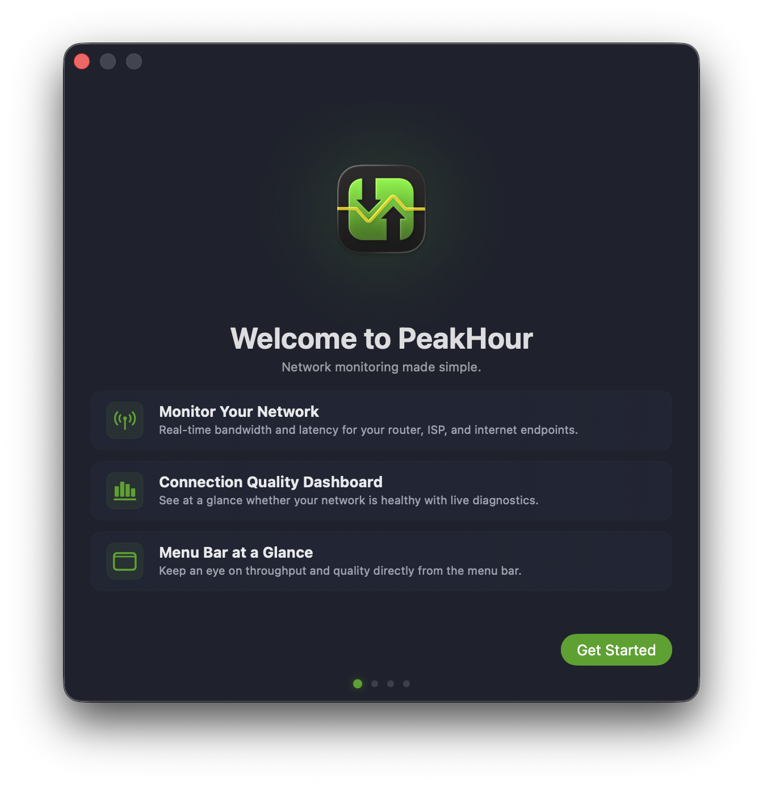
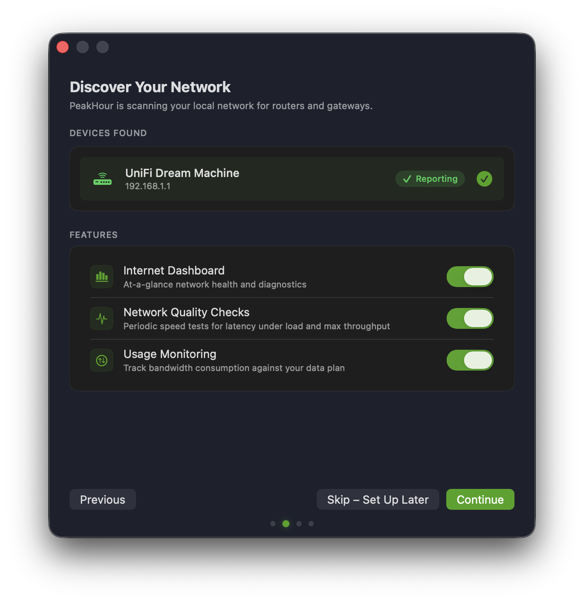
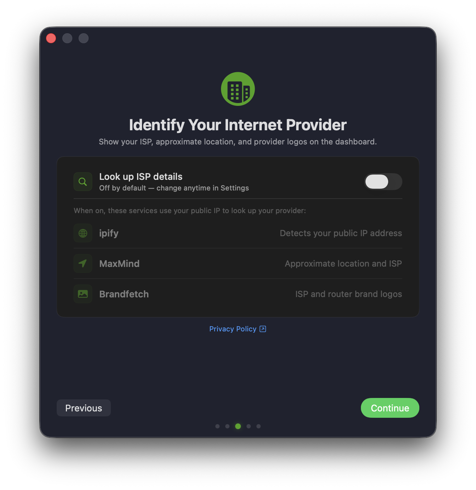
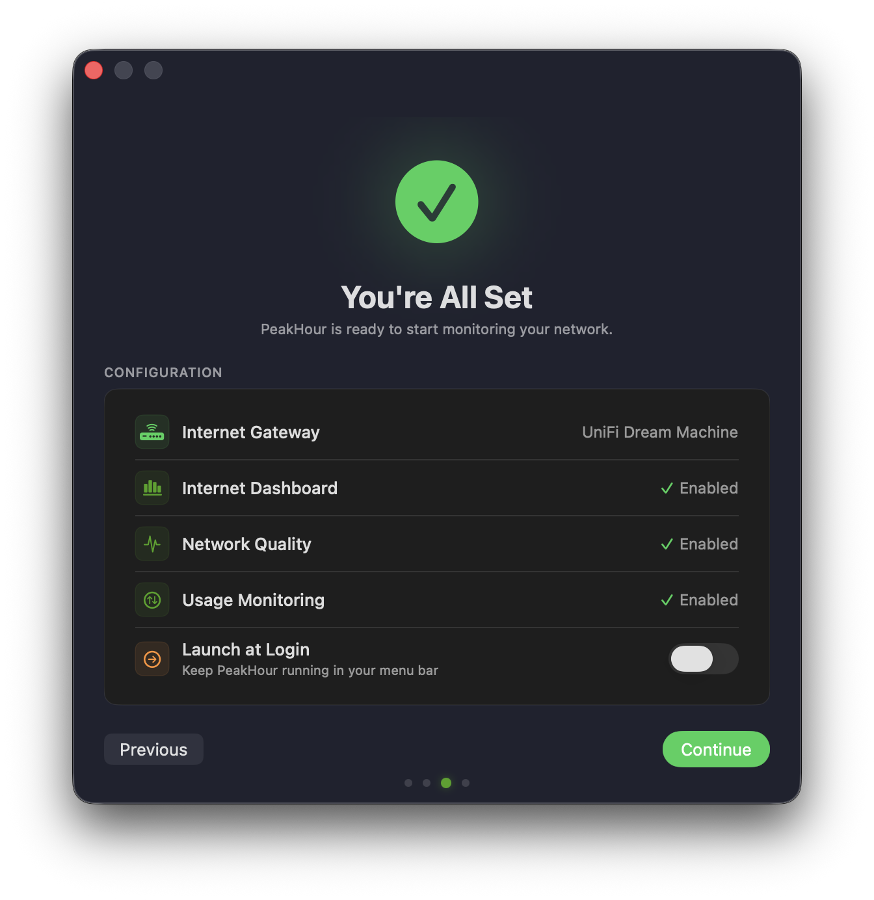
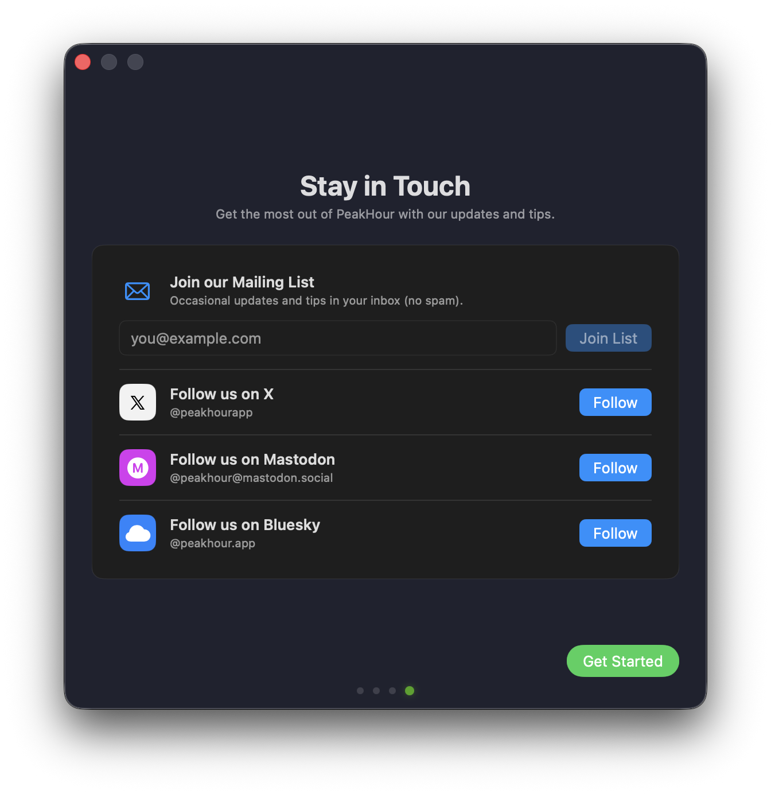
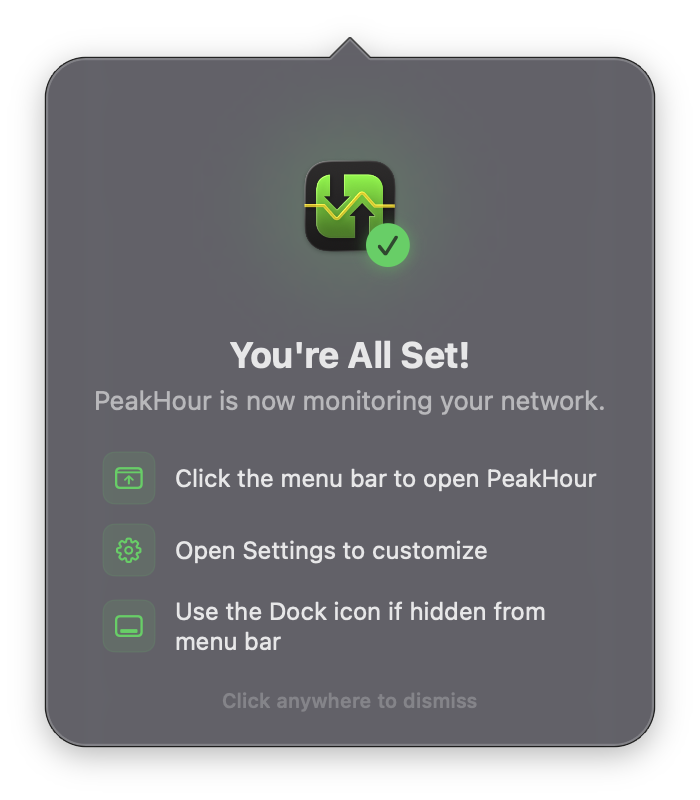
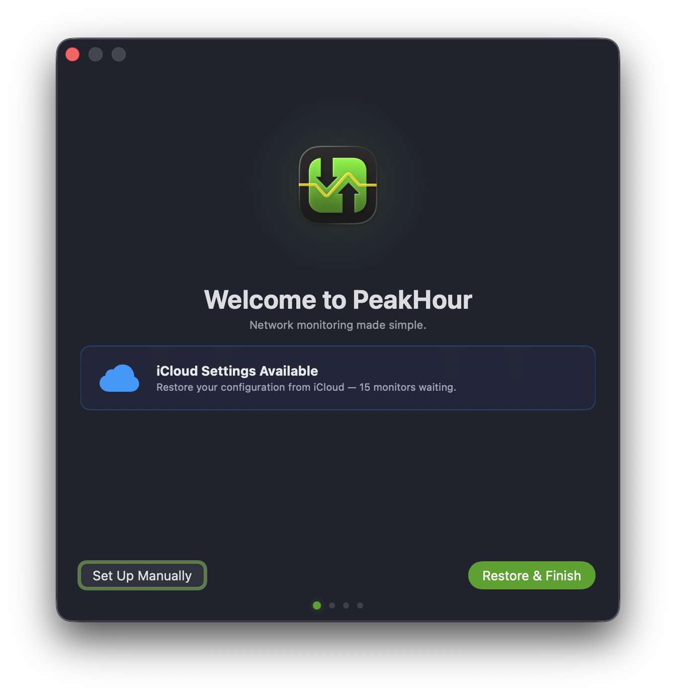

# Prerequisites

Before you set up PeakHour on your Mac:

- Check that your system meets the [Requirements](/user-guide/requirements/).
- **Enable UPnP on your Internet router.** PeakHour uses UPnP to discover your router automatically during setup. Most routers ship with UPnP on by default — if yours doesn't, look for an option labelled **UPnP** or **Universal Plug & Play** in your router's admin interface and turn it on before launching PeakHour. See [UPnP Troubleshooting](/troubleshooting/frequently-asked-questions-faq/troubleshooting-known-issues/upnp-troubleshooting/) if your router still isn't discovered.

# Getting Started

When you launch PeakHour for the first time, the First Time Setup Assistant will appear to guide you through the setup process.

Setup takes five short steps:

1. **Welcome** — a quick overview of what PeakHour does.
2. **Discover Your Network** — PeakHour finds your router and lets you pick which features to enable.
3. **Identify Your Internet Provider** — choose whether PeakHour looks up your ISP details (off by default).
4. **You're All Set** — confirm your configuration before finishing.
5. **Stay in Touch** — optional: subscribe to updates or follow PeakHour on social.

If you've previously used PeakHour on another Mac with iCloud sync enabled, see [Restoring from iCloud](#restoring-from-icloud) — setup can apply those settings in a single click.

# 1. Welcome

The Welcome screen introduces the three main views you'll work with in PeakHour: bandwidth monitoring for your router, ISP and internet endpoints; the Internet Dashboard; and the menu bar widget. Click **Get Started** to continue.

# 2. Discover Your Network

PeakHour scans your local network for routers and gateways that support UPnP. If a device is found and is reporting usage correctly, it appears under **Devices Found** with a **Reporting** badge. If your router doesn't appear, see [Can't find your Internet router?](#cant-find-your-internet-router) below.

Below the devices list, choose which features to enable:

| Feature | Description |
|---------|-------------|
| **Internet Dashboard** | An at-a-glance view of your network's health and live diagnostics. |
| **Network Quality Checks** | Periodic speed tests for latency under load and max throughput. |
| **Usage Monitoring** | Tracks bandwidth consumption against your data plan. |

All three are enabled by default. Click **Continue** to apply them, or **Skip – Set Up Later** to configure things manually from [Settings](/user-guide/settings/) later.

## Can't find your Internet router?

If the **Devices Found** list is empty or your router isn't appearing:

- Make sure UPnP is enabled on your router — see [Prerequisites](#prerequisites). Look for an option labelled **UPnP** or **Universal Plug & Play** in your router's admin interface.
- Restart both your router and PeakHour after enabling UPnP so PeakHour re-runs discovery.
- Some routers don't fully implement the UPnP spec, or implement it poorly. PeakHour validates what your router reports and marks it as **Reporting** when the data looks valid.
- For deeper diagnostics, see [UPnP Troubleshooting](/troubleshooting/frequently-asked-questions-faq/troubleshooting-known-issues/upnp-troubleshooting/).

**Using SNMP instead?** PeakHour can monitor SNMP-enabled routers and other devices, but SNMP doesn't support auto-discovery — SNMP devices won't appear in First Time Setup. Skip the Discover step and add them after setup from [Settings](/user-guide/settings/).

# 3. Identify Your Internet Provider

PeakHour can enrich your [Internet Dashboard](/user-guide/main-view/internet-dashboard/) with your provider's name, approximate location, and ISP and router brand logos. Enabling this lookup is optional.

**Look up ISP details is off by default.** Leave the toggle off to keep PeakHour from contacting any third-party services, or turn it on to identify your provider. You can change this later under [Settings → Dashboard](/user-guide/settings/dashboard/#isp-information).

When enabled, PeakHour sends your public IP address to these services to look up your provider:

| Service | What it provides |
|---------|------------------|
| **ipify** | Detects your public IP address. |
| **MaxMind** | Approximate location and ISP. |
| **Brandfetch** | ISP and router brand logos. |

:::note
Only your public IP address is shared with these services. No personal or identifying information beyond that is included.
:::

Click **Privacy Policy** to read exactly how this information is used, then click **Continue**.

# 4. You're All Set

Review the configuration PeakHour is about to apply:

- **Internet Gateway** — the router PeakHour found in the previous step.
- **Internet Dashboard**, **Network Quality**, **Usage Monitoring** — the features you enabled.
- **Launch at Login** — toggle on if you'd like PeakHour to start automatically when you log in to your Mac.

Click **Continue** to apply your configuration.

# 5. Stay in Touch

The final step is optional. Join the mailing list for occasional updates and tips (no spam), or follow PeakHour on [X](https://x.com/peakhourapp), [Mastodon](https://mastodon.social/@peakhour) or [Bluesky](https://bsky.app/profile/peakhour.app).

Click **Get Started** to finish setup and start monitoring. 🎉

# After Setup

Once setup completes, PeakHour starts monitoring in the background and a short popover appears from its menu bar icon confirming everything is up and running. Click anywhere to dismiss it.

## Can't see PeakHour in your menu bar?

PeakHour needs some horizontal space in the menu bar to display its monitors — especially on Macs with the notch (MacBook Pro 14"/16"), where usable menu-bar width is limited. If PeakHour's icons aren't visible, macOS has likely hidden them behind the notch or another app's menu-bar item.

To make room:

- Open **PeakHour Settings → [Menu Bar](/user-guide/settings/menu-bar/)** and disable any Menu Bar Items you don't need by dragging them from **Active Items** back to **Available Items**.
- Or remove other apps' menu-bar icons from **System Settings → Control Center**, or use a menu-bar manager like Bartender or Ice to hide them.

If you can't see PeakHour at all, click its icon in the Dock to open the main window — monitoring continues regardless of whether the menu bar item is visible.

# Restoring from iCloud

If you've previously set up PeakHour on another Mac signed in to the same Apple Account, the Welcome screen detects your saved settings and offers to restore them. Click **Restore & Finish** to apply your existing configuration in a single step, or **Set Up Manually** to go through the regular four-step flow.

# Next Steps

Now that PeakHour is running, here are some additional resources to help you use PeakHour:

  - To open PeakHour and view your monitors, click the menu bar area or the Dock icon to open PeakHour. For detailed instructions and explanation of the interface, visit [Main View](/user-guide/main-view/).

  - To read more about PeakHour's many options, visit [Settings](/user-guide/settings/).
