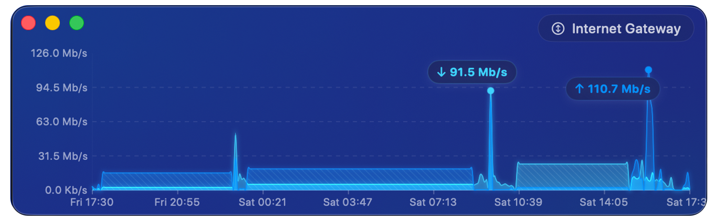
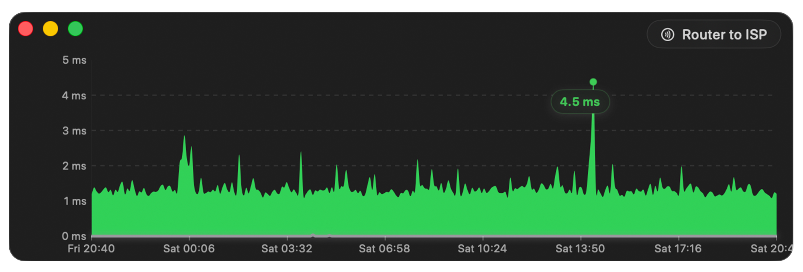
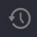
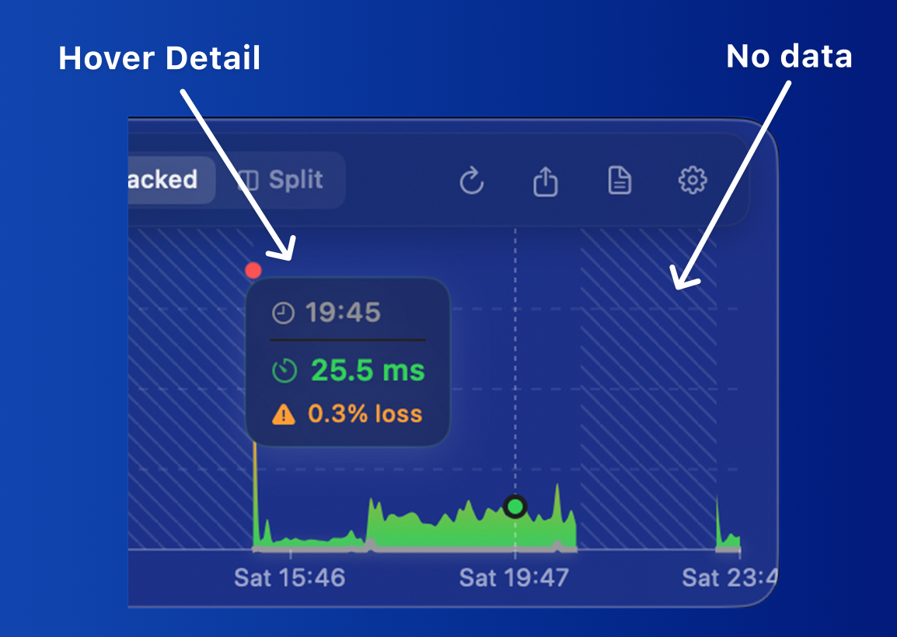
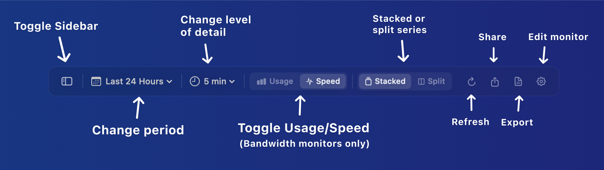

The History view gives a more comprehensive perspective on a monitor's data, letting you visualize bandwidth activity or connection quality for periods extending from the last few hours to years in the past.

Both Bandwidth Monitors and Latency Monitors have a History view:

## Opening the History view

There are two ways to open the History view for a monitor:

- Click the **History** button () in the [graph toolbar](/user-guide/main-view/bandwidth-monitors/) above the monitor's graph.
- If the graph isn't visible, right-click the monitor and choose **History…** from the menu.

You can also open History for a whole section at once using the **Open History** button in the [Bandwidth Monitors](/user-guide/main-view/bandwidth-monitors/) or [Latency Monitors](/user-guide/main-view/latency-monitors/) section header. Once the window is open, use its sidebar to switch between monitors without reopening it.

## Reading the graph

Hover over any point on the graph to see the actual value at that moment. To inspect a span of time, drag-select a range — PeakHour shows the total (for usage) or the average (for speed) across the selected period.

- **Hover detail** — a tooltip showing the values at the point under the pointer. For a latency monitor this is the time, latency, and packet loss; for a bandwidth monitor it's the time and the usage or speed.
- **No data** — a hatched region marks periods where no data was recorded, for example while PeakHour wasn't running.
- **Estimated** — for bandwidth monitors, an **Estimated** tag indicates usage that PeakHour calculated by averaging the total data used between the time it stopped running and the time it started again, rather than measuring it directly.

## The toolbar

The toolbar along the top of the window controls the period being shown, the level of detail, and how the data is displayed.

From left to right:

| Control | Description |
|---------|-------------|
| **Show / Hide Sidebar** | Shows or hides the sidebar, which lists the monitors available to view in the History window. |
| **Graph period** | Sets the time range to display. Choose one of the presets, or select **Choose Dates…** to pick a custom start and end date. |
| **Level of detail** | Sets how much time each point on the graph represents — for example, 5-minute intervals for 12 hours of data, or one-day intervals for several months. Higher detail over long periods can take a few seconds to calculate. |
| **Usage / Speed** | Toggles between the total amount of data used (**Usage**) and the average speed for each point (**Speed**). Bandwidth monitors only. |
| **Stacked / Split** | Shows inbound and outbound on the same axis (**Stacked**) or on separate axes (**Split**). |
| **Refresh** | Forces the graph to refresh. |
| **Share** | Shares a picture of the graph via Mail, Messages, AirDrop, etc. |
| **Export** | Exports the data currently shown to a CSV file. |
| **Edit monitor** | Opens settings for the monitor being shown. |

The latency History view has the same toolbar without the **Usage / Speed** toggle, since latency monitors only show a single measurement type.

:::note
The view auto-refreshes about once a minute. If the graph takes a long time to render, auto-refresh is disabled automatically to avoid excessive CPU use. If the graph isn't refreshing on its own, lower the level of detail or shorten the time period to speed up rendering and re-enable auto-refresh.
:::
