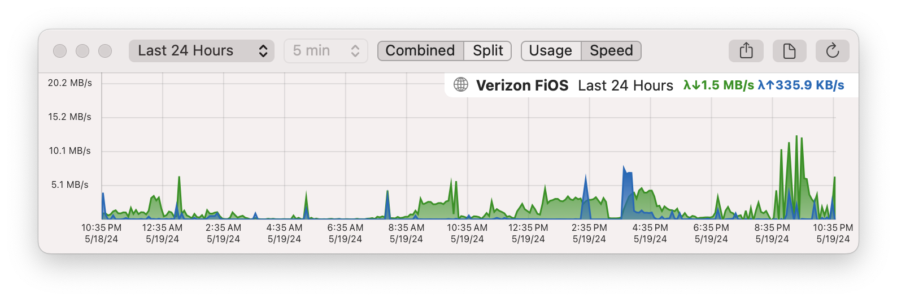
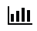
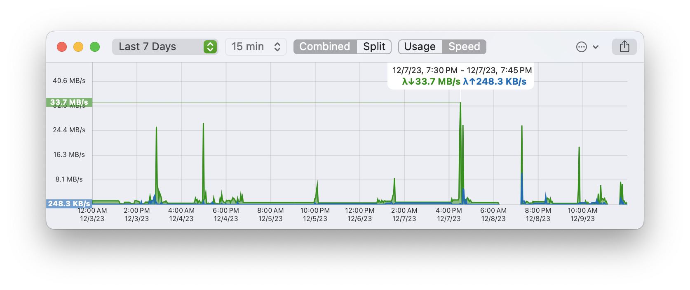

The History view offers a more comprehensive perspective of your monitor's data, enabling you to visualize the bandwidth activity or connection quality of your targets for periods extending up to years in the past.

Bring up the History view for any monitor by either clicking the  button in the toolbar above the graph, or (if the graph is not visible), right-clicking the Monitor and choosing **History…** from the menu.

## Viewing data points / details

The History graph supports mousing over individual points to see the actual values. You can also drag-select a range of values to see either a total or aggregate (average) for that period.

## The Toolbar

The toolbar along the top of the History window controls the period of time being shown in the graph, as well as what sort of information is shown (usage or speed), how it is displays (combined or split) and the level-of-detail.

From left to right, the controls are:

**Period**

This dropdown controls the period for which to display data. There are a number of preset periods, or you can select **Choose Dates...** and choose a start and end date.

**Level-of-detail**

This controls how much time each point on the graph represents. For example, if you're viewing 12 hours of data you're likely going to want to see the data in 5 minute intervals. If however you're viewing several months of data, you're likely going to want to see the data in one-day intervals. Note that viewing higher levels of detail for longer periods may require a few seconds to calculate.

**Combined / Split**

Determines whether to show inbound and outbound graphs on the same axis or split them onto separate axes.

**Usage / Speed**

This toggles whether each point on the graph shows the total amount of data used (usage) or the average speed for that period (speed). Usage is always shown as a bar chart whilst speed is always shown as an area chart.

**Share**

Brings up the Sharing menu allows you to export a picture of the graph via Email, iMessage, Airdrop etc.

**Export to CSV**

Exports the data currently being shown to a CSV file.

**Refresh**

Forces a refresh of the graph.

Note: the view will auto-refresh every minute or so. There are some circumstances where this will not happen however: if the graph takes a long time to render, auto-refresh will be automatically disabled to prevent excessive CPU utilisation. If you're finding the graph isn't automatically refreshing, try dropping the level of detail or the time period to speed up rendering and re-enable auto-refresh.

