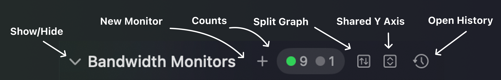
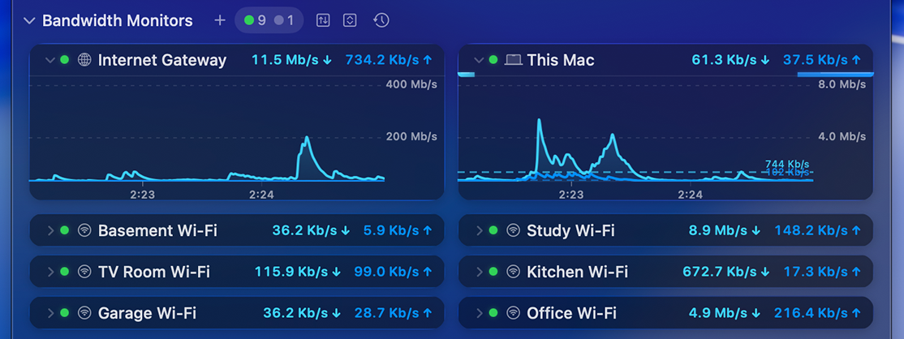
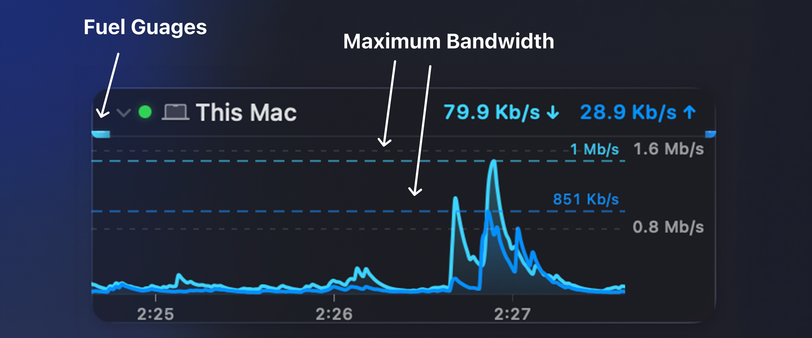
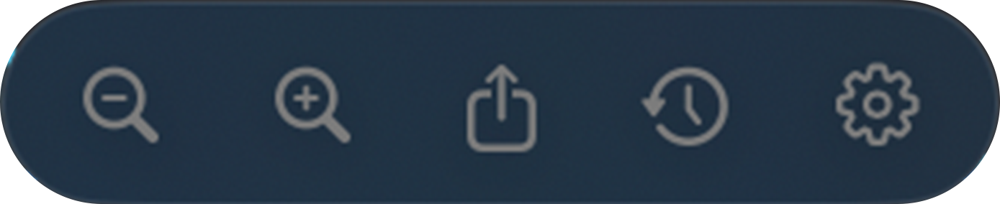

Bandwidth Monitors display live upload and download throughput for a router, gateway, network interface, or other device. They appear in the [Main View](/user-guide/main-view/) between the Internet Dashboard (above) and Latency Monitors (below).

## What can be monitored

A Bandwidth Monitor can pull data from:

- **Your internet router** via UPnP (auto-discovered during [First Time Setup](/user-guide/first-time-setup/)) or SNMP.
- **A local network interface** on your Mac (Wi-Fi, Ethernet, USB tethering, VPN).
- **SNMP-enabled network devices** (switches, access points, NAS, servers) added manually via [Configuration Assistant](/user-guide/configuration-assistant/).

## Section header

The header bar above the monitors holds controls for the whole Bandwidth Monitors section:

From left to right:

| Control | Description |
|---------|-------------|
| **Show / Hide** | Collapses or expands the entire Bandwidth Monitors section. |
| **New Monitor** | Adds a new Bandwidth Monitor via the [Configuration Assistant](/user-guide/configuration-assistant/). |
| **Counts** | Summarises monitors by status, with a colored dot for each: green for **Active**, yellow for **Warning**, red for **Error**, and grey for **Disabled**. |
| **Split Graph** | Toggles between a single combined graph and a separate graph for each monitor. |
| **Shared Y Axis** | Puts every monitor's graph on the same vertical scale so throughput can be compared directly. |
| **Open History** | Shows a menu of this section's monitors; choose one to open its [History view](/user-guide/history-view/). |

## Reading the graph

Each monitor shows live upload (↑) and download (↓) throughput, plus a graph of recent activity. Hover over an expanded graph to reveal the [graph toolbar](#graph-toolbar) below.

A single monitor packs more detail than it first appears:

Along the top of each monitor, from left to right:

- **Disclosure triangle** — expands or collapses the monitor's graph, leaving just the title and throughput visible.
- **Status light** — a colored dot showing the monitor's current state: green for **Active**, yellow for **No Data** or **Initializing**, red for **Error**, and grey for **Disabled**.
- **Symbol** — the icon representing device or interface being monitored. This can be configured in [Settings → Bandwidth Monitor](/user-guide/settings/monitors-settings/bandwidth-monitor/).
- **Name** — the monitor's label. Set this in [Settings → Bandwidth Monitor](/user-guide/settings/monitors-settings/bandwidth-monitor/).
- **Download speed** — current inbound throughput, marked with a down arrow (↓).
- **Upload speed** — current outbound throughput, marked with an up arrow (↑).

The graph itself adds a couple more details:

- **Fuel gauges** — the slim bars beside the monitor title fill up to show current upload and download speed relative to the device's maximum bandwidth. Enable or disable them from [Settings → Display](/user-guide/settings/display/).
- **Maximum bandwidth lines** — the dashed lines mark the maximum inbound and outbound bandwidth for the device, with optional numeric labels. This shows the configured theoretical maximum bandwidth for the given device or interface. Configure the maximum bandwidth under [Bandwidth Options](/user-guide/settings/monitors-settings/bandwidth-monitor/#bandwidth).

## Configuring

Add, remove, and customize Bandwidth Monitors from [Settings → Bandwidth Monitor](/user-guide/settings/monitors-settings/bandwidth-monitor/), where you can adjust polling intervals, units, colors, alert thresholds, and more.

## Graph toolbar

The same graph toolbar appears on both Bandwidth Monitors and [Latency Monitors](/user-guide/main-view/latency-monitors/). Hover over an expanded graph to reveal it:

From left to right:

| Control | Description |
|---------|-------------|
| **Zoom out** | Zooms the graph out, showing more time. |
| **Zoom in** | Zooms the graph in, showing less time. |
| **Share** | Shares the graph via Mail, Messages, AirDrop, etc. |
| **History** | Opens the [History view](/user-guide/history-view/) for this target. |
| **Settings** | Opens the settings for this monitor in [Settings → Bandwidth Monitor](/user-guide/settings/monitors-settings/bandwidth-monitor/). |
