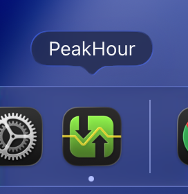
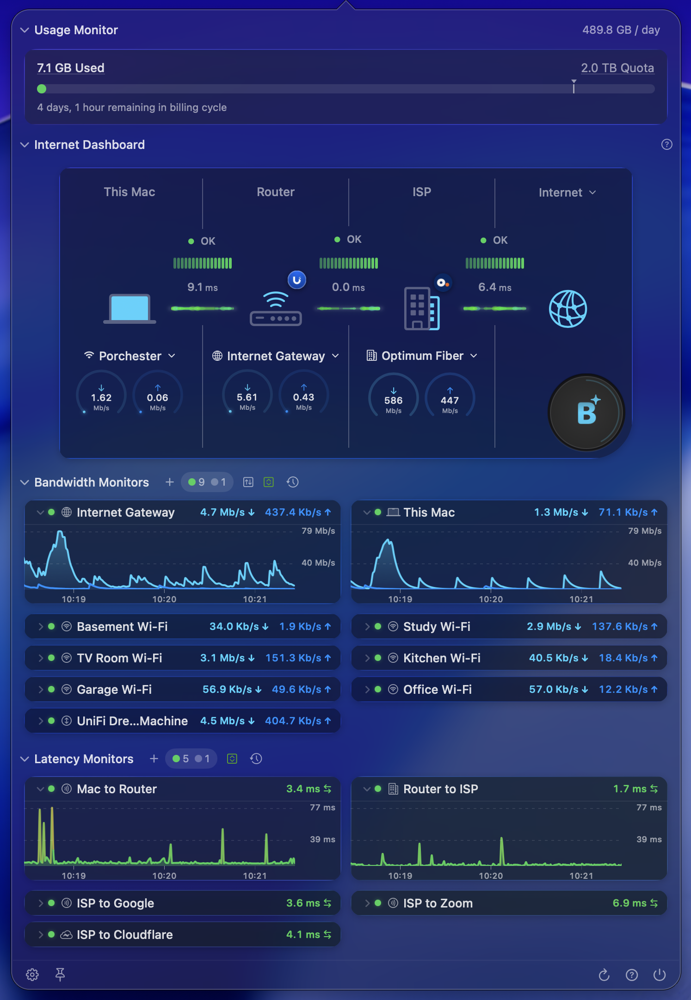

## Opening the main window

PeakHour's main window is your primary view into network activity. There are two ways to open it:

**From the menu bar.** Click the PeakHour menu bar item. The exact information shown there depends on which Menu Bar Items you have configured in [Settings → Menu Bar](/user-guide/settings/menu-bar/).

**From the Dock.** Click PeakHour's Dock icon if it's enabled. The Dock icon is on by default — toggle it from [Settings → Dashboard](/user-guide/settings/dashboard/).

## Overview

The main window stacks four sections vertically:

- **[Usage Monitor](/user-guide/settings/usage/)** — tracks data used and remaining against your billing cycle quota. Only visible when Usage Monitoring is enabled.
- **[Internet Dashboard](/user-guide/main-view/internet-dashboard/)** — a single-view summary of your connection's health from your Mac out to the internet.
- **[Bandwidth Monitors](/user-guide/main-view/bandwidth-monitors/)** — real-time throughput graphs for each device or interface you've configured.
- **[Latency Monitors](/user-guide/main-view/latency-monitors/)** — round-trip latency, jitter, and packet loss for hosts on the internet.
