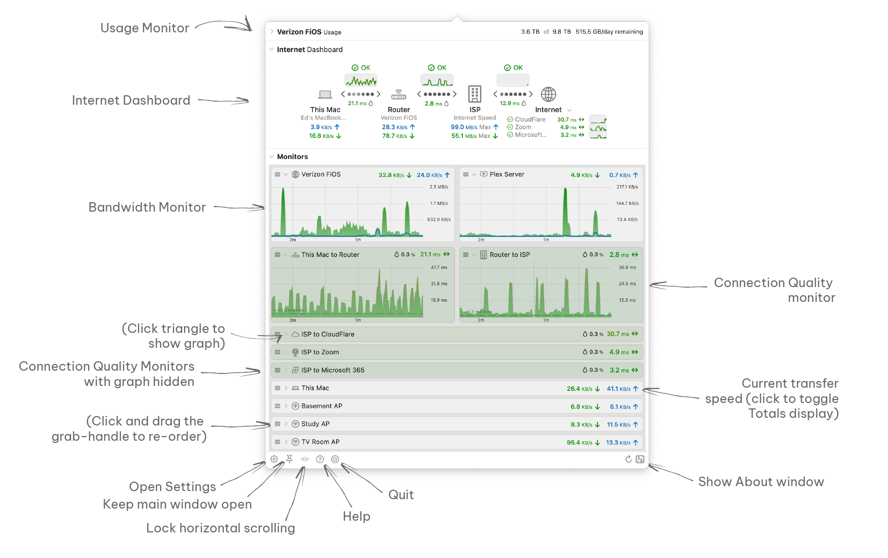

import img1 from './images/cleanshot-2024-05-19-at-17-53-05-2x-20240519-215309.png';
import img2 from './images/cleanshot-2023-12-04-at-20-55-56-2x.png';

The main window can be accessed by either:

<table>
<tbody>
<tr class="odd">
<td>1. Clicking the PeakHour icon  / target information in the menu bar. 
(<strong>Note:</strong> PeakHour may be displaying more or less information depending on what monitors you have configured). </td>
<td></td>
</tr>
<tr class="even">
<td>2. Clicking the PeakHour icon in the Dock (if the Dock Icon enabled. It is by default).</td>
<td></td>
</tr>
</tbody>
</table>

## Key Features

The graphic below points out the primary feature of the main view:

## Internet Dashboard

See [Understanding the Internet Dashboard](/user-guide/main-view/understanding-the-internet-dashboard/).

## Monitors

Monitors appear in the main PeakHour view and will display their information in real-time. Monitors refresh at the refresh rate set under Settings \> Display \> Refresh.

There are two types of monitors:

| **Monitor Type**                                                                                 | **Description**                                                                                                                                                                                                                                                                                                               |
| ------------------------------------------------------------------------------------------------ | ----------------------------------------------------------------------------------------------------------------------------------------------------------------------------------------------------------------------------------------------------------------------------------------------------------------------------- |
| [Bandwidth Monitor](/user-guide/settings/monitors-settings/bandwidth-monitor/)                   | Bandwidth monitors display the throughput of a device, gateway, router or interface. Bandwidth Monitors can monitor a router, using either UPnP or SNMP protocols. They can also monitor a Local interface on your Mac.                                                                                                       |
| [Connection Quality Monitor](/user-guide/settings/monitors-settings/connection-quality-monitor/) | Connection Quality monitors measure the latency to a hop / router or host, or they measure the latency between two different hops / routers. Latency shows you how quickly packets are being sent over different points on the Internet. Higher latency can indicate your connection or path to that host may not be optimal. |

## Graph Toolbar

The graph toolbar appears when mousing over an expanded graph:

From left to right, the controls are:

<table>
<tbody>
<tr class="odd">
<td><strong>Zoom out</strong></td>
<td>Zooms out the graph view, increasing the amount of time shown.</td>
</tr>
<tr class="even">
<td><strong>Zoom slider</strong></td>
<td>Adjusts the graph zoom</td>
</tr>
<tr class="odd">
<td><strong>Zoom in</strong></td>
<td>Zooms in the graph view, decreasing the amount of time shown.</td>
</tr>
<tr class="even">
<td><strong>Lock / unlock graph scale</strong></td>
<td>When locked, the graph's vertical scale adjusts to the visible area. 
?When unlocked, the graph's vertical scale is taken from the entire graph area.</td>
</tr>
<tr class="odd">
<td><strong>Toggle absolute / relative times</strong></td>
<td>Toggles absolute time-of-day times (e.g. 8:39pm) vs. relative times (e.g. 13m) on the graph's Y axis.</td>
</tr>
<tr class="even">
<td><strong>Share</strong></td>
<td>Share the graph via Email, iMessage, AirDrop etc.</td>
</tr>
<tr class="odd">
<td><strong>History</strong></td>
<td>Opens the <a href="/user-guide/history-view/">History view</a> for this target.</td>
</tr>
</tbody>
</table>

