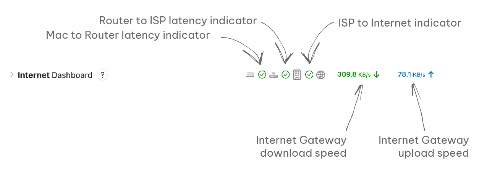
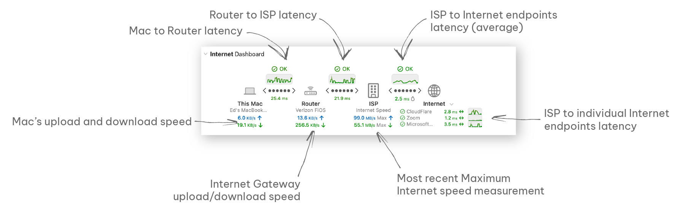

import img1 from './internet-dashboard-images/cleanshot-2024-05-19-at-18-14-01-2x-20240519-221406.png';
import img2 from './internet-dashboard-images/cleanshot-2024-05-19-at-18-26-30-2x-20240519-222635.png';
import img3 from './internet-dashboard-images/cleanshot-2024-05-19-at-18-18-29-2x-20240519-221834.png';
import img4 from './internet-dashboard-images/cleanshot-2024-05-19-at-18-31-01-2x-20240519-223108.png';
import img5 from './internet-dashboard-images/cleanshot-2024-05-19-at-18-31-47-2x-20240519-223152.png';
import img6 from './internet-dashboard-images/cleanshot-2024-05-19-at-18-34-02-2x-20240519-223404.png';
import img7 from './internet-dashboard-images/cleanshot-2024-05-19-at-18-35-38-2x-20240519-223547.png';
import img8 from './internet-dashboard-images/cleanshot-2024-05-19-at-18-34-02-2x-20240519-223745.png';

The Internet Dashboard is specifically crafted to offer you a quick and comprehensive overview of your internet connection's latency and quality. Once activated, monitors are established to track each step of your internet connection, evaluating latency and jitter at crucial points including your router, ISP, and three distinct websites on the internet.

In addition, the dashboard will exhibit both the upload and download speeds of your Mac along with those of your router (if set up). Additionally, if enabled, periodic speed checks for your internet connection will be performed by the dashboard to provide you with insights into the maximum upload and download speeds attained.

You can configure all of these settings in [Internet Dashboard](/user-guide/settings/dashboard/) settings.

## Internet Dashboard Overview

The Internet Dashboard can have two states: expanded (the default) or a more space-efficient collapsed state.

### Collapsed

### Expanded

### Understanding the Dashboard

The Dashboard can initially seem overwhelming due to the amount of information it presents. Its primary goal is to provide a clear overview of each hop your Mac goes through to get to the Internet. PeakHour assesses the quality of connection to each hop using the 'ping' protocol. It does this by continually sending ping packets to the destination host and measuring the time it takes for them to return.

<table>
<colgroup>
<col style="width: 50%" />
<col style="width: 50%" />
</colgroup>
<tbody>
<tr class="odd">
<td></td>
<td>
This status at the top of each hop indicates the latency of the connection. If the latency (or the time packets take to return) is within an acceptable range, it will display <strong>OK</strong>. If the latency exceeds the Light congestion threshold, it will change to <strong>Light congestion</strong>. If latency exceeds the Heavy congestion threshold, it will change to <strong>Heavy congestion</strong>. The color will also change to indicate these congestion levels.

The colors and latency thresholds can be customized in Settings &gt; <a href="/user-guide/settings/monitors-settings/connection-quality-monitor/display-colors-connection-quality/">Display &amp; Colors [Connection Quality]</a>.
</td>
</tr>
<tr class="even">
<td></td>
<td>This graph shows this hop’s latency in the recent past (typically 30-45 seconds, depending on the Refresh Interval).</td>
</tr>
<tr class="odd">
<td></td>
<td>This graph represents the hop between two hosts. The line in the middle 'shimmers' with each ping. The speed of this shimmer effect indicates the latency relative to other hops.</td>
</tr>
<tr class="even">
<td></td>
<td>
This indicates the last ping response time, in milliseconds. The color indicates the response time relative to the known latency of this hop. By default, the known latency is automatically calculated every time PeakHour starts, but this can be changed under <a href="/user-guide/settings/monitors-settings/connection-quality-monitor/latency-options/">Latency options</a>.

If the  indicator is showing, it means some packet loss has been observed recently. Packet loss is where a ping is sent but no response is received. Mouse over this indicator for more details.

If the  indicator is showing, it means the latency or ping responses times are varying significantly. This is known as ‘jitter’ and is typically an indication of instability.
</td>
</tr>
</tbody>
</table>

It's important to note that for the last hop (ISP to Internet), the data displayed represents an aggregate or average of three Internet monitors (ISP to xx). If you wish to delve into details for each individual monitor, you can expand the section below for more in-depth insights or navigate back to the Monitors section where you can examine each monitor meticulously.

### Additional Tips

  - By default, PeakHour uses differential latency to measure the round-trip times between two hops. For example, the latency shown for Router to ISP is actually the time a packet takes to travel between your router and your ISP, not between your Mac and your ISP.

  - You can customize any of the Monitors that power the Internet Dashboard, configuring them to suit your needs. You can do this under [Settings: Monitors](/user-guide/settings/monitors-settings/). Note that if you delete one of the Monitors intentionally or accidentally, and wish to get it back, you will need remove all Monitors and recreate them. See [Internet Dashboard](/user-guide/settings/dashboard/) settings for more information.

  - If you see this icon displayed  , it means your Mac is currently experiencing high CPU usage, which can potentially have an impact on the accuracy of latency measurements.

