The Internet Dashboard is specifically crafted to offer you a quick and comprehensive overview of your internet connection's latency and quality. Once activated, monitors are established to track each step of your internet connection, evaluating latency and jitter at crucial points including your router, ISP, and three distinct websites on the internet.

In addition, the dashboard will exhibit both the upload and download speeds of your Mac along with those of your router (if set up). Additionally, if enabled, periodic speed checks for your internet connection will be performed by the dashboard to provide you with insights into the maximum upload and download speeds attained.

You can configure all of these settings in [Internet Dashboard](/user-guide/settings/dashboard/) settings.

## Choosing a view

The Internet Dashboard offers two views. Use the toggle at the top of the dashboard to switch between them:

- **Simple** — a compact, three-panel summary of your connection's health.
- **Detailed** — the full path to the internet, broken into per-hop segments with latency and throughput.

Both are described below.

## Simple View

The Simple View distils your connection's health into three panels you can read at a glance:

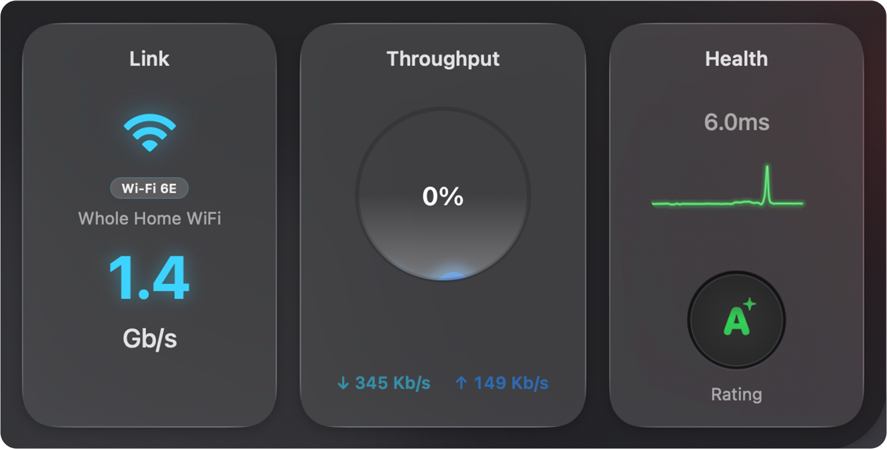

| Panel | What it shows |
|-------|---------------|
| **Link** | Your active network connection — its type (e.g. Wi-Fi 6E), name, and current link speed.|
| **Throughput** | Real-time upload (↑) and download (↓) speeds, with a ring showing usage relative to your [connection's capacity](/user-guide/settings/monitors-settings/bandwidth-monitor/bandwidth-options/). |
| **Health** | Overall connection quality — current latency, a recent latency graph, and a letter **Rating** (A+ down to F) summarising stability. The rating is produced by the [AI Advisor](#ai-advisor). |

:::note
The **Link** speed is the speed of your Mac's connection to the local network (for example, the Wi-Fi or Ethernet link rate) — not the speed of your internet connection. Your internet speed is shown under **Throughput** and, when speed tests are enabled, in the **ISP** segment of the [Detailed View](#detailed-view).
:::

## Detailed View

Expanding the Internet Dashboard reveals the full path your traffic takes to reach the internet, broken into four segments — **This Mac**, **Router**, **ISP**, and **Internet** — with an overall connection quality rating on the right.

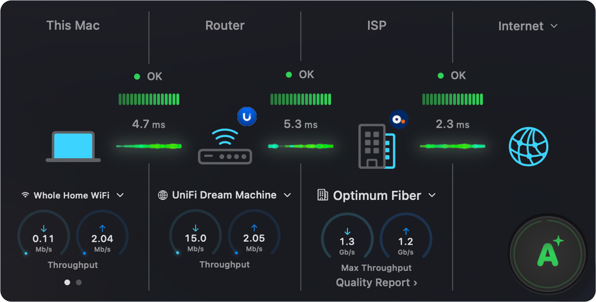

Each segment shows the same set of elements: a status indicator, a latency graph, the latency to the next hop, and (where applicable) a device selector and throughput dials. The sections below cover each segment in turn.

### This Mac

The **This Mac** segment represents your Mac's connection to the local network. It's the first segment in the path to the internet.

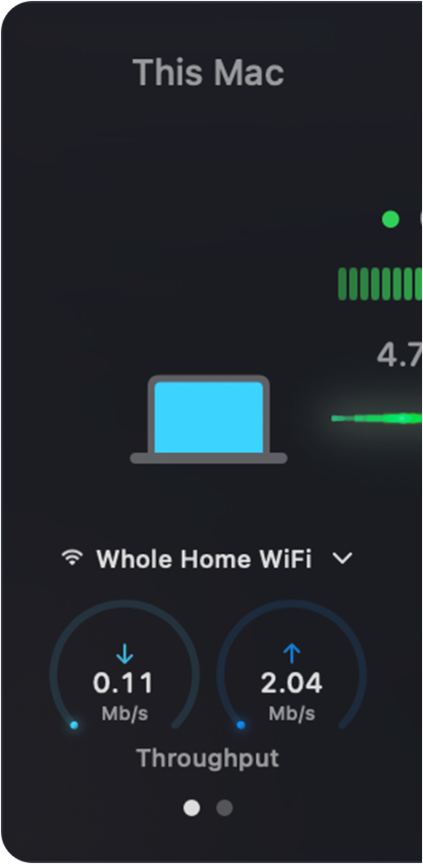

The segment shows, from top to bottom:

| Element | Description |
|---------|-------------|
| **Status** | The green dot and bar graph indicate the latency status of this hop (**OK**, **Light congestion**, or **Heavy congestion**). |
| **Latency** | The figure beside the graph (e.g. 4.7 ms) is the latency from your Mac to the next hop. |
| **Connection selector** | The dropdown (e.g. **Whole Home WiFi**) lets you choose which interface this segment tracks when your Mac has more than one. |
| **Throughput** | The two dials show real-time download (↓) and upload (↑) speeds for your Mac. |

The dots beneath the dials indicate that the panel has more than one page. Swipe left or right on the trackpad, or click the dots, to cycle through additional dials — **Signal Strength** and **Link Speed**.

Click the segment to open a popover with full details about your Mac's connection to the local network:

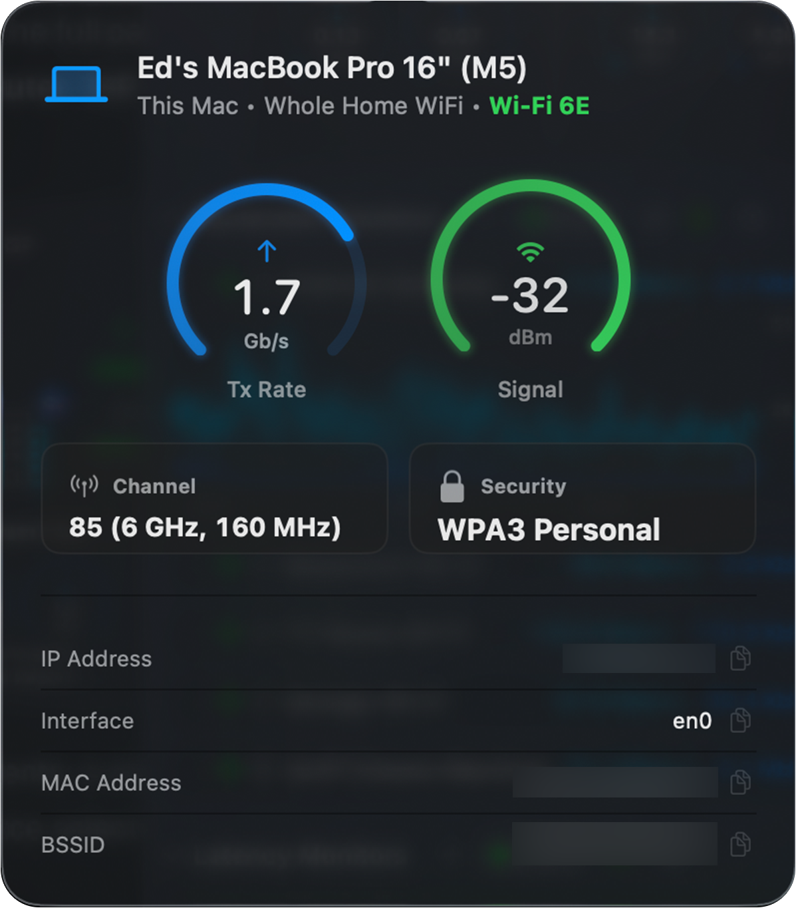

The header shows your Mac's name, the active connection, and its type (for example, **Wi-Fi 6E**). Below that:

| Field | Description |
|-------|-------------|
| **Tx Rate** | The current transmit link rate between your Mac and the network — not your internet speed. |
| **Signal** | Wi-Fi signal strength in dBm. Values closer to 0 are stronger (e.g. −32 dBm is excellent; −70 dBm or lower is weak). |
| **Channel** | The Wi-Fi channel, band, and channel width in use (e.g. 85, 6 GHz, 160 MHz). |
| **Security** | The Wi-Fi security protocol (e.g. WPA3 Personal). |
| **IP Address** | The local IP address assigned to your Mac. |
| **Interface** | The macOS network interface name (e.g. `en0`). |
| **MAC Address** | The hardware address of your Mac's network interface. |
| **BSSID** | The hardware address of the access point your Mac is connected to. |

:::note
The fields shown depend on your connection type. Wi-Fi connections show signal, channel, security, and BSSID; a wired Ethernet connection shows the relevant subset.
:::

### Router

The **Router** segment represents your internet router or gateway — the device that connects your local network to your ISP.

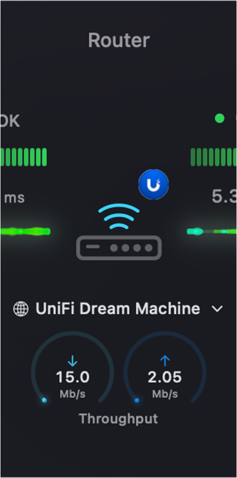

Because the router sits in the middle of the path, it shows a latency graph on each side — one for the hop from **This Mac** to the router, and one for the hop from the router to your **ISP**.

PeakHour displays the detected Internet Gateway in this slot, recognising many router brands and showing the manufacturer's badge (for example, the UniFi logo) on the device icon. If no gateway is configured (via either UPnP or SNMP), it shows the default gateway with placeholder information instead. Throughput dials are only available when a gateway is actively being monitored. For more on configuring a gateway, see [First Time Setup](/user-guide/first-time-setup/) and [Settings → Bandwidth Monitor](/user-guide/settings/monitors-settings/bandwidth-monitor/).

| Element | Description |
|---------|-------------|
| **Status** | The status dot and bar graphs indicate the latency status of the hops on either side of the router. |
| **Latency** | The figures beside each graph are the latency to the router (left) and from the router to your ISP (right). |
| **Device selector** | The dropdown (e.g. **UniFi Dream Machine**) lets you choose which monitored device represents your router. |
| **Throughput** | The two dials show real-time download (↓) and upload (↑) throughput reported by the router. Each dial fills relative to the gateway's configured [Bandwidth settings](/user-guide/settings/monitors-settings/bandwidth-monitor/bandwidth-options/). |

Click the segment to open a popover with full details about your router:

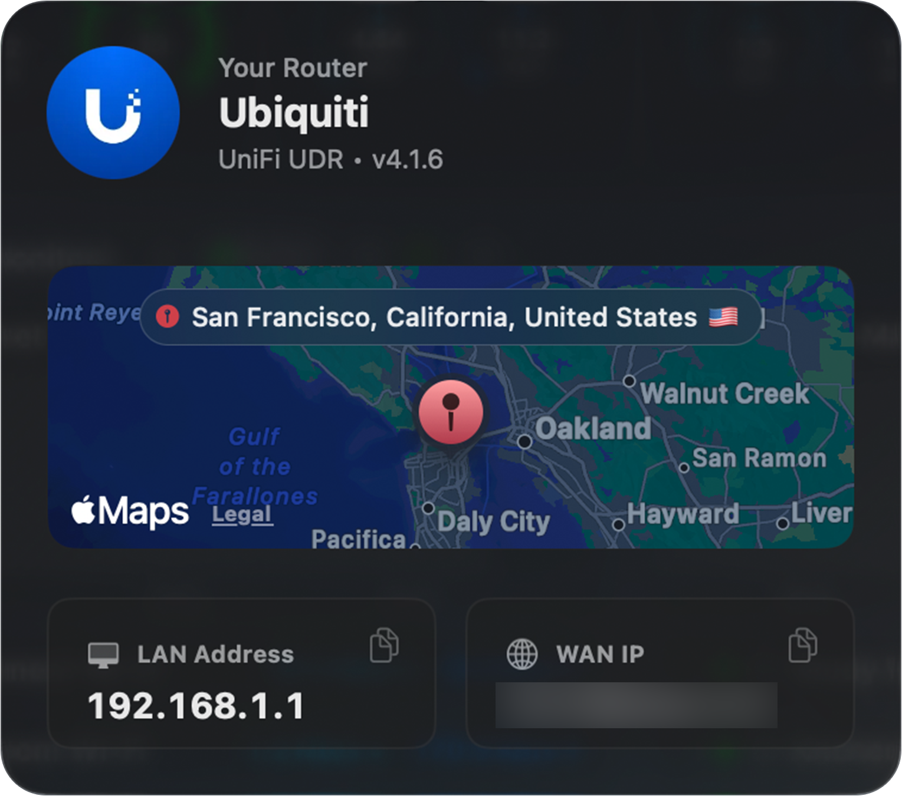

| Field | Description |
|-------|-------------|
| **Your Router** | The detected brand and model of your router (e.g. UniFi Dream Machine, UDM-Pro). |
| **Map** | The approximate physical location of your connection, derived from your WAN IP address. |
| **LAN Address** | Your router's address on your local network (e.g. 192.168.1.1) — typically the gateway your devices connect through. |
| **WAN IP** | The public IP address your ISP has assigned to your router. |

### ISP

The **ISP** segment represents the connection from your router out to your internet service provider.

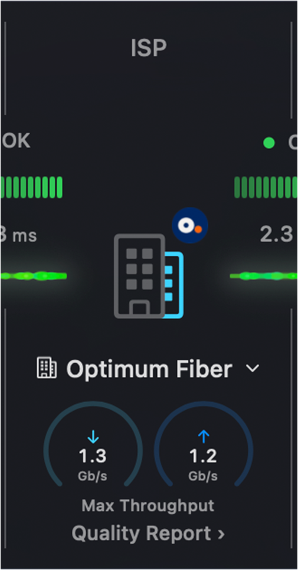

Like the Router, the ISP segment sits mid-path and shows a latency graph on each side — the hop from your router to the ISP, and the hop from the ISP out to the internet. PeakHour identifies your ISP and shows its badge on the building icon.

| Element | Description |
|---------|-------------|
| **Status** | The status dot and bar graphs indicate the latency status of the hops on either side of the ISP. |
| **Latency** | The figures beside each graph are the latency from your router to the ISP (left) and from the ISP to the internet (right). |
| **ISP selector** | The dropdown (e.g. **Optimum Fiber**) shows the detected ISP. |
| **Max Throughput** | The two dials show the maximum download (↓) and upload (↑) speeds measured by the most recent [speed test](/user-guide/settings/dashboard/#speed-test) — not real-time throughput. |
| **Quality Report** | Opens the [Network Quality Report](#network-quality-report) — a detailed measurement of your connection's responsiveness and latency. |

:::note
The **Max Throughput** dials are only populated when periodic speed tests are enabled. Enable them under [Internet Dashboard settings → Speed Test](/user-guide/settings/dashboard/#speed-test).
:::

Click the segment to open a popover with full details about your ISP:

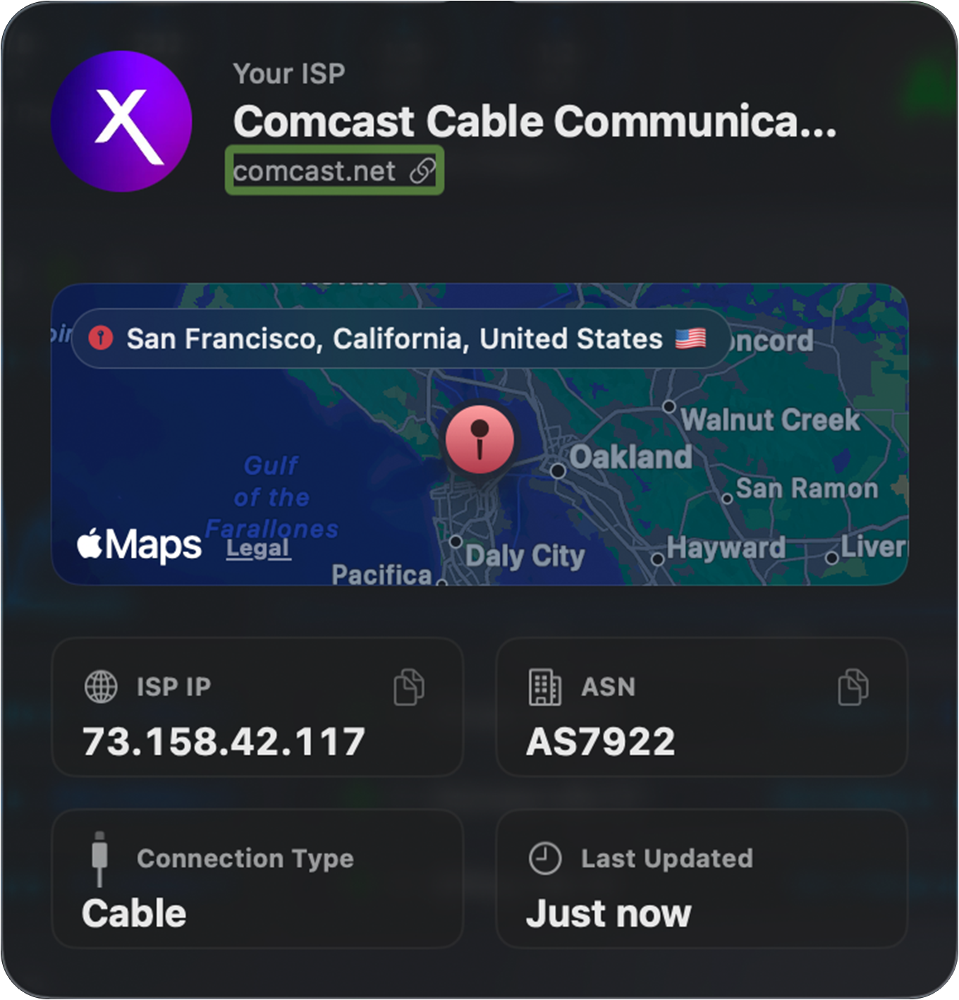

| Field | Description |
|-------|-------------|
| **Your ISP** | The detected name of your internet service provider (e.g. Comcast Cable Communications), with a link to its website. |
| **Map** | The approximate location of your connection, derived from your public IP address. |
| **ISP IP** | The public IP address your ISP has assigned you. |
| **ASN** | The Autonomous System Number identifying your ISP's network (e.g. AS7922). |
| **Connection Type** | The detected connection technology (e.g. Cable, Fiber, DSL). |
| **Last Updated** | When PeakHour last refreshed this information. |

#### Network Quality Report

Clicking **Quality Report** shows the results of your most recent speed test. It measures not just raw speed but how *responsive* your connection stays under load — a better indicator of real-world experience for video calls, gaming, and browsing.

:::note
The Quality Report is only available when periodic [speed tests](/user-guide/settings/dashboard/#speed-test) are enabled. Clicking it displays the latest test results rather than running a new test — to re-run the test on demand, click the **Refresh** button at the top of the report.
:::

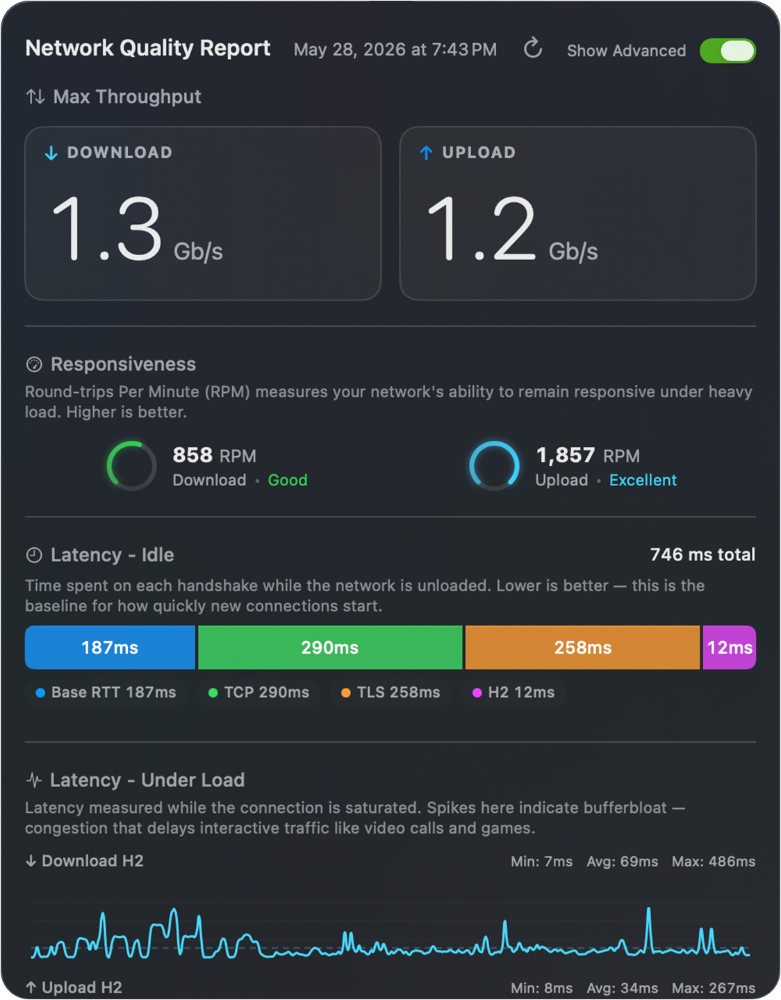

| Section | What it measures |
|---------|------------------|
| **Max Throughput** | The maximum download and upload speeds measured during the test. |
| **Responsiveness** | Round-trips Per Minute (RPM) — how well your network stays responsive under heavy load. Higher is better. |
| **Latency – Idle** | Time spent establishing a connection while the network is unloaded (Base RTT, TCP, TLS, H2 handshakes). Lower is better — this is the baseline for how quickly new connections start. |
| **Latency – Under Load** | Latency measured while the connection is saturated. Spikes here indicate **bufferbloat** — congestion that delays interactive traffic like video calls and games. |

The **Latency – Under Load** graphs (one for download, one for upload) each report three round-trip latency figures measured while the connection was saturated:

| Value | Meaning |
|-------|---------|
| **Min** | The lowest round-trip time observed during the test — your best-case latency under load, usually close to your idle latency. |
| **Avg** | The average round-trip time across the test — the most representative measure of how responsive the connection feels under load. |
| **Max** | The highest round-trip time observed — the worst-case latency, typically at peak congestion. A large gap between **Min** and **Max** is a sign of bufferbloat. |

Toggle **Show Advanced** in the top-right of the report for the per-handshake latency breakdown and the under-load latency graphs.

### Internet

The **Internet** segment represents the final hop — from your ISP out to the wider internet. It's the end of the path, so it shows a single latency graph (the hop from your ISP to the internet) alongside a globe icon.

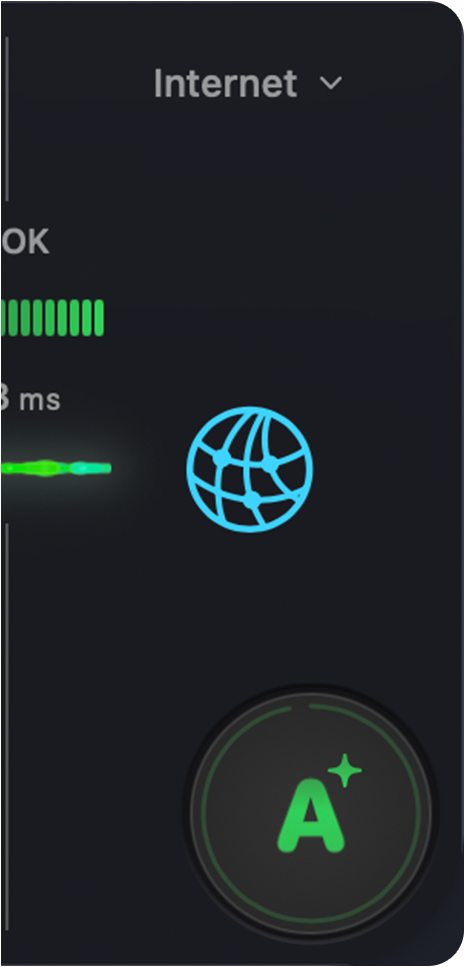

| Element | Description |
|---------|-------------|
| **Status** | The status dot and bar graph indicate the latency status of the hop from your ISP to the internet. |
| **Latency** | The figure beside the graph is the latency from your ISP out to the internet. |
| **Rating** | The overall connection quality grade, described in [AI Advisor Rating](#ai-advisor-rating) below. |

### AI Advisor Rating

The large badge at the end of the dashboard is your overall **AI Advisor Rating** — a single letter grade (A+ down to F) summarising the health of your whole connection, based on latency, jitter, packet loss, and responsiveness.

Click the rating to open the [AI Advisor](#ai-advisor) for a plain-language explanation of what the grade means for you.

## AI Advisor

The **AI Advisor** translates PeakHour's raw measurements into plain-language insight about your connection. Click the [AI Advisor Rating](#ai-advisor-rating) badge to open it.

:::note
The AI Advisor uses **Apple Intelligence** with on-device models. Your network data is analysed entirely on your Mac — nothing leaves your device.
:::

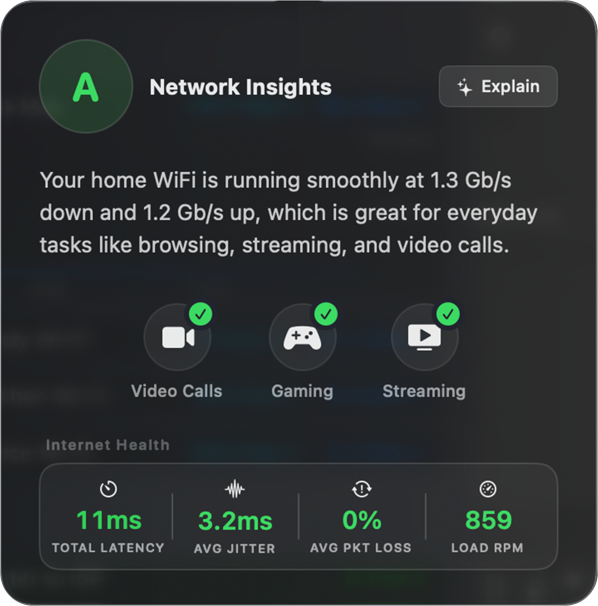

The **Network Insights** popover shows:

| Element | Description |
|---------|-------------|
| **Summary** | A plain-language assessment of how your connection is performing and what it's well suited for. |
| **Activity suitability** | Icons for common activities — **Video Calls**, **Gaming**, **Streaming** — each marked with a check when your connection comfortably supports it. |
| **Internet Health** | The key metrics behind the rating: **Total Latency**, **Avg Jitter**, **Avg Packet Loss**, and **Load RPM** (responsiveness under load). |

### Detailed Network Analysis

Click **Explain** in the top-right of the Network Insights popover for a deeper, AI-powered diagnostic breakdown:

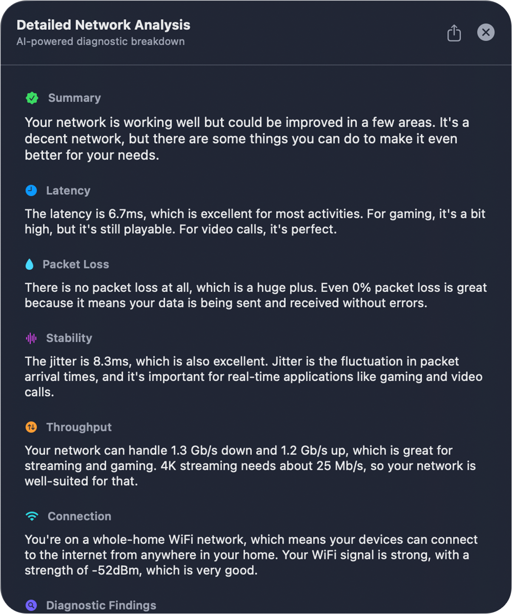

The **Detailed Network Analysis** expands on each dimension of your connection in turn — **Summary**, **Latency**, **Packet Loss**, **Stability** (jitter), **Throughput**, and **Connection** — explaining what each measurement means and how it affects real-world use, followed by specific **Diagnostic Findings**.

:::note
Click the **Export** button at the top of the analysis to generate a detailed Markdown file of the full report — handy for saving a record or sharing with your ISP or IT support.
:::

## Tips

- By default, PeakHour uses **differential latency** to measure the round-trip time between two hops. For example, the latency shown for Router → ISP is the time a packet takes to travel between your router and your ISP, not between your Mac and your ISP.
- You can customise any of the monitors that power the Internet Dashboard under [Settings → Monitors](/user-guide/settings/monitors-settings/). If you delete one of these monitors and want it back, you'll need to recreate them all — see [Recreating Internet Dashboard monitors](/user-guide/settings/dashboard/#recreating-internet-dashboard-monitors).
- If a high-CPU-usage indicator appears on the dashboard, your Mac is under heavy load, which can affect the accuracy of latency measurements.

