The Internet Dashboard is specifically crafted to offer you a quick and comprehensive overview of your internet connection's latency and quality. Once activated, monitors are established to track each step of your internet connection, evaluating latency and jitter at crucial points including your router, ISP, and three distinct websites on the internet.

In addition, the dashboard shows the upload and download speeds of your Mac along with those of your router (if set up). If enabled, the dashboard also runs periodic speed tests of your internet connection and shows the result of the last one.

You can configure all of these settings in [Internet Dashboard](/user-guide/settings/dashboard/) settings.

## Choosing a view

The Internet Dashboard offers two views. Use the toggle at the top of the dashboard to switch between them:

- **Simple** — a compact, three-panel summary of your connection's health.
- **Detailed** — the full path to the internet, in four columns with the latency between each hop and live speeds.

Both are described below.

## Simple View

The Simple View distils your connection's health into three panels you can read at a glance:

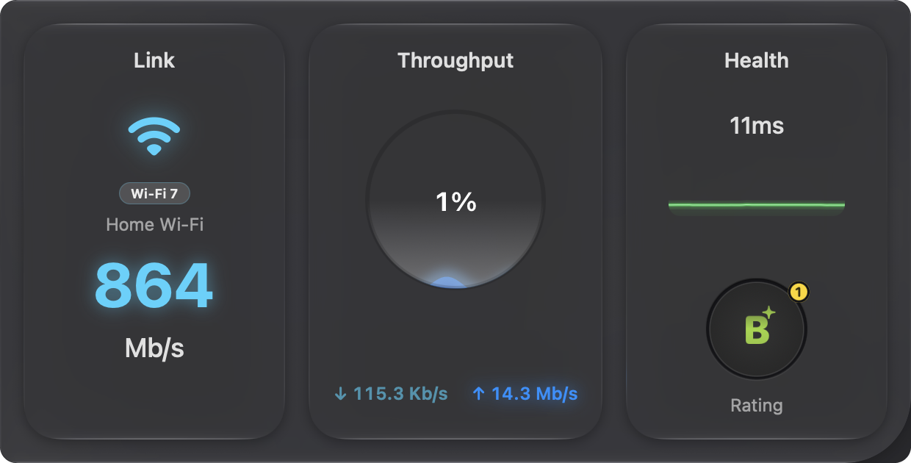

| Panel | What it shows |
|-------|---------------|
| **Link** | Your active network connection — its type (e.g. Wi-Fi 6E), name, and current link speed.|
| **Throughput** | Real-time upload (↑) and download (↓) speeds, with a ring showing usage relative to your [connection's capacity](/user-guide/settings/monitors-settings/bandwidth-monitor/#bandwidth). |
| **Health** | Overall connection quality — current latency, a recent latency graph, and a letter **grade** (A+ down to F) for your whole connection. Click it to open the [PeakHour Advisor](/user-guide/advisor/). See [Grade](#grade). |

Hover over a panel to see an **i**. Click it to open an explanation of the panel. A second click, a click outside the explanation, or Escape closes it.

:::note
The **Link** speed is the speed of your Mac's connection to the local network (for example, the Wi-Fi or Ethernet link rate) — not the speed of your internet connection. Your internet speed is shown under **Throughput** and, when speed tests are enabled, in the **ISP** column of the [Detailed View](#detailed-view).
:::

## Detailed View

Expanding the Internet Dashboard reveals the full path your traffic takes to reach the internet, in four columns — **This Mac**, **Router**, **ISP**, and **Internet** — with your connection's grade on the right.

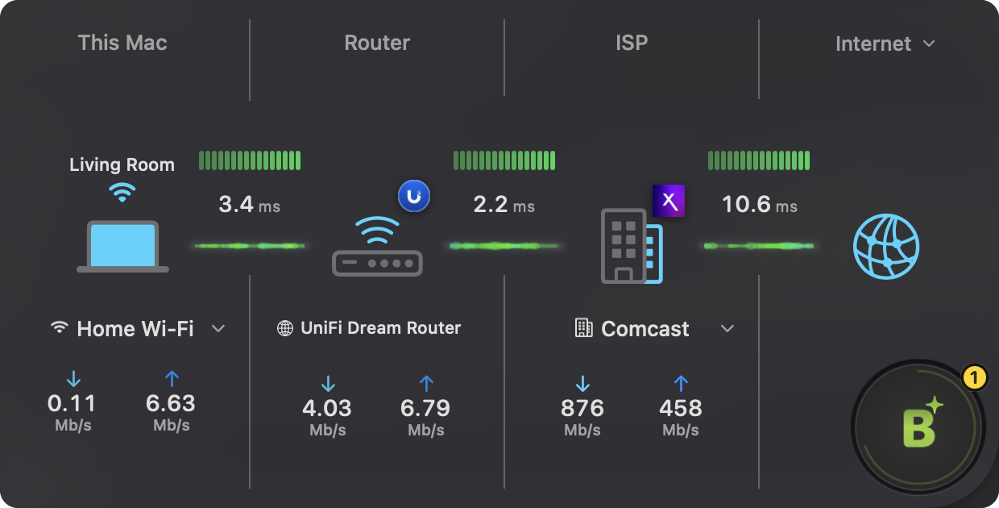

Each column shows its name, the latency to the next hop, and (where it applies) a pair of speed readouts. The sections below cover each column in turn.

### Columns and cards

Each column name is a plain label. A chevron at the top right of the column shows that it has a **card** with more details.

- **Hover** anywhere over a column to highlight it.
- **Click** the column once to open its card under it.
- **Click again**, click outside the card, or press **Escape** to close it.

Every card has the same layout: a header with an icon or a logo, a name and one line about the item, then a panel of live figures, then sections with small headings. Hover over a row with an address to see a copy button. Hover over a figure or a row that has an explanation to see an **i**, and click it to read the explanation.

### Reading the speed readouts

Each pair of readouts shows two large numbers at rest — download (↓) and upload (↑). Both numbers of a pair use the same unit, with about three significant digits.

Hover over the column to see more:

- the **arcs**, which fill to show each speed against its maximum;
- the **caption** of the pair — **Throughput**, **Signal**, **Tx Rate** or **Speed test**;
- the **page dots**, when the column has more than one pair.

### Reading the latency timeline

Every column shares the same latency timeline. Once you can read it in one column, you can read it in all of them:

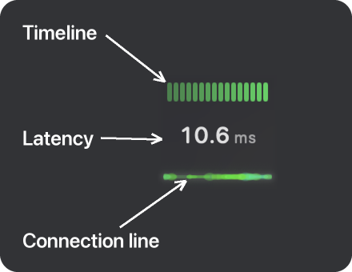

| Element | Description |
|---------|-------------|
| **Status** | A coloured dot and label (**Light congestion**, **Heavy congestion** or **Error**) for the latency of this hop. It shows only when the hop has a problem. |
| **Timeline** | A bar graph of recent latency readings, newest on the right. Each bar is colour-coded from green (Good) to red (Error) so you can spot recent trends and spikes at a glance. |
| **Latency** | The current latency to the next hop (e.g. 17.5 ms), as a large number with a small grey unit. The number takes a colour only when there is a problem. A latency under 2 ms reads **\<2 ms**. |
| **Packet Loss Warning** | A drop icon that appears beside the latency figure when packet loss exceeds 1% on this hop. Click the latency to see more detail. |
| **Jitter Warning** | A waveform icon that appears when latency is varying significantly — high jitter, which can disrupt video calls and gaming. Click the latency to see more detail. |
| **Connection line** | A plain line in the colour of the hop's health joins the hops. With [Connection particle effects](/user-guide/settings/dashboard/#visual-effects) turned on, animated particles flow along it to show live traffic. The effect is off by default. |

Hover over a latency to see an **i**. Click it to open an explanation with the current latency of the hop, and its packet loss and jitter when they matter. A second click, a click outside the explanation, or Escape closes it.

#### Router to ISP and ISP to Internet

The latency of these two hops is an estimate: PeakHour takes the latency to the far end and subtracts the latency to the hop before it. It never reads 0.0 ms — a hop too short to measure reads **\<2 ms**. When PeakHour can't measure the hop on its own, a caption explains the value:

- **Whole path** — the value is the latency of the whole path from this Mac, because PeakHour can't measure the hop between the two ends.
- **Slow ISP hop** — your ISP's router answers pings more slowly than the sites behind it, so PeakHour can't measure the hop from your ISP to the internet.

The caption shows in the explanation of the latency, and beside the monitor in [Latency Monitors](/user-guide/main-view/latency-monitors/).

### This Mac

The **This Mac** column represents your Mac's connection to the local network. It's the first column in the path to the internet.

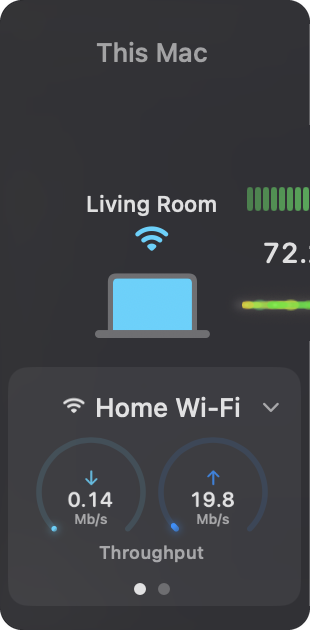

The column shows, from top to bottom:

| Element | Description |
|---------|-------------|
| **Name** | Your active connection — for example, the name of your Wi-Fi network. |
| **Latency** | The figure beside the graph (e.g. 4.7 ms) is the latency from your Mac to the next hop. |
| **Throughput** | The pair shows real-time download (↓) and upload (↑) speeds for your Mac. |

When the column has more than one pair, swipe left or right on the trackpad, or click the page dots, to see the others — for example **Signal** and **Tx Rate** on Wi-Fi.

Click the column to open its card, with full details about your Mac's connection to the local network:

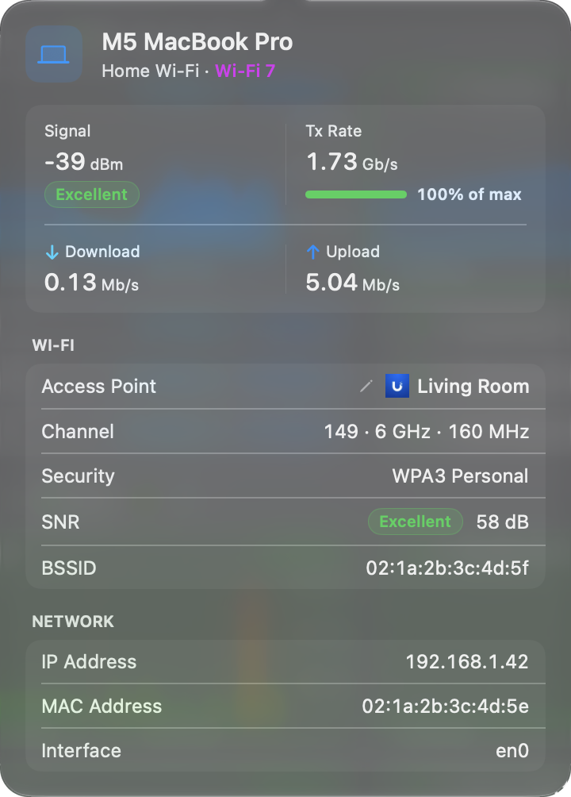

The header shows your Mac's model (for example, **MacBook Pro 16-inch**), then your Wi-Fi network and its Wi-Fi standard (for example, **Wi-Fi 6E**).

| Figure | Description |
|--------|-------------|
| **Signal** | Wi-Fi signal strength in dBm, with a pill: **Excellent**, **Good**, **Fair** or **Poor**. Values closer to 0 are stronger (e.g. −32 dBm is excellent; −75 dBm or lower is weak). |
| **Tx Rate** | The current transmit link rate between your Mac and the access point — not your internet speed. A bar shows it as a share of the highest rate that the Wi-Fi standard and channel width allow, for example **72% of max**. |
| **Download**, **Upload** | Your Mac's live throughput. |

Under the figures, the **Wi-Fi** section shows:

| Field | Description |
|-------|-------------|
| **Access Point** | The name of the access point your Mac is connected to. Click the pencil beside it to rename it. |
| **Channel** | The Wi-Fi channel, band, and channel width in use (e.g. 85 · 6 GHz · 160 MHz). |
| **Security** | The Wi-Fi security protocol (e.g. WPA3 Personal). |
| **SNR** | The signal-to-noise ratio in dB, with a pill: **Excellent** above 40 dB, **Good** 26–40 dB, **Fair** 16–25 dB, **Poor** 15 dB or less. |
| **BSSID** | The hardware address of the access point your Mac is connected to. |

The **Network** section shows your Mac's **IP Address**, its **MAC Address**, and the macOS **Interface** name (e.g. `en0`).

:::note
On a wired Ethernet connection, the figures show **Link Speed** instead of the Wi-Fi figures.
:::

### Router

The **Router** column represents your internet router or gateway — the device that connects your local network to your ISP.

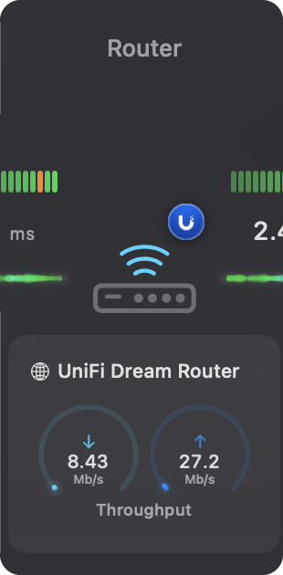

Because the router sits in the middle of the path, it shows a latency graph on each side — one for the hop from **This Mac** to the router, and one for the hop from the router to your **ISP**.

PeakHour displays the detected Internet Gateway in this slot, recognising many router brands and showing the manufacturer's badge (for example, the UniFi logo) on the device icon. For more on configuring a gateway, see [First Time Setup](/user-guide/first-time-setup/) and [Settings → Bandwidth Monitor](/user-guide/settings/monitors-settings/bandwidth-monitor/).

| Element | Description |
|---------|-------------|
| **Latency** | The figures beside each graph are the latency to the router (left) and from the router to your ISP (right). |
| **Name** | The name (e.g. **UniFi Dream Router**) of the [Bandwidth Monitor](/user-guide/settings/monitors-settings/bandwidth-monitor/) representing your Internet Gateway. It's normally detected automatically, but you can designate it manually in Settings. If no Bandwidth Monitor is detected or designated, the column shows the default gateway's IP address instead, and the throughput readouts stay empty. |
| **Throughput** | The pair shows real-time download (↓) and upload (↑) throughput reported by the router. The arcs fill relative to the gateway's [Bandwidth settings](/user-guide/settings/monitors-settings/bandwidth-monitor/#bandwidth). While the maximum is **Automatic**, your [Internet plan](/user-guide/settings/dashboard/#internet-plan) sets it. |

Click the column to open its card, with details about your router:

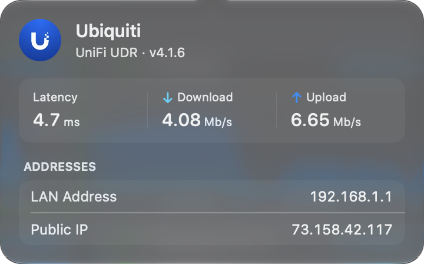

The header shows the router's name as the dashboard shows it, with its maker and firmware under it.

| Field | Description |
|-------|-------------|
| **Latency** | The latency from this Mac to the router. |
| **Download**, **Upload** | The live throughput that the router reports. |
| **LAN Address** | Your router's address on your local network (e.g. 192.168.1.1) — typically the gateway your devices connect through. It reads **LAN Host** when you added the router by its host name. |
| **Public IP** | The public IP address your ISP has assigned to your router. |

### ISP

The **ISP** column represents the connection from your router out to your internet service provider.

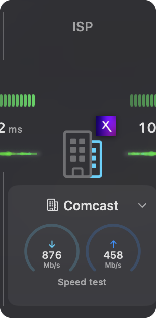

Like the Router, the ISP column sits mid-path and shows a latency graph on each side — the hop from your router to the ISP, and the hop from the ISP out to the internet. PeakHour identifies your ISP and shows its badge on the building icon.

| Element | Description |
|---------|-------------|
| **Latency** | The figures beside each graph are the latency from your router to the ISP (left) and from the ISP to the internet (right). |
| **Name** | The detected ISP (e.g. **Comcast**). |
| **Speed test** | The pair shows the download (↓) and upload (↑) speeds of your last [speed test](/user-guide/settings/dashboard/#speed-test) — not real-time throughput. |

:::note
The **Speed test** readouts fill in after a speed test. Until then, the column reads **Speed Test not run yet**. To run tests on a schedule, turn on [Run Speed Tests](/user-guide/settings/dashboard/#speed-test).
:::

Click the column to open its card, with your last speed test and details about your ISP:

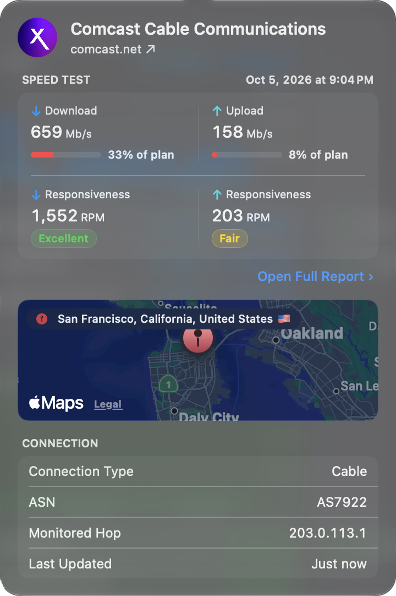

The header shows your ISP's logo and name (e.g. Comcast Cable Communications), with a link to its website.

The **Speed Test** section shows the time of your last test, its **Download** and **Upload** speeds, and the download and upload **Responsiveness** in RPM, each with a pill. With an [Internet plan](/user-guide/settings/dashboard/#internet-plan) set, each speed has a bar such as **82% of plan**.

Click **Open Full Report ›** under the figures to see the whole test:

- on macOS 26 and later, the card closes, and the PeakHour Advisor opens on its [Speed Test](/user-guide/advisor/speed-test/) page;
- on macOS 14 and 15, the card closes, and the full test opens in a popover on the dashboard. See [Speed Test on macOS 14 and 15](#speed-test-on-macos-14-and-15).

Under the speed test:

| Field | Description |
|-------|-------------|
| **Map** | The approximate location of your ISP, derived from your public IP address. Right-click it and choose **Open in Maps** to see it in Apple Maps. |
| **Connection Type** | The detected connection technology (e.g. Cable, Fiber, DSL). |
| **ASN** | The Autonomous System Number identifying your ISP's network (e.g. AS7922). |
| **Monitored Hop** | The address of your ISP's router that PeakHour pings to measure the ISP hop. |
| **Last Updated** | When PeakHour last refreshed this information. |

When [ISP Information](/user-guide/settings/isp-information/) is off, the card still opens with your last speed test. Its title is then **ISP**.

#### Speed Test on macOS 14 and 15

The PeakHour Advisor needs macOS 26 or later. On macOS 14 and 15, **Open Full Report ›** on the ISP card opens the full test in a popover, with the title **Speed Test**. The test measures more than raw speed. It also measures how *responsive* your connection stays under load. This value shows better how video calls, games and web pages feel.

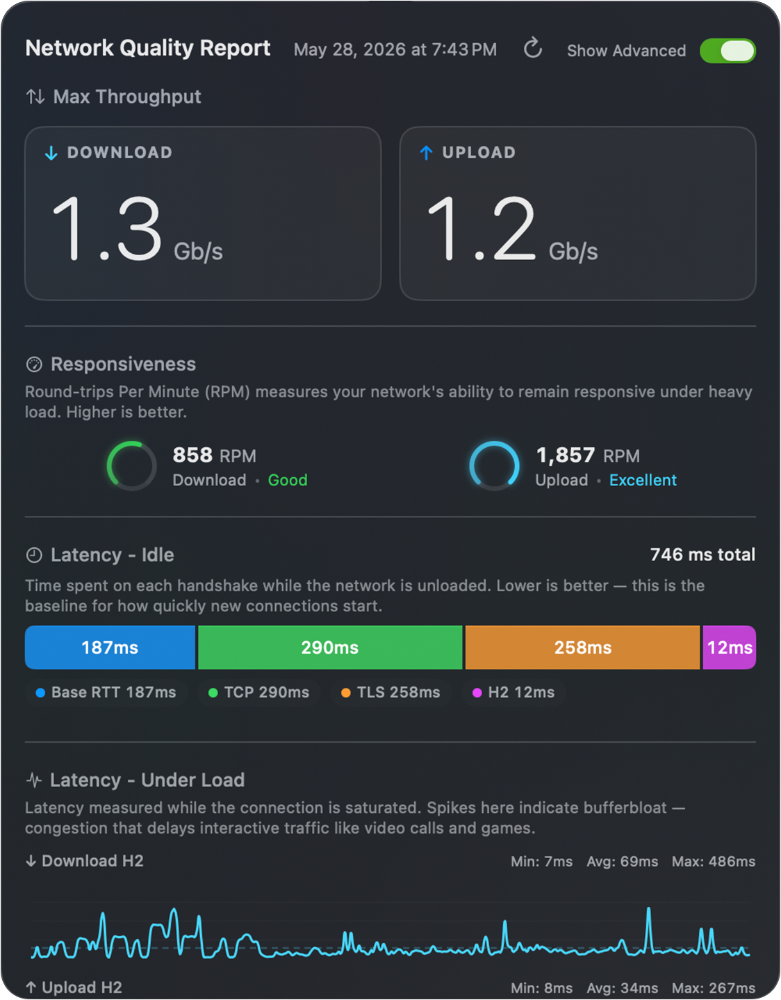

The popover has the layout of the column cards. The header shows the time of the test and the interface that it used. Under it are four figures: **Download**, **Upload**, and the download and upload **Responsiveness**, in Round-trips Per Minute (RPM).

Click **Show Details** to see three more sections:

| Section | What it measures |
|---------|------------------|
| **Idle Latency** | The time to start a connection while nothing else uses the network (Base RTT, TCP, TLS, H2). Lower is better. This is the baseline for how quickly new connections start. |
| **Latency Under Load** | The latency while the test fills the connection, for download and for upload. Spikes here show **bufferbloat**: congestion that delays interactive traffic, such as video calls and games. |
| **Test** | How the test ran: the interface, the server, the protocol, the number of flows, the data transferred, and the duration. |

For what each value means, see [Speed Test](/user-guide/advisor/speed-test/). The popover shows the results of the last test. It doesn't run a new test. To run a new test, click the refresh button (**Run Speed Test**) at the top of the popover.

### Internet

The **Internet** column represents the final hop — from your ISP out to the wider internet. It's the end of the path, so it shows a single latency graph (the hop from your ISP to the internet) alongside a globe icon.

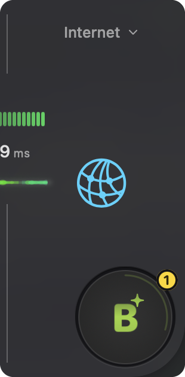

| Element | Description |
|---------|-------------|
| **Latency** | The figure beside the graph is the latency from your ISP out to the internet. |
| **Grade** | The overall connection quality grade, described in [Grade](#grade) below. |

Click **Internet** at the top of the column to open the list of **Internet Hosts** — the endpoints PeakHour uses for connectivity checks:

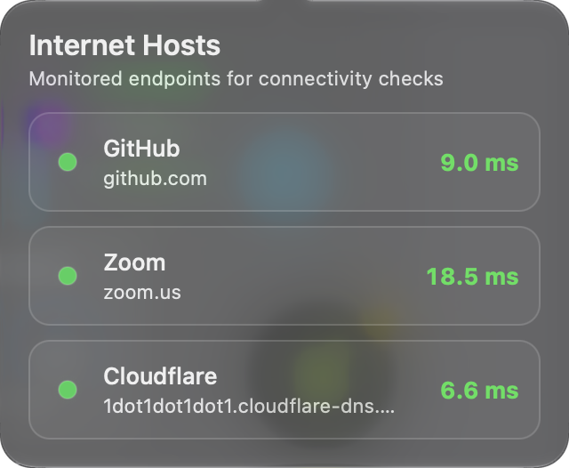

PeakHour measures the final hop with three well-known sites and combines the results. By default, the sites are **Google**, **Cloudflare** and **Netflix**. Each host shows a status dot that tells if it is reachable now, the host name of the check, and its latency. You can change which hosts are monitored in [Settings → Dashboard](/user-guide/settings/dashboard/).

### Grade

The large badge at the end of the dashboard is your connection's **grade** — a single letter from **A+** down to **F** for your whole connection, based on latency, jitter, packet loss, speed, and responsiveness under load. See [How the grade works](/user-guide/advisor/grade/).

- **Click the grade** to open the [PeakHour Advisor](/user-guide/advisor/), which explains the grade, shows where any problem starts, and suggests what to try.
- **A number on its rim** shows how many issues hold the grade back, in the color of the worst one.
- **The ring around it** counts down to the next update. PeakHour grades your connection every 30 seconds.

The grade needs macOS 26 or later, and **AI Advisor** turned on in [Settings → Dashboard](/user-guide/settings/dashboard/#ai-advisor). With the AI Advisor off, the button shows a stethoscope and the word **Advisor** instead of a grade. Click it to open the Advisor window, which still shows your speed tests, your history and the routes to each site.

## Tips

- By default, PeakHour uses **differential latency** to measure the round-trip time between two hops. For example, the latency shown for Router → ISP is the time a packet takes to travel between your router and your ISP, not between your Mac and your ISP. See [Router to ISP and ISP to Internet](#router-to-isp-and-isp-to-internet).
- You can customise any of the monitors that power the Internet Dashboard under [Settings → Monitors](/user-guide/settings/monitors-settings/). If you delete one of these monitors and want it back, turn the dashboard off and on again: PeakHour creates only the monitors that are missing. See [Recreating Internet Dashboard monitors](/user-guide/settings/dashboard/#recreating-internet-dashboard-monitors).
- If a high-CPU-usage indicator appears on the dashboard, your Mac is under heavy load, which can affect the accuracy of latency measurements.
