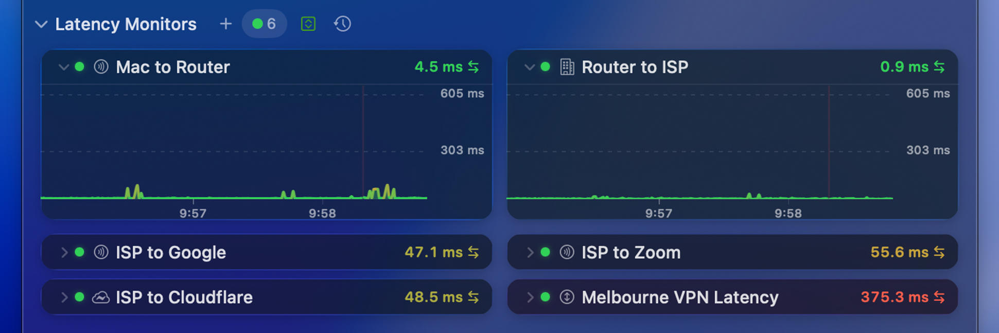
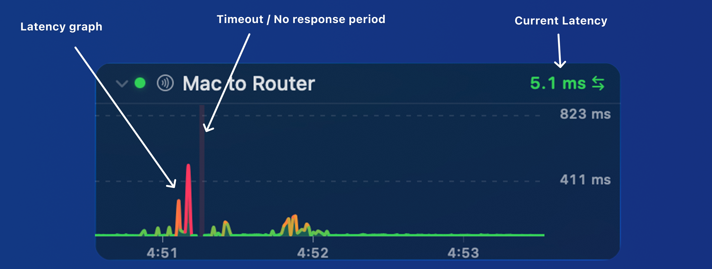

Latency Monitors (previously called Connection Quality Monitors) measure round-trip latency, jitter, and packet loss to hosts on the internet. They appear at the bottom of the [Main View](/user-guide/main-view/).

## What they measure

| Metric | Description |
|--------|-------------|
| **Latency** | Round-trip time for a single ping, in milliseconds. |
| **Jitter** | Variation in latency over time. High jitter suggests an unstable connection. |
| **Packet loss** | Percentage of pings that didn't get a reply. |

Higher latency, jitter, or packet loss can indicate problems on your network or along the route to a host.

## Single-hop vs differential

A Latency Monitor can target a single host (for example, `1.1.1.1`) or measure the *difference* between two hops (for example, **Router → ISP**). Differential measurements isolate problems to specific portions of the path, which is how the [Internet Dashboard](/user-guide/main-view/internet-dashboard/) measures latency to your router and ISP.

## Section header

The header bar above the monitors holds controls for the whole Latency Monitors section:

From left to right:

| Control | Description |
|---------|-------------|
| **Show / Hide** | Collapses or expands the entire Latency Monitors section. |
| **New Monitor** | Adds a new Latency Monitor via the [Configuration Assistant](/user-guide/configuration-assistant/). |
| **Counts** | Summarises monitors by status, with a colored dot for each: green for **Active**, yellow for **Warning**, red for **Error**, and grey for **Disabled**. |
| **Shared Y Axis** | Puts every monitor's graph on the same vertical scale so latency can be compared directly. |
| **Open History** | Opens the [History view](/user-guide/history-view/) for the monitors in this section. |

## Reading the graph

Each monitor shows the latest latency value, a colored quality indicator, and a graph of recent measurements. Hover over an expanded graph to reveal the [graph toolbar](#graph-toolbar) below.

A single monitor packs more detail than it first appears:

Along the top of each monitor, from left to right:

- **Disclosure triangle** — expands or collapses the monitor's graph, leaving just the title and current latency visible.
- **Status light** — a colored dot showing the monitor's current state: green for **Active**, yellow for **Warning**, red for **Error**, and grey for **Disabled**.
- **Symbol** — the icon representing the target or path being measured. This can be configured in [Settings → Latency Monitor](/user-guide/settings/monitors-settings/latency-monitor/).
- **Name** — the monitor's label. Set this in [Settings → Latency Monitor](/user-guide/settings/monitors-settings/latency-monitor/).
- **Current latency** — the most recent round-trip time, in milliseconds.

The graph itself adds a couple more details:

- **Latency graph** — plots recent round-trip times, colored by quality so spikes and slow responses stand out at a glance.
- **Timeout / No response** — pings that didn't get a reply are drawn as red marks, making packet loss easy to spot.

## Configuring

Add, remove, and customize Latency Monitors from [Settings → Latency Monitor](/user-guide/settings/monitors-settings/latency-monitor/), where you can adjust polling intervals, latency thresholds, packet count, and colors.

## Graph toolbar

Hover over an expanded graph to reveal its toolbar:

From left to right:

| Control | Description |
|---------|-------------|
| **Probe-method pill** | Appears only when the monitor has fallen back from standard ping. The label shows the method in use — **UDP TTL**, **TCP**, or **HTTP**. See [Probe methods](#probe-methods) below. |
| **Zoom out** | Zooms the graph out, showing more time. |
| **Zoom in** | Zooms the graph in, showing less time. |
| **Share** | Shares the graph via Mail, Messages, AirDrop, etc. |
| **History** | Opens the [History view](/user-guide/history-view/) for this target. |
| **Settings** | Opens the settings for this monitor in [Settings → Latency Monitor](/user-guide/settings/monitors-settings/latency-monitor/). |

### Probe methods

Latency Monitors normally measure round-trip time with standard ICMP ping. If ping is blocked or stops getting replies, PeakHour automatically falls back to another method so monitoring keeps working — stepping down through **UDP TTL**, then **TCP**, then **HTTP** until something succeeds.

Whenever a monitor is running on anything other than ping, the toolbar shows a small pill with the active method's name. PeakHour keeps retrying the better methods in the background and clears the pill automatically once ping recovers (usually within a few minutes).

:::note
The pill is informational — it tells you a connection is being measured by a fallback method, not that anything is wrong. You don't need to do anything; it disappears on its own when standard ping starts working again.
:::
