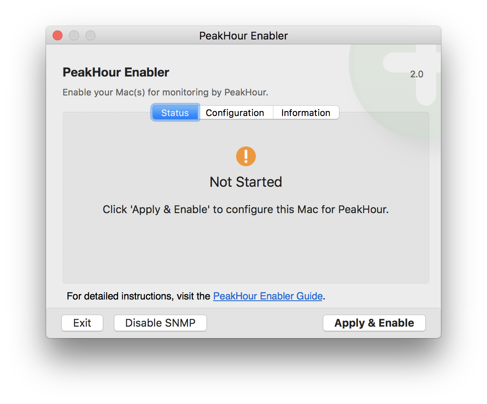
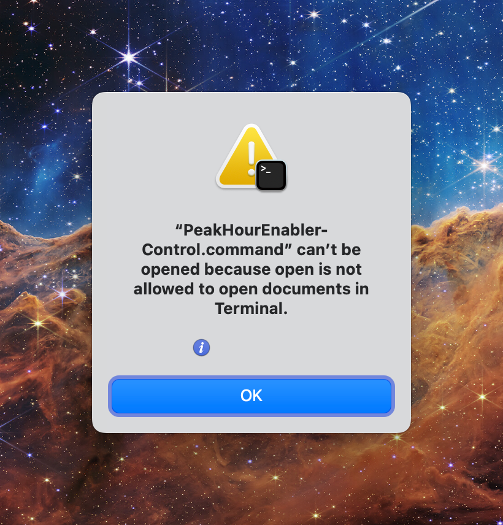
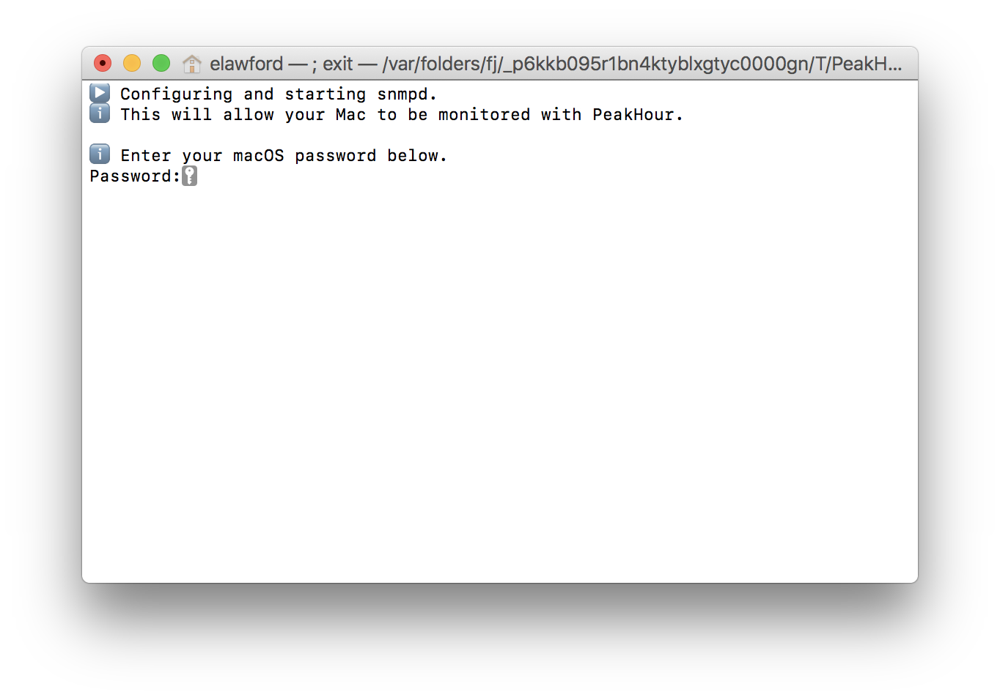
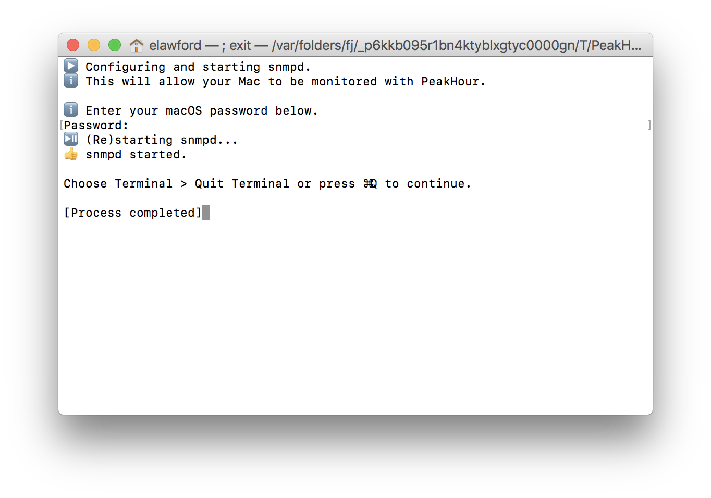
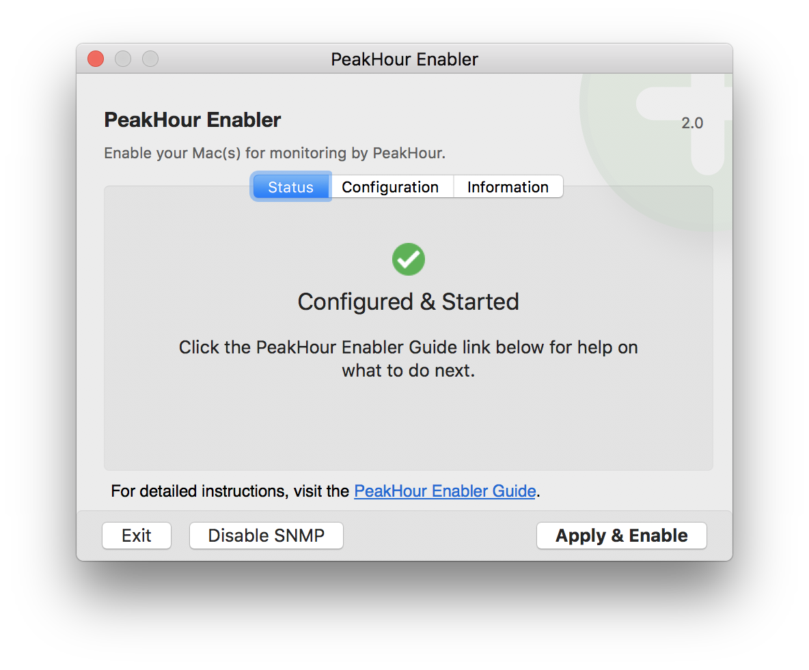
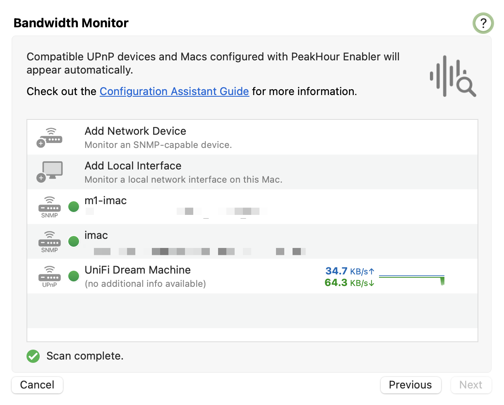
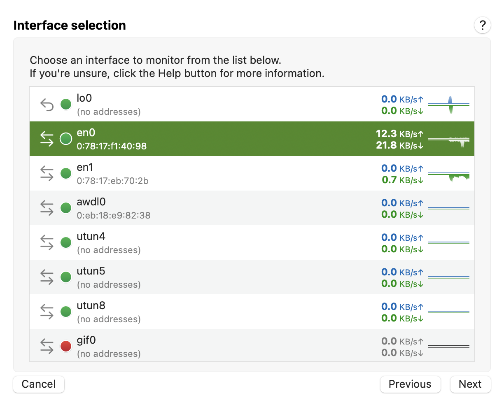

# Steps

This page steps you through enabling other Macs so that they can be monitored by PeakHour. We've made this process super-easy by creating **PeakHour Enabler**. This tool, which you can download for free below, will automatically set up your Mac(s) so that they can be monitored by PeakHour.

Here's what you need to do:

### 1. Get PeakHour Enabler

On the Mac you want to monitor with PeakHour, download the latest version of PeakHour Enabler:

  -  [**Download PeakHour Enabler**](https://updates.peakhourapp.com/releases/PeakHour%20Enabler.zip)

### 2\. Run PeakHour Enabler

1.  On the Mac you wish to monitor in PeakHour, launch PeakHour Enabler:
    
    

2.  Click **Apply & Enable** to start and configure SNMP.
    
    Note: in **macOS Ventura** (macOS 13) and above, Apple has disabled the ability for Terminal to run scripts. To work around this, do the following:
    
    1.  Clicking Apply & Enable will display the following error:  
          
          
          
    2.  Click the *i* icon to reveal the path of the script.
    3.  Double-click **PeakHourEnabler-Control.command** to open the script in **Finder**.
    4.  Go back to **Terminal** and click **OK** to dismiss the error.
    5.  Choose **Terminal \> Quit Terminal** from the menu.
    6.  Go back to **Finder** and double-click the script to execute it.
    7.  Follow the instructions below as normal.

3.  Enter your macOS password when prompted:
    
    

4.  Press **Command-Q** to Quit Terminal or choose **Terminal** \> **Quit** from the menu.
    
    

5.  Status should now be Configured & Started.
    
    

6.  Click **Exit**.

### 3\. Add the Mac to PeakHour

Switch to the Mac running PeakHour.

1.  Go to **Settings** \> **+** \> **Bandwidth Monitor**. You should see enabled Mac in the list of available devices. Click on the Mac and click **Next** to configure it.
    
    

2.  Confirm the SNMP details (the IP address and SNMP community will be automatically populated.

3.  Choose the interface you wish to monitor.
    
    

4.  Click **Finish**.

5.  The Mac will be added as a new Bandwidth Monitor.

PeakHour Enabler uses iCloud to share configuration details. The Mac will only auto-populate in the Configuration Assistant if both Macs are sharing the same iCloud account.

#### If they're not sharing the same iCloud accout

1.  In PeakHour, open [Settings](/user-guide/settings/).

2.  Click + to add a new Target.

3.  Choose **Bandwidth**.

4.  Click **Add SNMP Device...**

5.  Specify the IP address and SNMP community you noted down in step 6b. above.

6.  Click **Next** and **Finish**.

