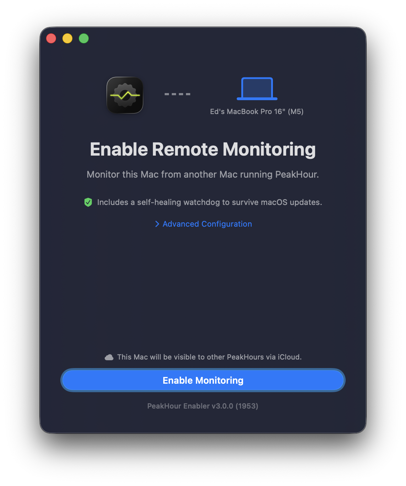

PeakHour can monitor the bandwidth of other Macs on your network. To do that, the Mac you want to monitor needs SNMP enabled — and **PeakHour Enabler** sets that up for you automatically.

PeakHour Enabler is free and open source. The tool and its full step-by-step setup instructions live on GitHub.

  <a class="cta-button" href="https://github.com/EpaL/PeakHour-Enabler/releases/latest" target="_blank" rel="noopener noreferrer">⬇&nbsp; Download PeakHour Enabler</a>

  <a href="https://github.com/EpaL/PeakHour-Enabler" target="_blank" rel="noopener noreferrer"><strong>View PeakHour Enabler on GitHub →</strong></a>

## How it works

1. Run **PeakHour Enabler** on the Mac you want to monitor — it configures and starts SNMP for you. Full instructions are in the [repository's README](https://github.com/EpaL/PeakHour-Enabler#readme).
2. On the Mac running PeakHour, open the [Bandwidth Configuration Assistant](/user-guide/configuration-assistant/configuration-assistant-bandwidth/) and add the enabled Mac.

When both Macs share the same iCloud account, PeakHour Enabler shares the connection details via iCloud, so the enabled Mac appears automatically in the list of discovered devices.

If the two Macs aren't on the same iCloud account, add it manually instead: in the Bandwidth Configuration Assistant choose **Add SNMP Device** and enter the Mac's IP address and SNMP community (both shown by PeakHour Enabler).
