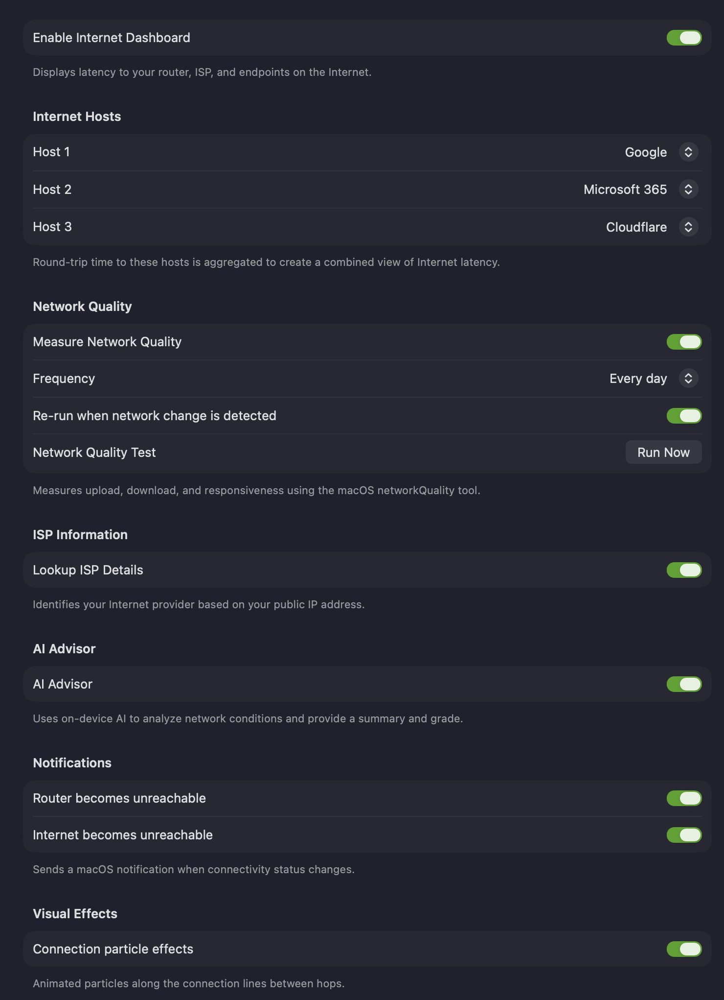

The **Dashboard** settings are where you enable and configure the [Internet Dashboard](/user-guide/main-view/internet-dashboard/) — a real-time view of your internet latency, throughput, and connection health.

**Enable Internet Dashboard** — turns the Internet Dashboard on and shows it on the main display, displaying latency to your router, ISP, and endpoints on the internet. For what it shows, see [Internet Dashboard](/user-guide/main-view/internet-dashboard/).

## Internet Hosts

PeakHour continually pings three hosts and aggregates the round-trip times into a combined view of internet latency. Choose services you use often.

**Host 1, 2, 3** — the service to ping for each slot. Each dropdown offers a large list of popular services and DNS providers: Akamai, Amazon, Amazon AWS, Apple, Apple TV+, Cloudflare, Disney+, Fastly, GitHub, Google, Google Cloud, Meta (Facebook), Microsoft 365, Microsoft Azure, Netflix, OpenDNS, PlayStation Network, Quad9, Reddit, Slack, Spotify, Steam, Twitch, X (Twitter), Xbox Live, YouTube, and Zoom. Choose **None** to leave a slot empty, or **Custom…** to enter your own hostname or IP address.

These hosts appear in the **Internet** segment's popover on the dashboard.

## Network Quality

PeakHour can periodically measure your connection's upload speed, download speed, and responsiveness using the macOS **networkQuality** tool, and show the results on the Internet Dashboard.

| Setting | Description |
|---------|-------------|
| **Measure Network Quality** | Enables periodic measurement. Results appear under **ISP** on the dashboard and in the [Network Quality Report](/user-guide/main-view/internet-dashboard/#network-quality-report). Running a test also calibrates your Internet Gateway's maximum available upload and download bandwidth. |
| **Frequency** | How often the test runs — every hour, 6 hours, 12 hours, day, or week. |
| **Re-run when network change is detected** | Also runs a test automatically whenever PeakHour detects a network change, such as switching Wi-Fi networks. |
| **Network Quality Test → Run Now** | Runs a test immediately. You can also right-click the Internet Dashboard and run it from there. |

## ISP Information

**Lookup ISP Details** — identifies your internet provider (name, ASN, connection type, and approximate location) from your public IP address, shown in the **ISP** segment's popover on the dashboard.

## AI Advisor

**AI Advisor** — uses on-device AI to analyse your network conditions and produce a plain-language summary and an overall grade. See [AI Advisor](/user-guide/main-view/internet-dashboard/#ai-advisor).

:::note
The AI Advisor runs entirely on your Mac using Apple Intelligence — your network data never leaves your device.
:::

## Notifications

Send a macOS notification when connectivity changes — both when a connection drops and when it comes back:

- **Router becomes unreachable** — notifies you when your router stops responding, and again when it recovers.
- **Internet becomes unreachable** — notifies you when the wider internet stops responding, and again when it recovers.

## Visual Effects

**Connection particle effects** — animated particles flow along the connection lines between hops on the dashboard, visualising live traffic. Disable to turn the animation off.

## Recreating Internet Dashboard monitors

If you delete one or more of the monitors that power the Internet Dashboard, the only way to restore them is to recreate them all:

1. Open **Dashboard** settings.
2. Disable the Internet Dashboard.
3. When prompted whether to delete all monitors associated with the Internet Dashboard, choose **Yes, remove all Dashboard monitors**.
4. Re-enable the Internet Dashboard.

This recreates all Internet Dashboard monitors with their default settings.
