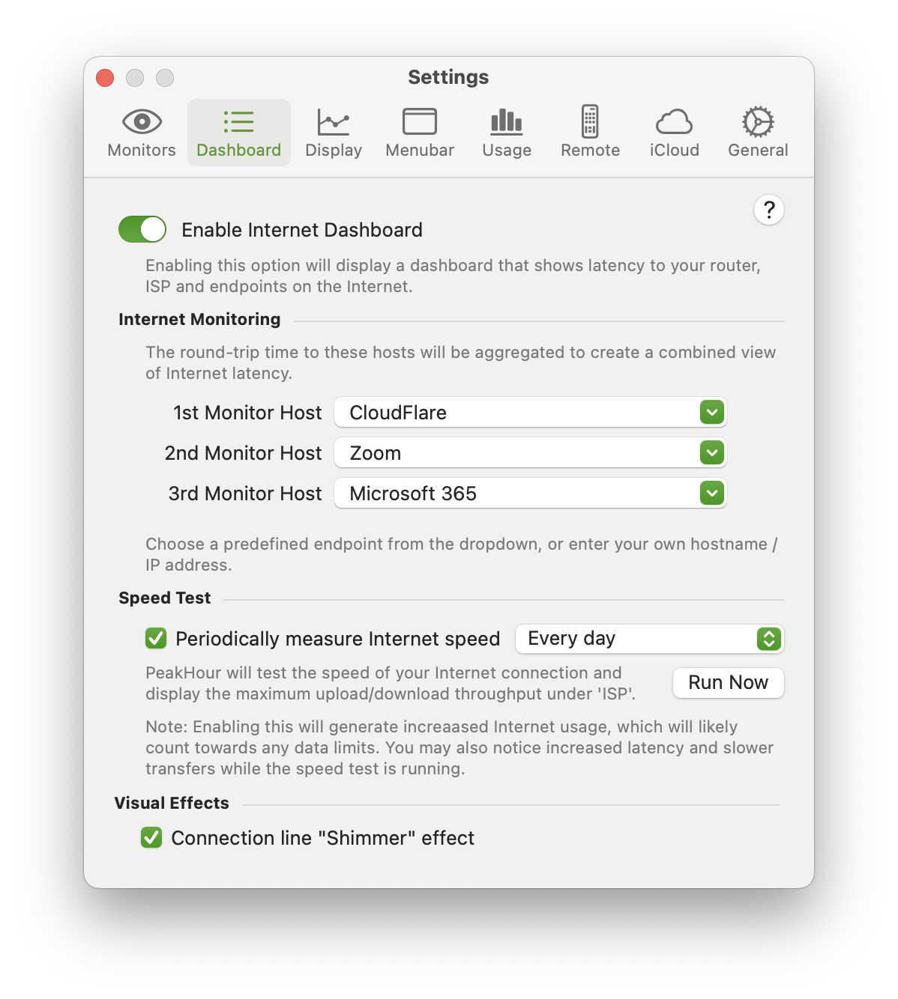

import NeedsReview from '@/components/NeedsReview.astro';

<NeedsReview />

The Dashboard tab is where you enable and configure the Internet Dashboard. The Internet Dashboard shows a real-time view of your Internet latency and throughput, along with other metrics that indicate the health of your Mac’s connectivity.

<table>
<tbody>
<tr class="odd">
<td><strong>Enable Internet Dashboard</strong></td>
<td>
Enables the Internet Dashboard and shows it on the main display.

For more information on the Internet Dashboard and the information it presents, see <a href="/user-guide/main-view/understanding-the-internet-dashboard/">Understanding the Internet Dashboard</a>.
</td>
</tr>
</tbody>
</table>

## Internet Monitoring

This section lets you define three hosts that PeakHour will continually ping. These hosts should ideally represent services that you use often.

<table>
<tbody>
<tr class="odd">
<td><strong>1st, 2nd, 3rd Monitor Host</strong></td>
<td>
The service / hostname / IP address to ping. The dropdown contains a handful of pre-configured destinations:

<ul>
<li>
Microsoft 365 (office.com)
</li>
<li>
Google (dns.google)
</li>
<li>
Zoom (zoom.us)
</li>
<li>
CloudFlare (1dot1dot1dot1.cloudflare-dns.com)
</li>
<li>
NetFlix (fast.com)
</li>
</ul>

You can also enter your own hostname or IP address.

PeakHour will measure latency to all three hosts and display both the individual host latency, as well as an average, on the Internet Dashboard.
</td>
</tr>
</tbody>
</table>

## Speed Test

PeakHour can periodically measure your Internet’s maximum upload and download speed and display that on the Internet Dashboard.

<table>
<tbody>
<tr class="odd">
<td><strong>Periodically measure Internet Speed</strong></td>
<td>
If enabled, PeakHour will run a periodic test of your Internet’s maximum upload and download speed. The result will be displayed on the Internet Dashboard under ISP. Running a Speed Test will also calibrate your Internet Gateway’s maximum available upload and download bandwidth.

You can set a schedule of how often the test runs using the drop down:

<ul>
<li>
Every hour
</li>
<li>
Every 6 hours
</li>
<li>
Every 12 hours
</li>
<li>
Every day
</li>
<li>
Every week
</li>
</ul>

You can also manually trigger a speed test on demand by clicking <strong>Run Now</strong> or right-clicking the Internet Dashboard itself and choosing <strong>Run Speed Test</strong>.
</td>
</tr>
</tbody>
</table>

## Visual Effects

<table>
<tbody>
<tr class="odd">
<td><strong>Connection line ‘Shimmer’ effect</strong></td>
<td>
This option enables or disables the ‘shimmer’ of the lines between Mac to Router, Router to ISP and ISP to Internet.

When enabled, the line will shimmer each time a ping is sent. The speed of the shimmer is relative to the response time. The higher the ping response time, the slower the shimmer effect.
</td>
</tr>
</tbody>
</table>

### Recreating Internet Dashboard monitors

If you accidentally (or intentionally) delete or more of the Monitors that power the Internet Dashboard, the only way to restore them is to recreate them all.

You can do this by following these steps:

1.  Open [Dashboard](/user-guide/settings/dashboard/) settings.

2.  Disable the Internet Dashboard.

3.  You will be prompted whether or not to delete all Monitors associated with the Internet Dashboard. Choose Yes, remove all Dashboard monitors.

4.  Re-enable the Internet Dashboard.

This will recreate all Internet Dashboard monitors with their default settings.

