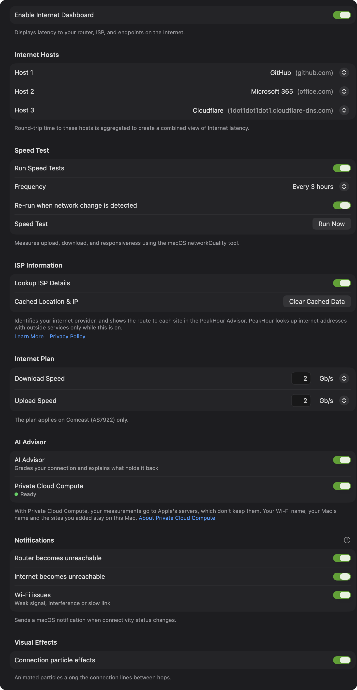

The **Dashboard** settings are where you enable and configure the [Internet Dashboard](/user-guide/main-view/internet-dashboard/) — a real-time view of your internet latency, throughput, and connection health.

**Enable Internet Dashboard** — turns the Internet Dashboard on and shows it on the main display, displaying latency to your router, ISP, and endpoints on the internet. For what it shows, see [Internet Dashboard](/user-guide/main-view/internet-dashboard/). To turn it off, see [Turning off the dashboard](#turning-off-the-dashboard).

## Internet Hosts

PeakHour continually pings three hosts and aggregates the round-trip times into a combined view of internet latency. Choose services you use often.

**Host 1, 2, 3** — the service to ping for each slot. Each dropdown offers a large list of popular services and DNS providers: Akamai, Amazon, Amazon AWS, Apple, Apple TV+, Cloudflare, Disney+, Fastly, GitHub, Google, Google Cloud, Meta (Facebook), Microsoft 365, Microsoft Azure, Netflix, OpenDNS, PlayStation Network, Quad9, Reddit, Slack, Spotify, Steam, Twitch, X (Twitter), Xbox Live, YouTube, and Zoom. Choose **None** to leave a slot empty, or **Custom…** to enter your own hostname or IP address.

These hosts appear in the **Internet** column of the dashboard, and on [The Internet](/user-guide/advisor/the-internet/) page of the PeakHour Advisor.

## Speed Test

PeakHour can run a speed test on a schedule. The test measures your upload speed, your download speed and your responsiveness. It uses the macOS **networkQuality** tool.

| Setting | Description |
|---------|-------------|
| **Run Speed Tests** | Runs a speed test on a schedule. The results show under **ISP** on the dashboard and in its card, on the Advisor's [Speed Test](/user-guide/advisor/speed-test/) page, and in the Advisor's [speed test history](/user-guide/advisor/history/#speed-tests). Each test also calibrates the maximum upload and download bandwidth of your Internet Gateway. |
| **Frequency** | How often the test runs — every hour, 3 hours, 6 hours, 12 hours, day, or week. |
| **Re-run when network change is detected** | Also runs a test when PeakHour detects a network change, for example a change to another Wi-Fi network. |
| **Speed Test → Run Now** | Runs a test immediately. |

**Frequency**, **Re-run when network change is detected** and **Run Now** show only while **Run Speed Tests** is on. You can also run a test at any time:

- right-click the Internet Dashboard, then choose **Run Speed Test**;
- click **Run Speed Test** on the Advisor's [Speed Test](/user-guide/advisor/speed-test/) page.

## ISP Information

**Lookup ISP Details** — identifies your internet provider (name, ASN, connection type, and approximate location) from your public IP address, shown in the **ISP** column of the dashboard and in its card. It also lets the PeakHour Advisor show the route to each site and a map of where each site answers from. It is off by default.

**Clear Cached Data** — removes the lookups that PeakHour has cached on this Mac.

For every service that ISP Information contacts, what each one receives, and what stays on your Mac, see [ISP Information](/user-guide/settings/isp-information/).

## Internet Plan

Enter the speeds that your internet plan promises, and PeakHour compares your speed tests with them.

| Setting | Description |
|---------|-------------|
| **Download Speed** | The download speed of your plan. Choose **Mb/s** or **Gb/s** from the menu beside it. |
| **Upload Speed** | The upload speed of your plan, also in **Mb/s** or **Gb/s**. |

Leave both fields empty if you don't want to set a plan. Each change saves at once.

With a plan set, PeakHour:

- shows each measured speed as a share of your plan — for example **82% of plan** — on the ISP card and the Advisor's [Speed Test](/user-guide/advisor/speed-test/) page. The bar is green from 85%, yellow from 70%, and red below that;
- uses the plan as the maximum of the **Router** readouts on the dashboard, while the router's maximum is **Automatic**. An automatically detected router always uses **Automatic**;
- tells you on the [Speed Test](/user-guide/advisor/speed-test/#your-plan) page whether your connection delivers your plan, or whether this Mac's Wi-Fi or cable connection limits the speed;
- records the plan with each speed test in the Advisor's [History](/user-guide/advisor/history/#speed-tests);
- gives the plan to [Ask](/user-guide/advisor/ask/), so you can ask whether you get the speed of your plan.

### Which network the plan applies to

When **Lookup ISP Details** is on, PeakHour ties the plan to the ISP you use when you save it. The footer then reads, for example, *The plan applies on Comcast (AS7922) only.* On another ISP, PeakHour doesn't use the plan, and the footer adds *This Mac uses another ISP now.* When **Lookup ISP Details** is off, the plan applies on every network. For more, see [Your Internet plan](/user-guide/settings/isp-information/#your-internet-plan).

The plan stays on this Mac. PeakHour doesn't sync it with [iCloud](/user-guide/settings/icloud/), so each Mac keeps its own plan.

:::tip
On macOS 26 and later, the Advisor's [Speed Test](/user-guide/advisor/speed-test/#your-plan) page also asks for your plan once, after your first speed test. Its **Edit Internet Plan…** and **Add Your Internet Plan…** links open this section, with the cursor in **Download Speed**. On macOS 14 and 15, enter the plan here.
:::

## AI Advisor

**AI Advisor** — grades your connection and explains what holds it back, in the [PeakHour Advisor](/user-guide/advisor/) window and on the dashboard. It is on by default, and needs macOS 26 or later. With it off, the Advisor window still opens, for your speed tests, your history and the routes to each site. See [With the AI Advisor off](/user-guide/advisor/#with-the-ai-advisor-off).

**Private Cloud Compute** — lets a larger Apple model write the Advisor's explanations, and lets you [ask questions about your connection](/user-guide/advisor/ask/). It is off by default, and needs macOS 27 or later with Apple Intelligence. The line under the switch shows whether it is ready, and how much of today's limit is left. While **AI Advisor** is off, this switch shows off and is grey. Your choice comes back when you turn the AI Advisor on again.

:::note
Without Private Cloud Compute, the AI Advisor runs entirely on your Mac. With it, your measurements go to Apple's servers, which don't keep them. Your Wi-Fi name, your Mac's name and the monitors you added stay on your Mac. See [What leaves your Mac](/user-guide/advisor/ask/#what-leaves-your-mac).
:::

## Notifications

Send a macOS notification when your connection has a problem. All three switches are off by default.

- **Router becomes unreachable** — notifies you when your router stops responding, and again when it recovers.
- **Internet becomes unreachable** — notifies you when the wider internet stops responding, and again when it recovers.
- **Wi-Fi issues** — *Weak signal, interference or slow link.* Notifies you when your Mac's Wi-Fi has a problem that lasts 2 minutes.

**Wi-Fi issues** watches for three problems, while the Wi-Fi carries your Mac's traffic:

| Notification | When |
|--------------|------|
| **Weak Wi-Fi signal** | The signal is below −75 dBm. |
| **Wi-Fi interference** | The signal-to-noise ratio is under 20 dB. |
| **Slow Wi-Fi link** | The Tx rate of the Wi-Fi link is under 50 Mb/s. |

PeakHour sends at most one notification in 30 minutes for each problem. Wi-Fi issues works with the AI Advisor off. For steps that help, see [Improve a weak Wi-Fi signal](/troubleshooting/fix-a-grade/weak-wifi-signal/).

## Visual Effects

**Connection particle effects** — animated particles flow along the connection lines between hops on the dashboard, visualising live traffic. It is off by default. When it is off, a plain line in the colour of each link's health joins the hops.

## Turning off the dashboard

When you turn off **Enable Internet Dashboard**, PeakHour asks **Delete Dashboard Monitors?** and says how many monitors the dashboard uses:

- **Delete Monitors** — deletes the dashboard's monitors and their history, and turns the dashboard off.
- **Keep Monitors** — turns the dashboard off and keeps its monitors in [Settings → Monitors](/user-guide/settings/monitors-settings/).
- **Cancel** — leaves the dashboard on.

When you turn the dashboard on again, PeakHour creates only the monitors that are missing.

## Recreating Internet Dashboard monitors

If you delete one or more of the monitors that power the Internet Dashboard, you can get them back:

1. Open **Dashboard** settings.
2. Turn off **Enable Internet Dashboard**, and choose **Keep Monitors**.
3. Turn on **Enable Internet Dashboard** again.

PeakHour creates the missing monitors with their default settings. Your other dashboard monitors and their history stay as they are.
