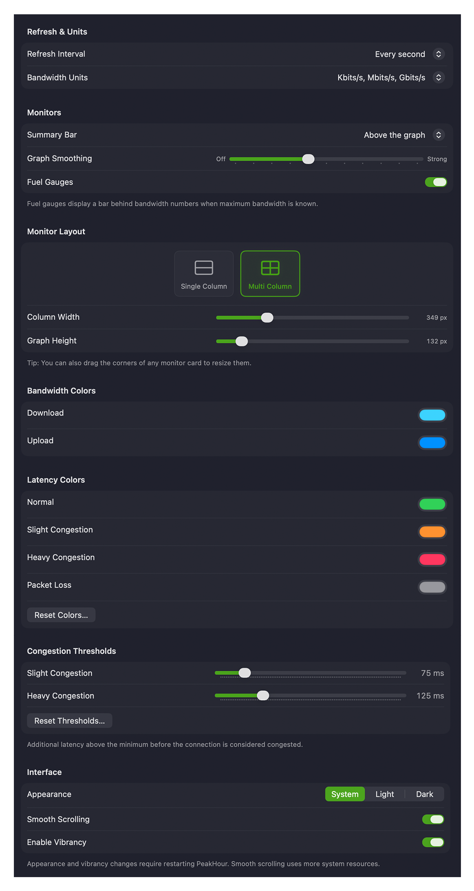

The **Display** settings control how PeakHour looks and how often it updates.

## Refresh & Units

| Setting | Description |
|---------|-------------|
| **Refresh Interval** | How often PeakHour polls each monitor for new data. More frequent polling uses more resources on your Mac and on the monitored devices. |
| **Bandwidth Units** | The units used to display throughput throughout PeakHour — bits per second (Kbit/s, Mbit/s, Gbit/s) or bytes per second (KByte/s, MByte/s, GByte/s). |

## Monitors

| Setting | Description |
|---------|-------------|
| **Summary Bar** | Whether the summary (current readings) appears above or below the graph. |
| **Graph Smoothing** | Applies a rolling average to smooth out irregularities. Higher settings make the graph smoother but slower to reflect changes; lower settings make it more responsive but more jagged. |
| **Fuel Gauges** | Displays a bar behind the bandwidth numbers showing the current speed relative to the device's maximum bandwidth, when that's known. |

## Monitor Layout

Choose how monitors are arranged in the main window.

- **Single Column** — all monitors in one full-width column; the window can be resized to any width.
- **Multi Column** — monitors laid out in a grid at a fixed width, so you can fit several per row. The window snaps to multiples of that width.

| Setting | Description |
|---------|-------------|
| **Column Width** *(Multi Column)* | The fixed width of each monitor card. |
| **Graph Height** | The height of monitors that show a graph. Summary-only monitors aren't affected. |

:::tip
You can also resize a monitor card directly — drag its **right** edge to change the width, or its **bottom** edge to change the height.
:::

## Bandwidth Colors

The colors used for **Download** and **Upload** traffic on Bandwidth Monitor graphs.

## Latency Colors

The colors used to indicate latency on Latency Monitor graphs, blended as a gradient between them:

| Color | Meaning |
|-------|---------|
| **Normal** | Good latency — at or near a monitor's measured minimum. |
| **Slight Congestion** | Mild congestion. |
| **Heavy Congestion** | Significant congestion. |
| **Packet Loss** | The color of the packet-loss line in the [History view](/user-guide/history-view/), which shows the percentage of packets lost in each period. It isn't shown on the live monitor graph. |

Click **Reset Colors…** to restore the defaults.

## Congestion Thresholds

How much latency above a monitor's measured minimum counts as congestion:

| Setting | Description |
|---------|-------------|
| **Slight Congestion** | Additional latency above the minimum before the connection is considered slightly congested (default 75 ms). |
| **Heavy Congestion** | Additional latency before it's considered heavily congested (default 125 ms). |

Click **Reset Thresholds…** to restore the defaults. Each monitor's minimum-latency baseline is set on its own [Latency Monitor](/user-guide/settings/monitors-settings/latency-monitor/#latency) settings.

## Interface

| Setting | Description |
|---------|-------------|
| **Appearance** | **System** follows the macOS appearance (System Settings → Appearance), or force **Light** or **Dark**. |
| **Smooth Scrolling** | Slides the graph sideways smoothly using Core Animation. Uses more of your Mac's resources. |
| **Enable Vibrancy** | The 'frosted glass' effect that lets colors behind the window bleed through — affects monitors and History windows. |

:::note
Changing **Appearance** or **Enable Vibrancy** requires restarting PeakHour. Vibrancy uses more resources to render, so turn it off to optimise battery or performance.
:::
