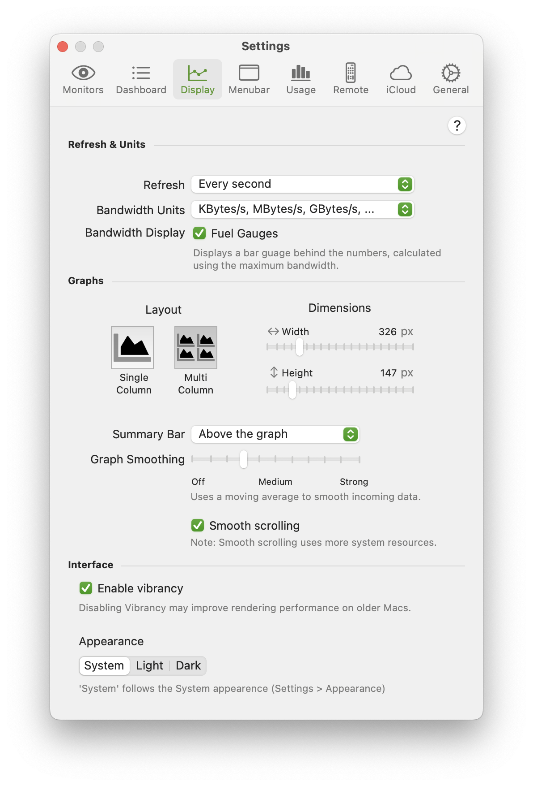

import img1 from './display-images/cleanshot-2023-12-15-at-20-17-34-2x-20231216-011738.png';
import img2 from './display-images/cleanshot-2024-05-25-at-14-02-58-2x-20240525-180305.png';
import img3 from './display-images/cleanshot-2024-05-26-at-13-53-55-2x-20240526-175402.png';
import img4 from './display-images/cleanshot-2024-05-26-at-13-58-59-2x-20240526-175903.png';
import img5 from './display-images/cleanshot-2024-05-26-at-14-03-39-2x-20240526-180344.png';
import img6 from './display-images/screen-shot-2013-10-26-at-4-33-33-pm.png';
import img7 from './display-images/screen-shot-2013-10-26-at-4-38-20-pm.png';
import img8 from './display-images/vibrancy-disabled.png';
import img9 from './display-images/vibrancy-enabled.png';

## Refresh & Units

<table>
<tbody>
<tr class="odd">
<td><strong>Refresh</strong></td>
<td>
Controls how often PeakHour updates. This means polling each monitor for new data.

<strong>Note:</strong> The more often you poll, the more resources PeakHour will use and more load you'll place on each device.
</td>
</tr>
<tr class="even">
<td><strong>Bandwidth Units</strong></td>
<td>
Controls the display of bandwidth throughout PeakHour:

<ul>
<li>
<strong>KBytes/s, MBytes/s, GBytes/s,</strong> ... 
Display as <em>x bytes per second</em>.
</li>
<li>
<strong>Kbits/s, Mbits/s, Gbits/s</strong> 
Display as <em>x bits per second</em>.
</li>
<li>
<strong>MBytes/s, GBytes/s,...</strong> 
Display as <em>x bytes per second</em> (&lt;1 MByte/s is rounded up)
</li>
<li>
<strong>MBits/s, GBits/s,...</strong> 
Display as <em>x bits per second</em> (&lt;1 Mbit/s is rounded up)
</li>
</ul></td>
</tr>
<tr class="odd">
<td><strong>Bandwidth Display</strong></td>
<td>
<strong>Bandwidth Fuel gauges:</strong> display a fuel guage behind bandwidth text. The gauge is scaled to the maximum bandwidth of the device.

</td>
</tr>
</tbody>
</table>

## Monitors

<table>
<tbody>
<tr class="odd">
<td><strong>Layout - Single Column</strong></td>
<td>
All monitors are in a single column, filling the full width of the view. The window can be resized to any width.

</td>
</tr>
<tr class="even">
<td><strong>Layout - Multi Column</strong></td>
<td>
This enables Multi-Column mode, where you can layout monitors in a grid. Each monitor is a customizable, fixed width (adjustable via the <strong>Width</strong> slider, see below). The window can be resized in increments of that fixed width, allowing you to fit multiple monitors per row. The window sizes are snapped to the width of the graph. Graphs are all the same width, but you can adjust that width with the <strong>Graph Width</strong> slider.

</td>
</tr>
<tr class="odd">
<td><strong>Width (Multi Column mode only)</strong></td>
<td>In Multi Column mode, the monitors are a fixed width that is controlled by this slider. The window can be resized in increments of this width, allowing multiple monitors per row. This can be used to create a compact, space-efficient layout.</td>
</tr>
<tr class="even">
<td><strong>Height</strong></td>
<td>This controls the height of monitors with graph enabled. The slide controls the total height of the monitor, including the graph. Monitors in Summary mode (no graph showing) are not affected by this setting.</td>
</tr>
<tr class="odd">
<td><strong>Summary Bar</strong></td>
<td>
This determines if the summary is above or below the graph.

</td>
</tr>
<tr class="even">
<td><strong>Graph Smoothing</strong></td>
<td>
Enables smoothing of the data. This implements a rolling average where new values are average with the previous x values in an attempt to smooth out irregularities. For example:

 <em>Smoothing turned off</em>

 <em>Smoothing set to <strong>Strong</strong></em>

Essentially: The higher this value is set, the longer changes in throughput will take to become evident. The lower the setting, the more 'jagged' the graph will tend to be.
</td>
</tr>
<tr class="odd">
<td><strong>Smooth Scrolling</strong></td>
<td>
This option enables smooth sideways scrolling of the graph. This uses Core Animation to constantly slide the graph sideways at a constant speed, giving a much more fluid look.

<strong>Note:</strong> this option requires more of your Mac’s resources.
</td>
</tr>
<tr class="even">
<td><strong>Interface Mode (Auto/Dark/Light)</strong></td>
<td>Choose between <strong>Light</strong> and <strong>Dark</strong> interface modes. <strong>System</strong> will track the macOS setting (System Settings &gt; Appearance).</td>
</tr>
<tr class="odd">
<td><strong>Enable Vibrancy</strong></td>
<td>
Vibrancy is the 'frosted glass'-like effect which allows some of the colors behind the window to bleed through.

Vibrancy affects the following elements:

<ul>
<li>
Monitors (Graph+Detail and Detail Only) in the main dropdown.
</li>
<li>
History windows
</li>
</ul>

PeakHour needs to restart for changes to this option to take effect.

Vibrancy requires more resources to render, especially when many graphs are enabled. Switch it off you're aiming to optimize battery and/or performance.

</td>
</tr>
</tbody>
</table>

