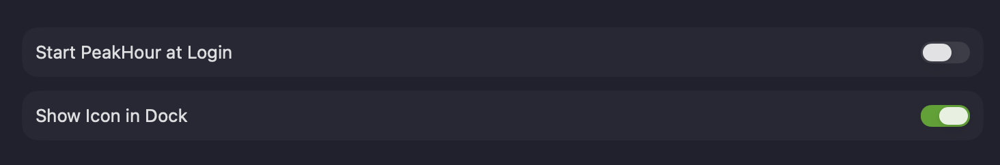

The **General** settings cover how PeakHour launches and where it appears.

| Setting | Description |
|---------|-------------|
| **Start PeakHour at Login** | Launches PeakHour automatically when you log in to your Mac. |
| **Show Icon in Dock** | Shows PeakHour's icon in the Dock as well as the menu bar. When off, PeakHour appears only in the menu bar. |
