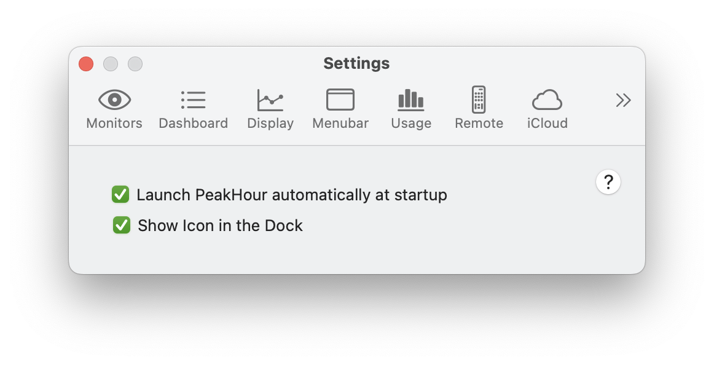

<table>
<tbody>
<tr class="odd">
<td><strong>Launch automatically when computer starts</strong></td>
<td>If enabled, PeakHour will automatically start when your Mac starts up.</td>
</tr>
<tr class="even">
<td><strong>Show icon in dock</strong></td>
<td>
If enabled, PeakHour will appear in your computer's dock, as well as in the menu bar.

If disabled, PeakHour will only appear in your menu bar.
</td>
</tr>
</tbody>
</table>

